# Usare l'app Calendario tramite interfaccia web

Puoi accedere alla tua app calendario premendo l'icona  {.inline} nella barra superiore.
*La barra di sinistra* nella finestra del calendario ti dà una panoramica dei tuoi calendari, delle loro opzioni e delle impostazioni generali.

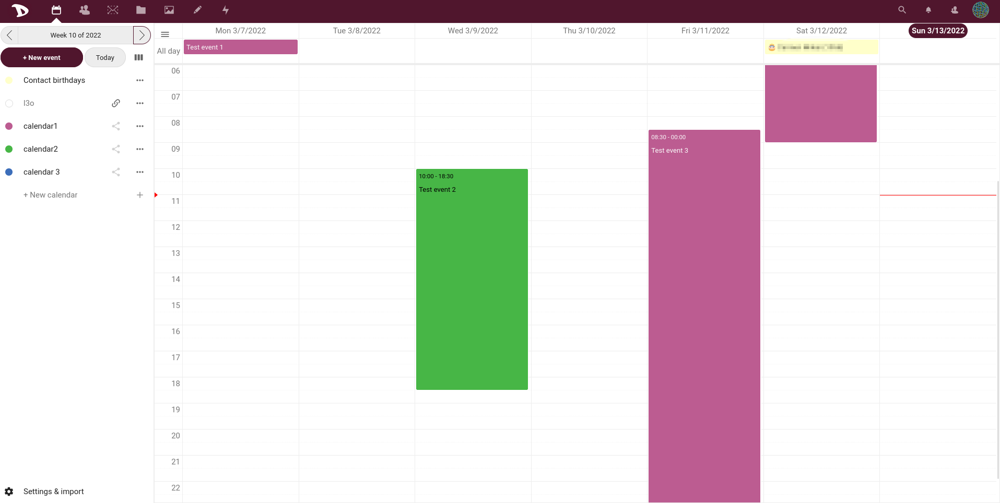

## Crea calendario
Per creare un nuovo calendario in questo pannello di opzioni premi "*crea calendario*".
Apparirà un piccolo prompt dove potrai digitare il nome che vuoi dare a questo nuovo calendario e selezionare un colore per esso.
Poi premi "*crea*".

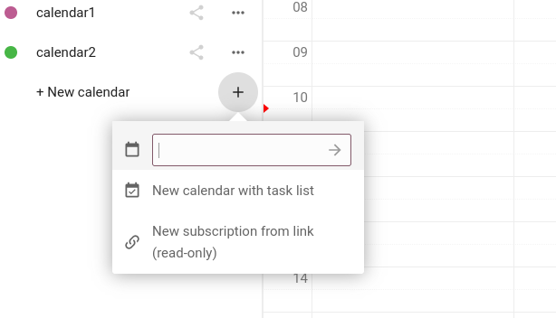

Puoi creare più calendari per scopi diversi (lavoro, attivismo, ecc.) ripetendo questo processo. Se lo fai, puoi usare colori diversi per distinguerli (l'ultima icona è il selezionatore di colori che ti permette di scegliere qualsiasi colore tu voglia

).

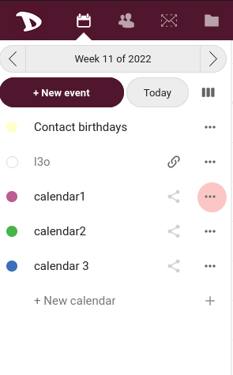

## Elimina, modifica, scarica calendario.
Nel pannello di sinistra, vedrai i tuoi calendari elencati. A destra di ogni calendario troverai un pulsante "altro" dove potrai:

- rinominare il tuo calendario,
- scaricarlo
- ottenere un link url per sincronizzarlo con altri dispositivi
- cancellare il tuo calendario.

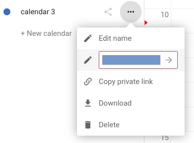

## Creare un evento
Puoi creare un nuovo evento nel tuo calendario cliccando nella *finestra principale* dei calendari semplicemente sul giorno dell'evento. Un pannello apparirà sul lato destro, dove potrai riempire con le informazioni dell'evento.

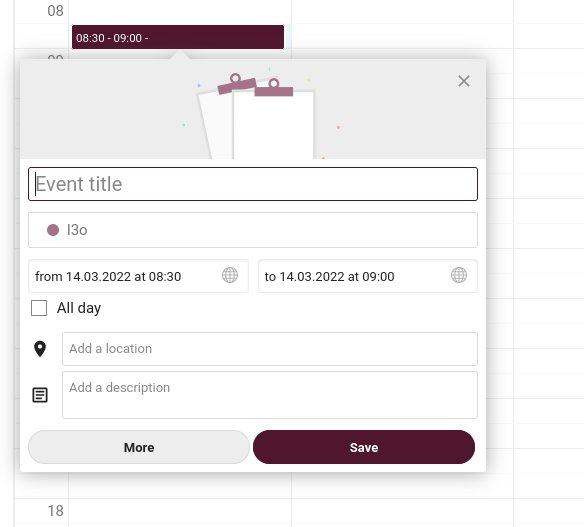

In questo pannello è possibile specificare:

  - titolo dell'evento
  - data di inizio e fine
  - l'ora di inizio e di fine
  - se si tratta di un evento di un giorno intero o meno
  - luogo dell'evento
  - descrizione dell'evento

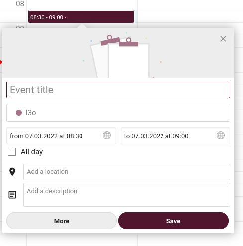

Se hai più calendari, nella tua app calendario Disroot, devi selezionare a quale calendario va l'evento. Puoi farlo sotto il campo del titolo dell'evento.

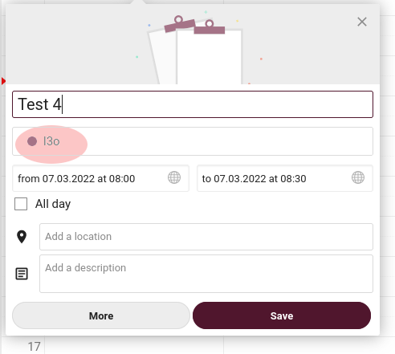

È possibile impostare un promemoria per l'evento premendo "Promemoria" e "Aggiungi".

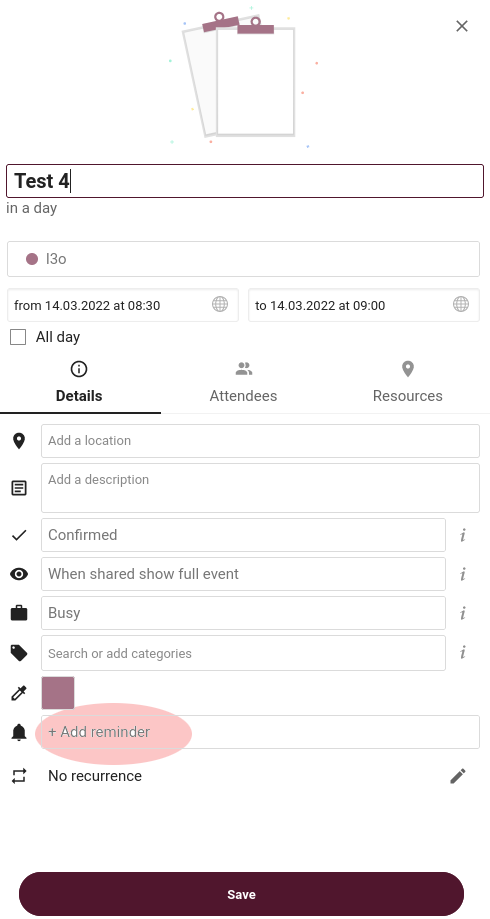

Potete selezionare il tipo di promemoria che volete:

* audio
* email
* pop up

E impostare il tempo per esso.

Basta premere il promemoria che hai aggiunto e le opzioni appariranno.

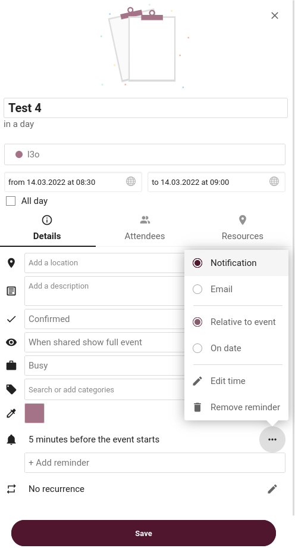

Puoi anche impostare se questo è un evento che si ripete o meno. Basta controllare le opzioni *ripetitivo*.

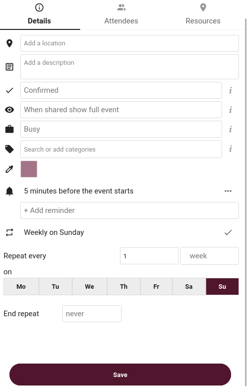

## Invita le persone agli eventi

Puoi anche invitare le persone al tuo evento via e-mail:

* premendo "Partecipanti"
* compilando il campo con l'indirizzo email delle persone
* premendo enter

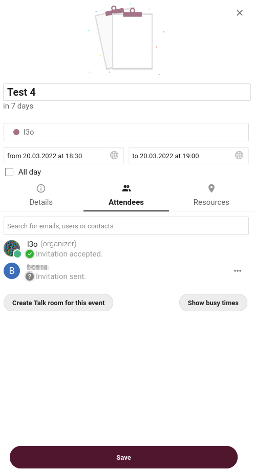

Le persone che inviti riceveranno un'email generata automaticamente con l'invito. Qualsiasi modifica apportata all'evento sarà inviata automaticamente via email alla persona che hai aggiunto.

Quando hai finito tutto, premi semplicemente Crea alla fine del pannello, e il tuo evento apparirà sullo schermo

## Modifica o cancella gli eventi
Per modificare o eliminare un evento che hai creato, basta cliccare sull'evento sullo schermo, modificarlo e poi premere "aggiorna".
Per eliminarlo, troverai il grande pulsante rosso.

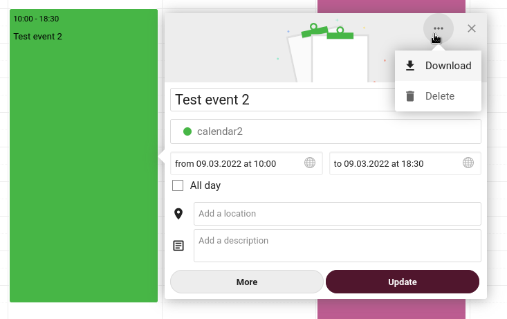

## Condividi calendari
Puoi condividere i tuoi calendari, sia con un altro utente disroot, via email, o con un link pubblico.

Per condividere con un altro utente Disroot:

* premi il pulsante di condivisione a destra del nome del tuo calendario
* digita il nome utente dell'utente Disroot con cui vuoi condividere il calendario
* premi enter.

Per condividere i calendari via e-mail o link pubblico:

* vai alla stessa opzione "condiviso".
* seleziona "Condividi link"
* riempi il campo dell'indirizzo e-mail con l'e-mail della persona con cui vuoi condividere il tuo calendario
* premi enter
* per ottenere solo il link premi il simbolo della catena accanto al simbolo della busta postale

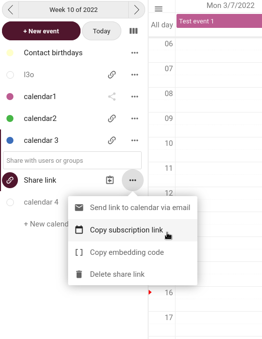

## Importazione di calendari
Se hai un file ICS con un calendario da importare, vai su disroot calendar app poi vai su "Settings & Import" in basso a sinistra dello schermo.

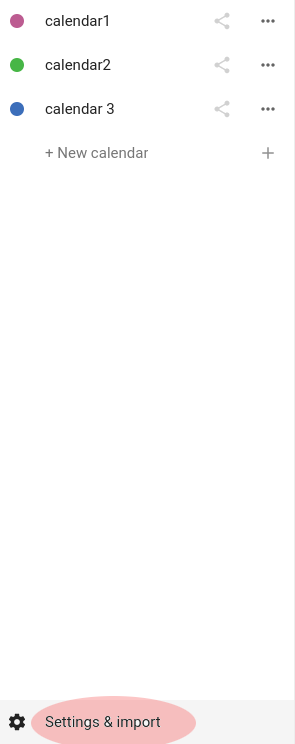

E seleziona l'opzione importa calendario.

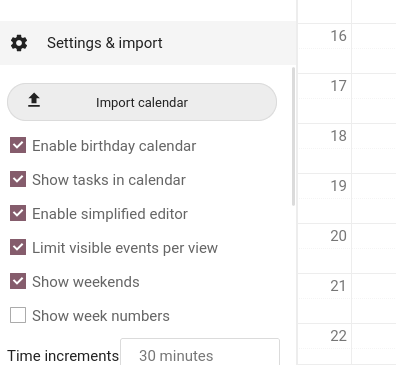
