------------
# Como usar a aplicação Calendário

Pode aceder à aplicação de calendário carregando no ícone  na barra superior da janela principal.
A *barra lateral esquerda* dá-lhe uma lista dos seus calendários, as suas opções e definições gerais.

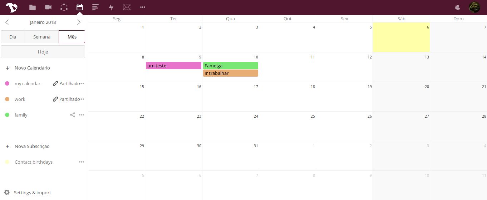

--------------
## Criar um calendário
Para criar um calendário basta carregar em "**+ Novo Calendário**" na barra lateral esquerda.
Irá aparecer uma pequena janela onde pode escrever o nome que quer dar ao seu calendário e escolher uma cor para o mesmo.
Depois carregue em "**Criar**".

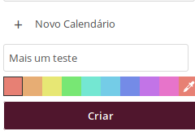

Pode criar vários calendários diferentes para propósitos diferentes (trabalho, activismo, etc.) repetindo este processo. Se fizer isso, pode também utilizar cores diferentes para distinguir melhor os diferentes calendários (o último ícone permite escolher qualquer cor que queira ).

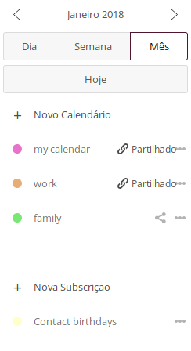

-----------------------
## Apagar, editar calendário e descarregar uma cópia.
Na **barra lateral esquerda** tem a lista dos seus calendários à direita do nome de cada calendário irá encontrar um botão de "mais opções" onde pode:

- mudar o nome ao seu calendário
- descarregar uma cópia para o seu computador
- obter um link URL para poder sincronizar o seu calendário com outros dispositivos
- apagar o seu calendário

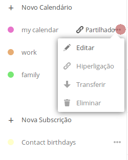

-------------------------
## Criar um evento
Pode criar um evento no seu calendário carregando na **janela principal da aplicação** de calendários no respetivo dia do evento. Um painel irá aparecer, onde pode preencher as informações gerais do evento e carregando no botão "**Mais**", pode obter a lista completa das opções.

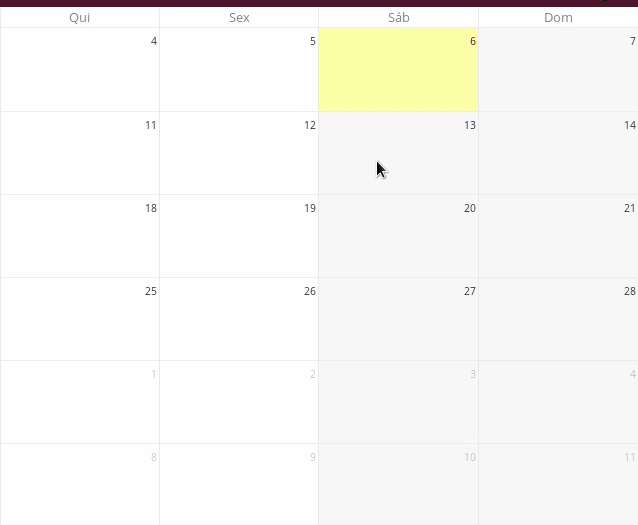

Neste painel pode especificar:

  - título do evento
  - data de início e fim do evento
  - se é um evento de dia inteiro ou não
  - localização do evento
  - descrição do evento

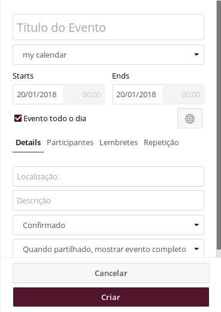

Se utiliza vários calendários diferentes, precisa de selecionar a qual dos seus calendários quer que este evento seja atribuido. Pode fazer isso por baixo do título do evento.

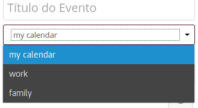

Pode também fazer um lembrete carregando em "Lembrete" e "Adicionar".

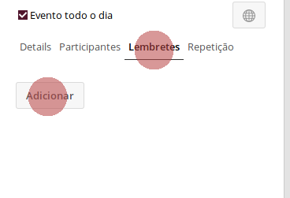

Pode também selecionar qual o tipo de lembrete que quer:

* áudio
* email
* popup

E escolher a antecedência do lembrete.

Basta carregar no lembrete que acabou de criar e irão aparecer as opções extra.

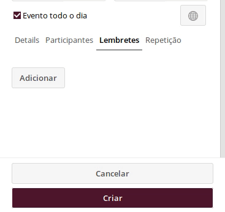

Também pode escolher se este é um evento que se repete ou não. Basta ver as opções em "**Repetição**".

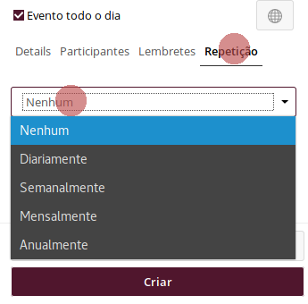

-------------------------------
## Convidar participantes para os eventos

Também pode convidar participantes para os seus eventos de calendário:

* Carregue em "Participantes"
* Preencha o campo em branco com o endereço de email da pessoa que quer convidar
* carregue em "**Adicionar**"

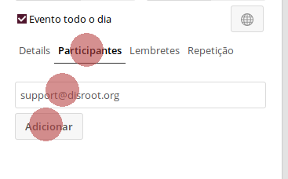

As pessoas que convidou irão receber automaticamente um email com o convite para o evento. Quaisquer alterações que faça no evento serão enviadas por email aos participantes que convidou.

Quando tiver terminado de editar o seu evento basta carregar em "**Criar**" e o seu evento irá aparecer no ecrã.

----------------------------
## Editar ou apagar eventos
Para editar ou apagar um evento que criou no seu calendário basta carregar no evento em causa no seu ecrã. Carregue em "**Mais...**" para editar e depois em "**Actualizar**".
Para apagar um evento irá encontrar o botão grande vermelho.

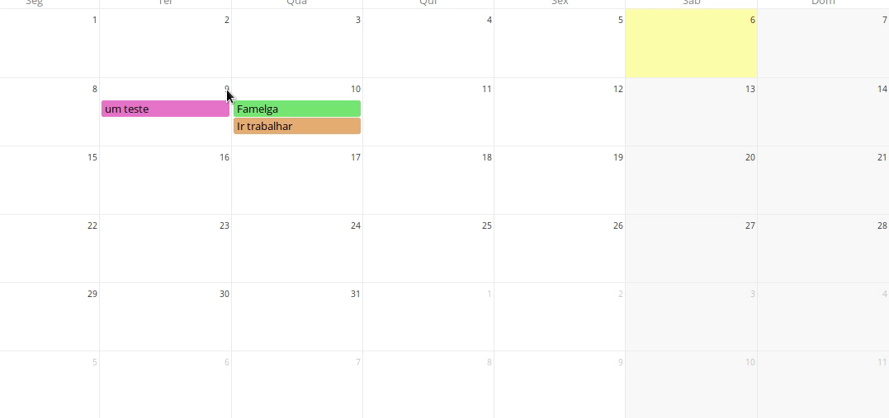

----------------------------
## Partilhar calendários
Você pode partilhar os seus calendários tento com outros utilizadores do Disroot como por outras pessoas por email ou link URL.

Para partilhar com outro utilizador do Disroot:

* carregue no botão de partilha à direita do nome do seu calendário
* escreva o nome de utilizador do utilizador do Disroot com o qual quer partilhar o seu calendário
* carregue em enter

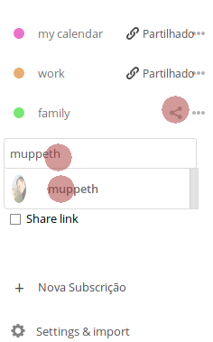

Para partilhar calendários via email ou link URL:

* Vá à mesma opção de "partilha"
* escollha "Share link"
* escreva o endereço de email com o qual quer partilhar o calendário
* carregue em "**Send**"
* para ter apenas o link URL público para o calendário carregue no símbolo de "corrente" ao lado do símbolo de "carta de correio"

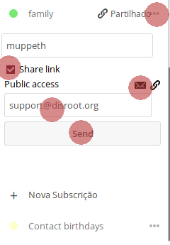

------------------------------
## Importar calendários
Se tem im ficheiro de calendário ICS, vá à aplicação de calendário e carregue em  "**Settings & Import**" no canto inferior esquerdo do ecrã.

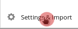

E selecione a opção importar calendário

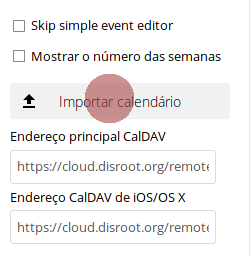

----------------------------------------
