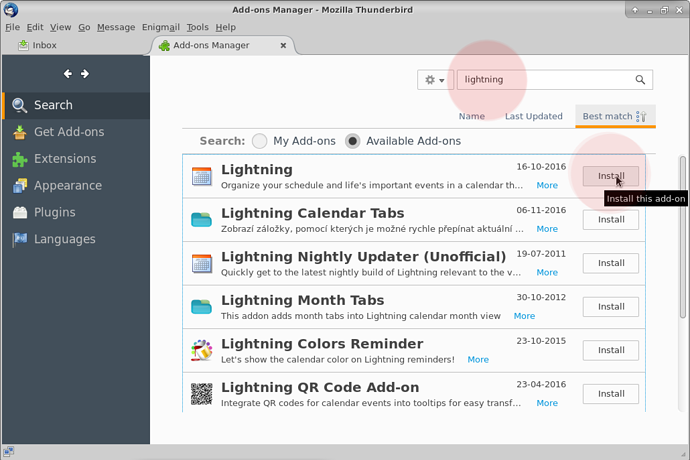
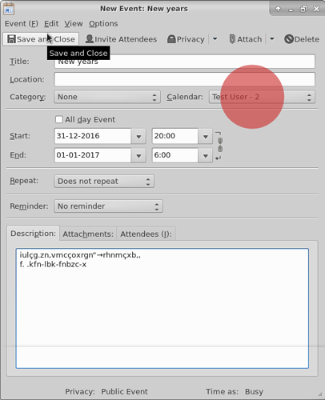

L'obiettivo principale di avere i tuoi contatti e calendari da **Disroot** integrati con **Thunderbird** attraverso il tuo account di posta elettronica è la possibilità di accedervi da un posto sul tuo desktop.

---------

# Primo passo: Installazione dei componenti aggiuntivi necessari

Per sincronizzare tutti i tuoi calendari e contatti su **Thunderbird**, è necessario installare il seguente add-on:

* **Lightning:** un calendario per **Thunderbird**

## Installazione di Lightning

In **Thunderbird** andate su > strumenti > Componenti aggiuntivi

Nella pagina dei componenti aggiuntivi nell'angolo in alto a destra troverai una barra di ricerca. Cerca semplicemente "Lightning". Una volta che **Thunderbird** lo trova per te, premi installa.

Dovrete riavviare **Thunderbird** per finire l'installazione.

# Integrazione del calendario con Thunderbird

Innanzitutto accedi al tuo [Disroot cloud](https://cloud.disroot.org) e vai all'app Calendario. Seleziona le opzioni del calendario che desideri sincronizzare con **Thunderbird**.
Ora, copia l'URL del link del tuo calendario. Ti servirà per sincronizzarsi con **Thunderbird**.

 

In **Thunderbird** puoi andare su: *File > Nuovo > Calendario* o andare direttamente alla finestra Calendario e selezionare *"Nuovo calendario"* facendo clic con il pulsante destro del mouse sull'elenco del calendario.

Ora configura il tuo calendario per la sincronizzazione:
1. Seleziona l'opzione **CalDAV**
2. Nel campo della posizione, incolla il link del tuo calendario **Disroot** che hai copiato in precedenza
3. Seleziona *Supporto offline*, se desideri conservare una copia locale del tuo calendario, nel caso in cui sia necessario lavorare offline
4. Premi *Avanti*

Assegna un nome al tuo calendario e assegnagli un colore, se lo desideri. 
Quindi premere *Avanti*.

E poi, infine, premere *Fine*.

Il tuo calendario è ora sincronizzato con **Thunderbird**. Qualsiasi evento creato in **Thunderbird** apparirà sul cloud **Disroot** e viceversa.

| **Nota**|
|:--:|
|Se hai più calendari nel tuo account **Disroot**, ripeti questa procedura per ogni calendario.  Puoi utilizzare un colore diverso per ogni calendario per distinguerli. Questo metodo funziona con qualsiasi provider **Nextcloud**/**ownCloud** disponibile. Inoltre puoi sincronizzare qualsiasi calendario da qualsiasi provider purché supporti il ​​protocollo caldav (rivolgiti al tuo provider per maggiori dettagli)| 

## Aggiunta di eventi con più calendari
Se hai più calendari in **Thunderbird**, quando crei un evento devi selezionare a quale calendario va, altrimenti potresti finire per cercarlo online nel posto sbagliato.

Se fai clic con il pulsante destro del mouse sui calendari in **Thunderbird** avrai una serie di opzioni, da:

* Mostra o nascondi un calendario
* Esporta calendario
* Annulla iscrizione calendario (rimuoverlo da **Thunderbird**)
* Rendendolo di sola lettura (in **Thunderbird**)
* Sincronizza calendario 

---
