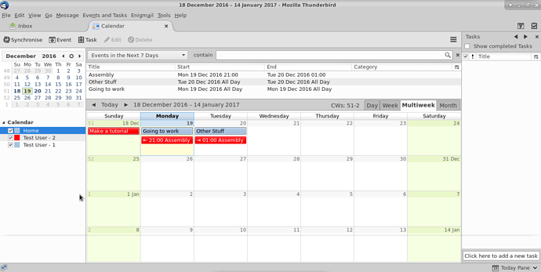

L'obiettivo principale di avere i tuoi contatti e calendari di **Disroot** integrati con **Thunderbird** attraverso il tuo account e-mail è quello di potervi accedere da un unico posto sul desktop.

---------

# Primo passo: Installare le componenti aggiuntive

Per sincronizzare tutti i tuoi calendari e contatti su **Thunderbird**, dovrai installare il seguente componente aggiuntivo:
* **Lightning:** un calendario per **Thunderbird**

## Installare Lightning

In **Thunderbird** vai in > strumenti > Componenti aggiuntivi

Nella pagina dei componenti aggiuntivi nell'angolo in alto a destra troverai una barra di ricerca. Cerca "Lightning". Una volta che **Thunderbird** lo trova per te, premi installa.

Sarà necessario riavviare **Thunderbird** per completare l'installazione.

# Integrare i calendari con Thunderbird

Fai il login su [Disroot cloud](https://cloud.disroot.org) e vai all'app Calendario. Seleziona le opzioni del calendario che desideri sincronizzare con **Thunderbird**.
Ora copia l'URL del link del tuo calendario. Ti servirà per la sincronizzazione con **Thunderbird**.

In **Thunderbird** puoi andare su: *File> Nuovo> Calendario* o andare direttamente alla finestra Calendario e selezionare *"Nuovo calendario"* facendo clic con il tasto destro sulla lista del calendario.

Adesso configura il tuo calendario per la sincronizzazione:
1. Seleziona l'opzione **CalDAV**
2. Incolla il link del tuo calendario **Disroot** che hai copiato in precedenza
3. Selezionare *Supporto offline*, se si desidera conservare una copia locale del proprio calendario, nel caso in cui sia necessario lavorare offline
4. Premi *Prossimo*

Assegna al tuo calendario un nome e un colore. 
Successivamente premi su *Prossimo*.

E finalmente premi su *Finito*.

Il tuo calendario è ora sincronizzato con **Thunderbird**. Qualsiasi evento creato in **Thunderbird** apparirà sul cloud **Disroot** e viceversa.

| **Note**|
|:--:|
| Se hai più calendari nel tuo account **Disroot**, ripeti questa procedura per ciascun calendario.   
Puoi utilizzare un colore diverso per ciascun calendario per distinguerli. Questo metodo funziona per qualsiasi provider **Nextcloud**/**ownCloud** disponibile.   
Inoltre, puoi sincronizzare tutti i calendari di qualsiasi provider purché supportino il protocollo caldav (consulta il tuo provider per maggiori dettagli).

## Aggiungere eventi con calendari multipli

Se hai più calendari in **Thunderbird**, quando crei un evento devi selezionare a quale calendario andare, altrimenti potresti finire per cercarlo online nel posto sbagliato.

Se fai clic con il pulsante destro del mouse sui calendari in **Thunderbird** avrai una serie di opzioni tra cui scegliere:

* Visualizza o nascondi calendari
* Esporta calendari
* Rimuovi calendari (li rimuove da **Thunderbird**)
* Rendi il calendario di sola lettura (in **Thunderbird**)
* Sincronizza calendari

---
