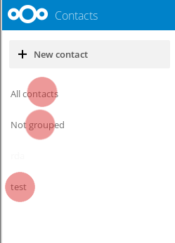
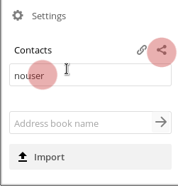

# Contatti
## Crea un contatto

Nell'app dei contatti seleziona "*Nuovo contatto*"

Ti verrà chiesto di creare il nuovo contatto.

Basta digitare le informazioni che vuoi/hai nei campi. Se necessario, puoi semplicemente aggiungere più campi nella parte inferiore del modulo.

## Elimina un contatto

* Seleziona il contatto
* Nell'intestazione del modulo di contatto, seleziona l'icona Elimina

## Crea gruppi di contatti
Puoi creare gruppi per organizzare i tuoi contatti es.: docenti, lavoro, collettivo, ecc.
Nel campo gruppo puoi assegnare un nuovo contatto a un gruppo esistente o crearne uno nuovo. Oppure assegna un contatto a più gruppi digitando i vari gruppi. 

Sul lato sinistro dello schermo nell'app dei contatti, vedrai i gruppi esistenti.
Selezionandoli verranno presentati tutti i contatti in quel rispettivo gruppo.

## Condividi le rubriche

Vai su "impostazioni" nell'angolo in basso a sinistra dello schermo nell'app dei contatti.

Nelle impostazioni puoi condividere la tua rubrica con altri utenti **Disroot** tramite: 
 - Selezionando condividi rubrica
 - Scrivere il nome utente dell'utente **Disroot** con cui vuoi condividere la rubrica.

Puoi anche utilizzare un link per condividere la tua rubrica tramite **webDAV**, ad altre rubriche di contatti (**Thunderbird**, cellulare, ecc.).

## Importa rubriche

È possibile importare rubriche o contatti individuali, se si dispone di un file vcf del contatto o della rubrica.

* Selezionando "Importa".

Quindi seleziona il file che desideri importare e premi ok.

## Crea una nuova rubrica

All'interno delle impostazioni nel campo "Nome rubrica" ​​scrivere il nome della nuova rubrica, quindi premere invio.

 

# Sincronizzazione dei contatti cloud con la webmail
Sincronizzare i contatti cloud con Webmail è molto semplice. Consentirà ai contatti dalla tua webmail e dal cloud di essere sincronizzati.

Per prima cosa vai alla tua app dei contatti **Nexcloud**. Fare clic sull'icona delle impostazioni nell'angolo in basso a sinistra.
Seleziona l'opzione "Copia collegamento" della rubrica che desideri sincronizzare con la webmail, l'indirizzo verrà copiato negli appunti.

Ora vai all'app **Mail** e fai clic sull'icona delle impostazioni (in alto a destra nell'app webmail)

Nelle tue impostazioni, nella barra laterale sinistra seleziona **Contatti** e una volta lì:

   1. Selezionare Abilita sincronizzazione remota
   2. In URL rubrica, incolla l'URL dalla rubrica dei contatti Cloud che hai salvato in precedenza.
   3. Fornisci il tuo nome utente
   4. Aggiungi la tua password

E quindi aggiorna entrambe le pagine. Ora i tuoi contatti rimarranno sincronizzati. 
