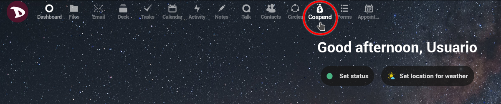
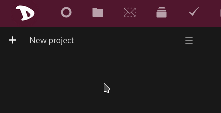
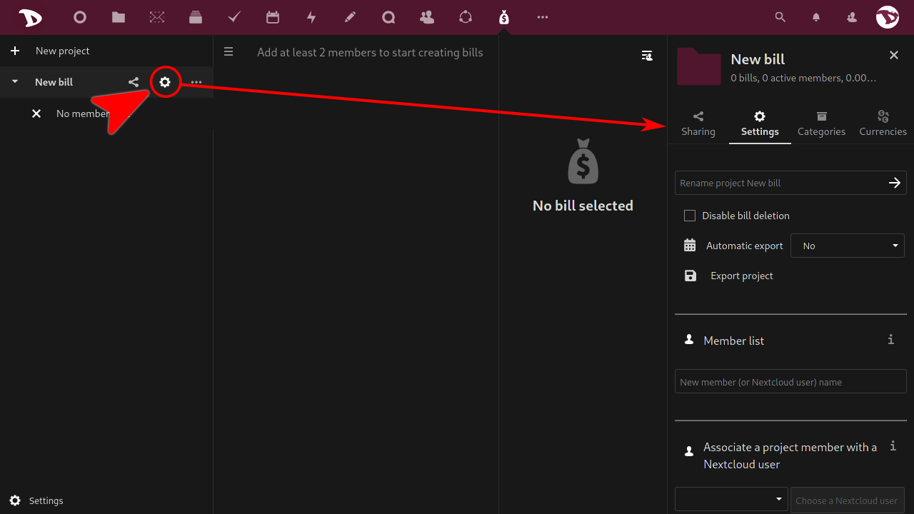
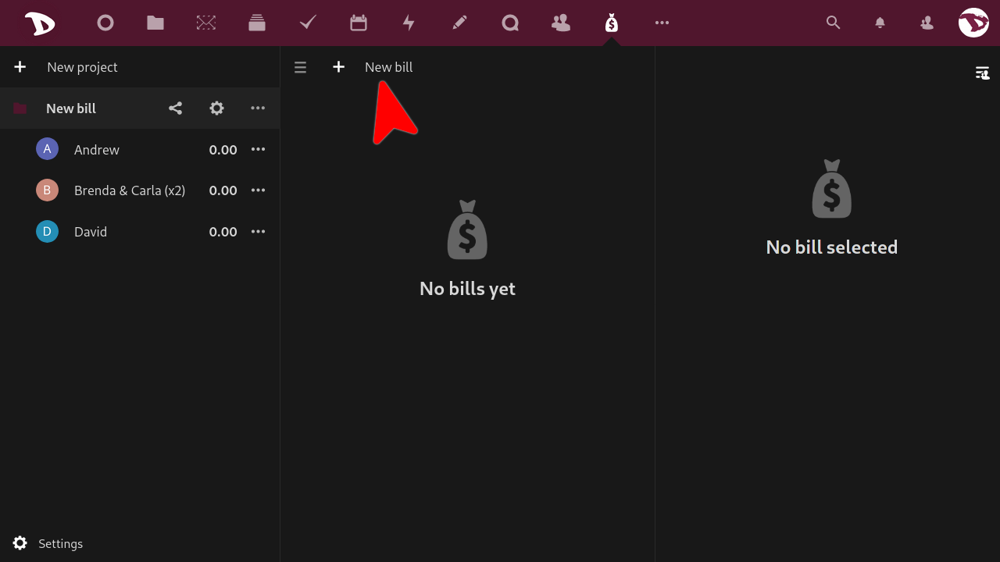
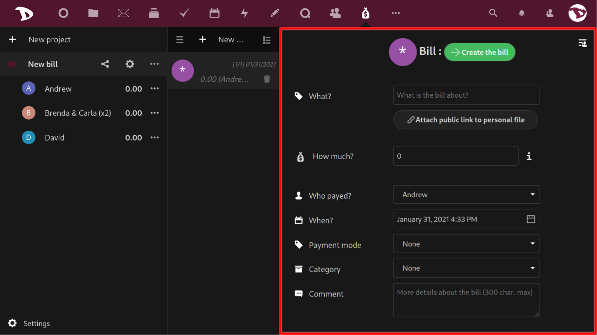
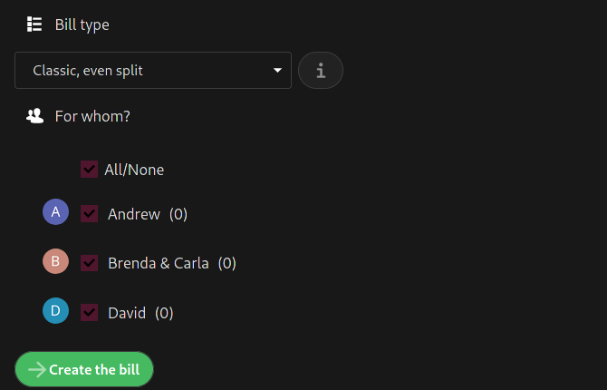
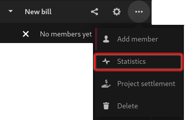
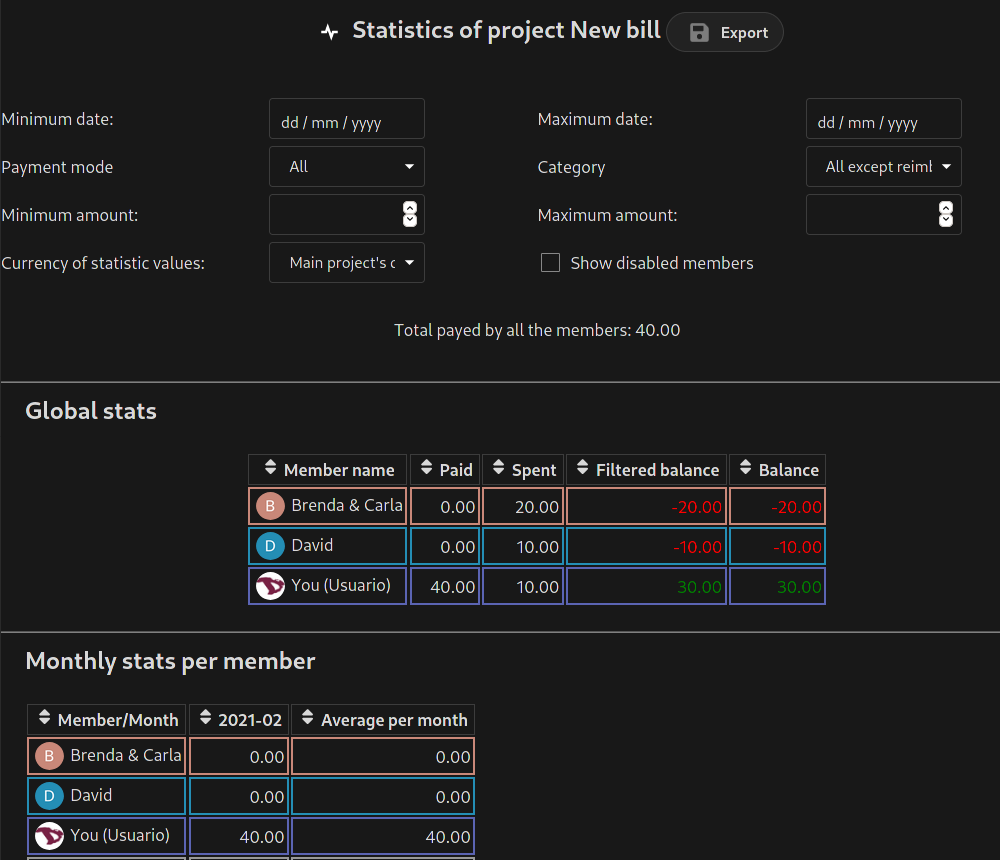
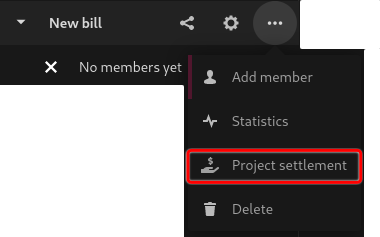
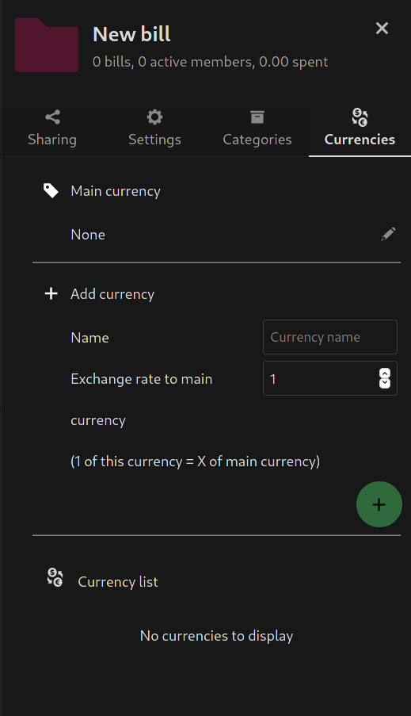

# What is Cospend?
**Cospend** is a group/shared budget manager app. You can use it when you share a house, when you go on vacation with friends or whenever you share money with others.

# How it works?
With **Cospend** you can create a **Project** which is a way of managing expenses and bills of a group of people. A project contains **Members** (any person or sub-group of persons that participates in the project and that has an initial weight of 1) and **Bills** (any expense made by one member that involves one or more members of the same project).

A basic practical example to understand how it works might be the following:

**Andrew**, **Brenda**, **Carla** and **David** want to organize and share the costs of a vacation trip. But since **Brenda** and **Carla** are a couple they want to be added as **one member** (**Brenda & Carla**) with a weight of 2.

- **Andrew** (a member with a weight of 1) pays a 40 euros bill. The balance of **Andrew** will increase to 40.
- This bill involves himself, "**Brenda & Carla**" (a member with a weight of 2) and **David** (a member with a weight of 1). So far the sum of the members weight is 4, which means they have to split the bill in 4 shares:
 - **Andrew** will owe 1 share (10 euros)
 - "**Brenda & Carla**" will owe 2 shares (20 euros) and
 - **David** will owe 1 share also (10 euros)

This example is pretty simple and intuitive but in a scenario with a larger budget and a bigger number of people, things can get complicated. That is when **Cospend** becomes more useful and interesting.

# Create a New Project

After log in, select the **Cospend App**

The first time you use it, it will be empty (of course).

To create a new project just click on the **+ New project** box and type its name.

Now at the right of the project's name you have two shortcuts to the **Panel** and a menu.

- The first one is the **Sharing** shortcut. Click on it to open the **Panel** and manage different sharing options (we will look at them in more detail below).

  

- The second one opens the project **Settings** tab in the **Panel** from where you can manage members and a couple of other options (again, we will look at them in more detail below).

  

- The "three dot" icon opens a menu from where you can add members, see statistics of the project, settle it (this option will show you a possible way to settle the bills and put everyone's balance back to 0) and delete it.

  

## Add a member

To add a member just click on the "three dots" icon and select **Add member**. The right panel will open and you will be able to add a new member from the **Member list** option in the **Settings** tab. You can also add a **Nextcloud** user from the same instance, assign a color, rename and set the weight of the member.

 You can also associate a member with a **Nextcloud** user.

 

 To "disassociate" them, just rename the member's name.

## Add a bill

To add a new bill click on **+ New bill**...

... and a right panel with bill options will be opened.

These options are:

- **What?**: here you can type a sort of title that describes what the bill is about.
- **How much?**: the amount of the bill or the expense made. You can type an amount or simple maths operations and press Enter to get the value (for example, if you write `10+15` and Enter the value will be `25`).
- **How payed?**: select the member who payed the bill.
- **When?**: select the date of the bill.
- **Payment mode**: select how the payment was made.
- **Category**: select a category for the bill.
- **Comment**: here you can add more information or a simple comment about the bill for other members.
- **Repeat**: select if it is a recurrent expense and how often it has to be repeated.  *The bill repetition process runs once a day. If your bills are not automatically repeated, you should contact us so we can check if there is an issue with it*.

Then you have the **Bill type** options.

There are four:

1. **Classic, even split**: by selecting this mode the bill is split equitably between members. _For example: **Andrew** pays a grocery bill and **Brenda & Carla** and **David** agree to share the cost equally._

2. **Even split with optional personal parts**: this mode is similar to the previous one but you can also add an amount related to "personal" expenses from other members. _For example: a collective shop is made at the supermarket but **David** added some personal items that should not be paid by **Andrew** and **Brenda & Carla**._

3. **Custom owed ammount per member**: the bill amount is ignored and you have to select a payer and enter a custom owed amount for each member. Then click on "**Create the bills**" and multiple bills will be created. _For example: **David** pays the dinner bill at the restaurant but there are quite a price difference between what **Brenda & Carla** and **Andrew** ate._

4. **Custom share per member**: this mode is similar to the previous one. The difference is that instead of amounts you set shares. _For example: **Brenda & Carla** pay an hotel bill for a month but **Andrew** was not there the whole month but two weeks. **Andrew** should then pay half a share (0.5) while **Brenda & Carla** and **David** pay a full share (1)._

## Statistics
This option does not require much explanations. Click on it to access a set of statistics that can help you manage your project.

## Settle a project
If for some reason you need to settle the bills in such a way that everyone's balance back to zero, you can use the **Settlement project** option.

You can choose wether to focus the settlement on one particular member and a maximum date after which the bills are not taken into account for it.

# Options and settings

## Sharing a project

In the **Sharing** tab you can:

1. Share the project with another **Nextcloud** users, a group or a circle. Just type the usernames you want to share with and select them.
2. Set access privileges per member:
  - Viewer
  - Participant
  - Maintainer
  - Admin
  - Remove the access to the project
3. Set a password protected access link

4. Or generate a QR code to access the project from the [**MoneyBuster** app](https://f-droid.org/en/packages/net.eneiluj.moneybuster/).

## Project settings

In the **Settings** tab you can:

- Rename a project
- Set automatic export
- Add new members and
- assign them a color
- change a member name
- set the member weight
- or remove a member

4. Associate a project member with a **Nextcloud** user. To do so, just choose a project member and then a **Nextcloud** user to associate with.

## Categories

To get more organized, you can use the **Categories** tab options. Here you can add, edit, create and manage categories for your projects.

## Currencies

Here you can select a main currency, add a new one or set exchange rates.
