# Qu'est-ce que Cospend ?
**Cospend** est une application de gestion de budget de groupe/partagé. Vous pouvez l'utiliser lorsque vous partagez une maison, lorsque vous partez en vacances avec des amis ou lorsque vous partagez de l'argent avec d'autres personnes.

# Comment ça marche ?
Avec **Cospend** vous pouvez créer un **Projet** qui est un moyen de gérer les dépenses et les factures d'un groupe de personnes. Un projet contient des **Membres** (toute personne ou sous-groupe de personnes qui participe au projet et qui a un poids initial de 1) et des **Factures** (toute dépense faite par un membre qui implique un ou plusieurs membres du même projet).

Un exemple pratique de base pour comprendre comment cela fonctionne pourrait être le suivant :

**Andrew**, **Brenda**, **Carla** et **David** veulent organiser et partager les coûts d'un voyage de vacances. Mais comme **Brenda** et **Carla** sont un couple, ils veulent être ajoutés comme **un membre** (**Brenda & Carla**) avec un poids de 2.

- **Andrew** (un membre avec un poids de 1) paie une facture de 40 euros. Le solde de **Andrew** passe à 40.
- Cette facture le concerne lui-même, "**Brenda & Carla**" (un membre avec un poids de 2) et **David** (un membre avec un poids de 1). Jusqu'à présent, la somme des poids des membres est de 4, ce qui signifie qu'ils doivent partager la facture en 4 parts :
 - **Andrew** devra 1 part (10 euros)
 - **Brenda & Carla**" devra 2 parts (20 euros) et
 - **David** devra également une part (10 euros).

Cet exemple est assez simple et intuitif mais dans un scénario avec un budget plus important et un plus grand nombre de personnes, les choses peuvent se compliquer. C'est là que **Cospend** devient plus utile et intéressant.

# Créer un nouveau projet

Après vous être connecté, sélectionnez l'application **Cospend App**.

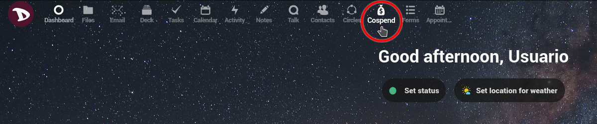

La première fois que vous l'utiliserez, elle sera vide (bien sûr).

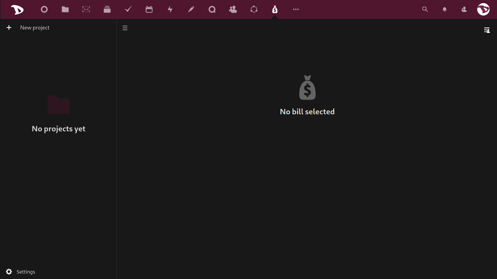

Pour créer un nouveau projet, il suffit de cliquer sur la case **+ Nouveau projet** et de taper son nom.

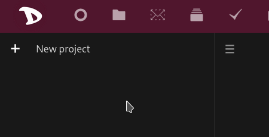

Now at the right of the project's name you have two shortcuts to the **Panel** and a menu.

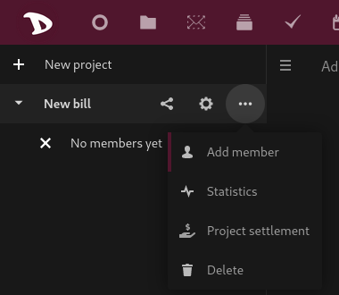

- The first one is the **Sharing** shortcut. Click on it to open the **Panel** and manage different sharing options (we will look at them in more detail below).

  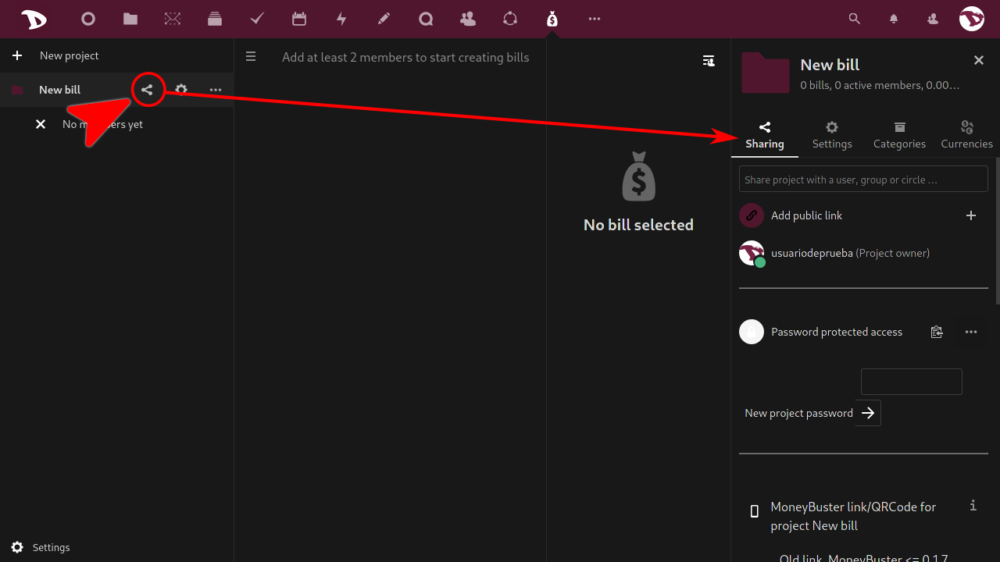

- Le second ouvre l'onglet **Paramètres** du projet dans le **Panneau** à partir duquel vous pouvez gérer les membres et quelques autres options (encore une fois, nous les verrons plus en détail ci-dessous).

  

- L'icône "trois points" ouvre un menu à partir duquel vous pouvez ajouter des membres, voir les statistiques du projet, le régler (cette option vous montrera une manière possible de régler les factures et de remettre le solde de chacun à 0) et le supprimer.

  

## Ajouter un membre

Pour ajouter un membre, il suffit de cliquer sur l'icône "trois points" et de sélectionner **Ajouter un membre**. Le panneau de droite s'ouvrira et vous pourrez ajouter un nouveau membre à partir de l'option **Liste des membres** dans l'onglet **Paramètres**. Vous pouvez également ajouter un utilisateur **Nextcloud** de la même instance, attribuer une couleur, renommer et définir le poids du membre.

 Vous pouvez également associer un membre à un utilisateur **Nextcloud**.

 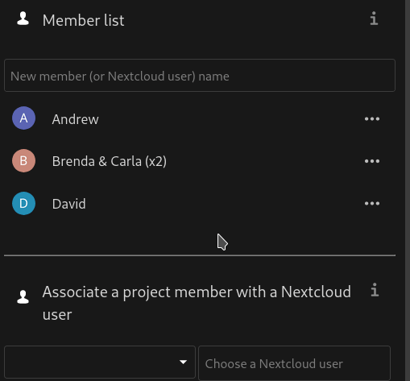

 Pour les "dissocier", il suffit de renommer le nom du membre.

## Ajouter une facture

Pour ajouter une nouvelle facture, cliquez sur **+ Nouvelle facture**...

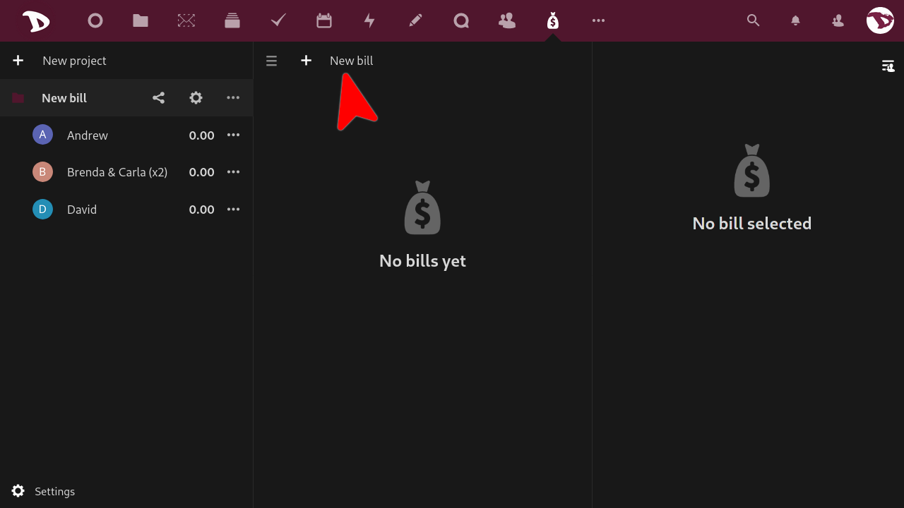

... et un panneau de droite avec les options de la facture s'ouvrira.

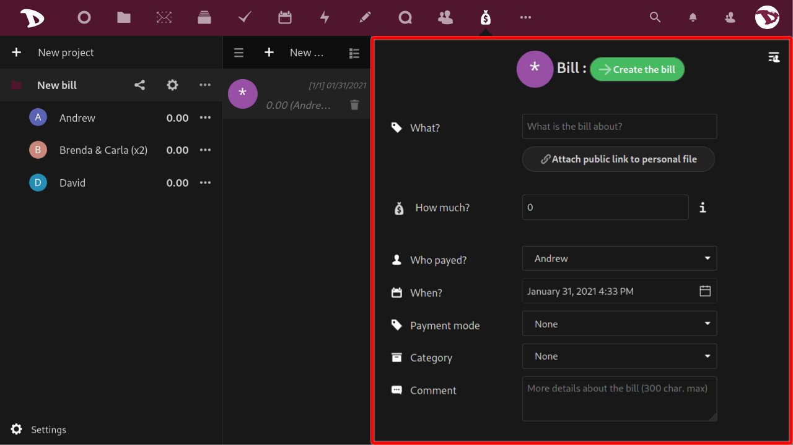

Ces options sont :

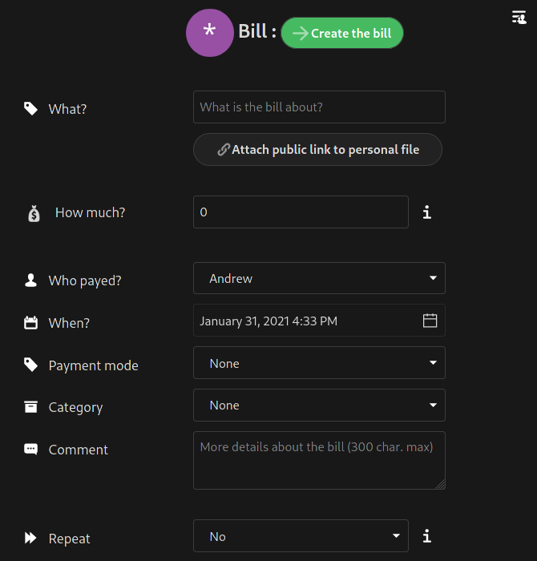

- **Quoi?** : vous pouvez taper ici une sorte de titre qui décrit le sujet de la facture.
- **Combien?** : le montant de la facture ou de la dépense effectuée. Vous pouvez taper un montant ou des opérations mathématiques simples et appuyer sur Entrée pour obtenir la valeur (par exemple, si vous écrivez "10+15" et que vous appuyez sur Entrée, la valeur sera "25").
- ** Comment payé?** : sélectionnez le membre qui a payé la facture.
- **Quand?** : sélectionnez la date de la facture.
- **Mode de paiement** : sélectionnez comment le paiement a été effectué.
- **Catégorie** : sélectionnez une catégorie pour la facture.
- **Commentaire** : vous pouvez ajouter ici plus d'informations ou un simple commentaire sur la facture pour les autres membres.
- **Répétition** : sélectionnez s'il s'agit d'une dépense récurrente et combien de fois elle doit être répétée.  *Le processus de répétition des factures fonctionne une fois par jour. Si vos factures ne sont pas répétées automatiquement, vous devez nous contacter pour que nous puissions vérifier s'il y a un problème à ce sujet*.

Ensuite, vous avez les options de **Type de facture**.

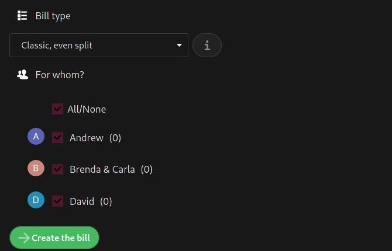

Il y en a quatre :

1. **Classique, partage égal** : en sélectionnant ce mode, la facture est partagée équitablement entre les membres. _Par exemple : **Andrew** paie une facture d'épicerie et **Brenda & Carla** et **David** acceptent de partager le coût de façon égale. _Par exemple : **Andrew** paie une facture d'épicerie et **Brenda & Carla** et **David** acceptent de partager le coût de façon égale. 

2. **Répartition égale avec parties personnelles facultatives** : ce mode est similaire au précédent mais vous pouvez également ajouter un montant lié aux dépenses " personnelles " des autres membres. _Par exemple : un achat collectif est effectué au supermarché mais **David** a ajouté quelques articles personnels qui ne devraient pas être payés par **Andrew** et **Brenda & Carla**._

3. **Montant dû personnalisé par membre** : le montant de la facture est ignoré et vous devez sélectionner un payeur et entrer un montant dû personnalisé pour chaque membre. Ensuite, cliquez sur "**Créer les factures**" et plusieurs factures seront créées. _Par exemple : **David** paie la note du dîner au restaurant mais il y a une sacrée différence de prix entre ce que **Brenda & Carla** et **Andrew** ont mangé.__.

4. **Partage personnalisé par membre** : ce mode est similaire au précédent. La différence est qu'au lieu de montants, vous définissez des parts. _Par exemple : **Brenda & Carla** paient une facture d'hôtel pour un mois mais **Andrew** n'était pas là tout le mois mais deux semaines. **Andrew** devrait alors payer une demi-part (0,5) alors que **Brenda & Carla** et **David** paient une part entière (1)._

## Statistiques
Cette option ne nécessite pas beaucoup d'explications. Cliquez dessus pour accéder à un ensemble de statistiques qui peuvent vous aider à gérer votre projet.

## Régler un projet
Si, pour une raison ou une autre, vous devez régler les factures de manière à ce que le solde de tout le monde revienne à zéro, vous pouvez utiliser l'option **Règlement d'un projet**.

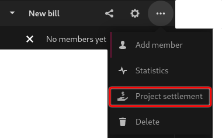

Vous pouvez choisir de concentrer le règlement sur un membre en particulier et une date maximale après laquelle les factures ne sont plus prises en compte pour lui.

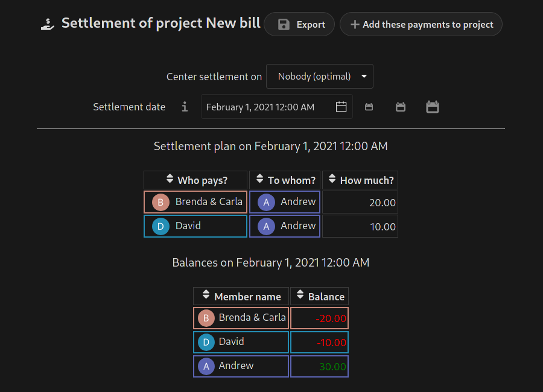

# Options et paramètres

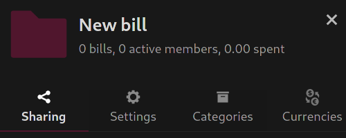

## Partager un projet

Dans l'onglet **Partage** vous pouvez :

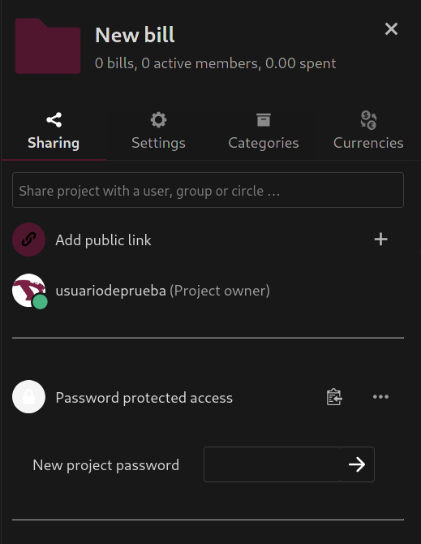

1. Partager le projet avec d'autres utilisateurs **Nextcloud**, un groupe ou un cercle. Il suffit de taper les noms d'utilisateurs avec lesquels vous voulez partager et de les sélectionner.
2. Définissez les privilèges d'accès par membre :
  - Visionneur
  - Participant
  - Mainteneur
  - Administrateur
  - Supprimer l'accès au projet
3. Définir un lien d'accès protégé par un mot de passe

4. Or generate a QR code to access the project from the [**MoneyBuster** app](https://f-droid.org/en/packages/net.eneiluj.moneybuster/).

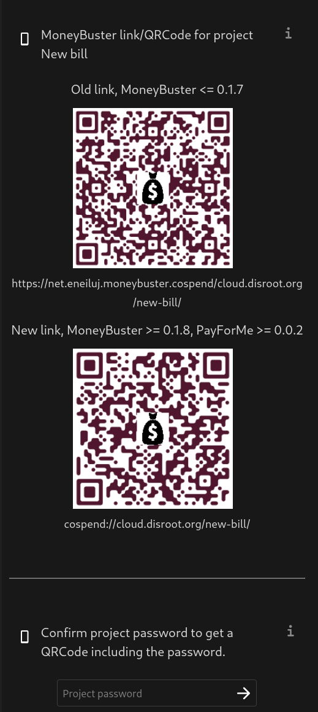

## Project settings

In the **Settings** tab you can:

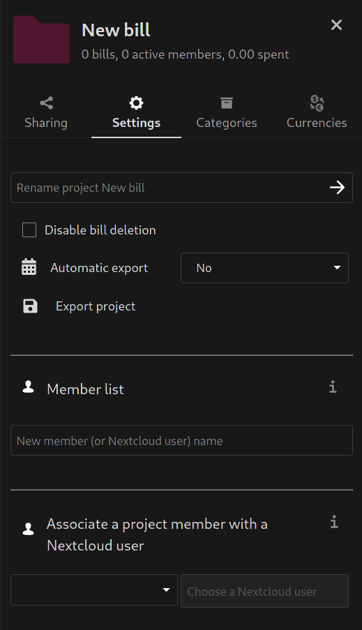

- Rename a project
- Set automatic export
- Add new members and
- assign them a color
- change a member name
- set the member weight
- or remove a member

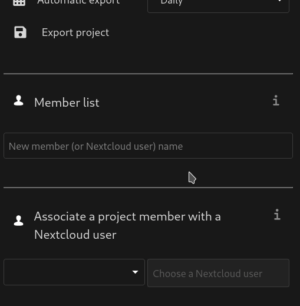

4. Associate a project member with a **Nextcloud** user. To do so, just choose a project member and then a **Nextcloud** user to associate with.

## Categories

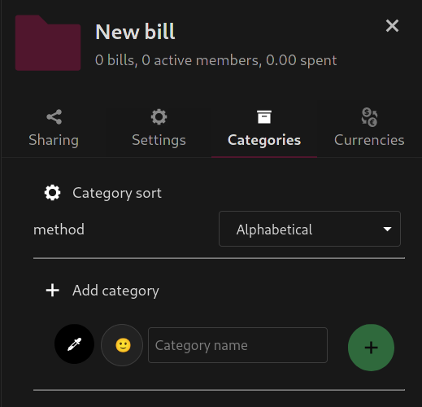

To get more organized, you can use the **Categories** tab options. Here you can add, edit, create and manage categories for your projects.

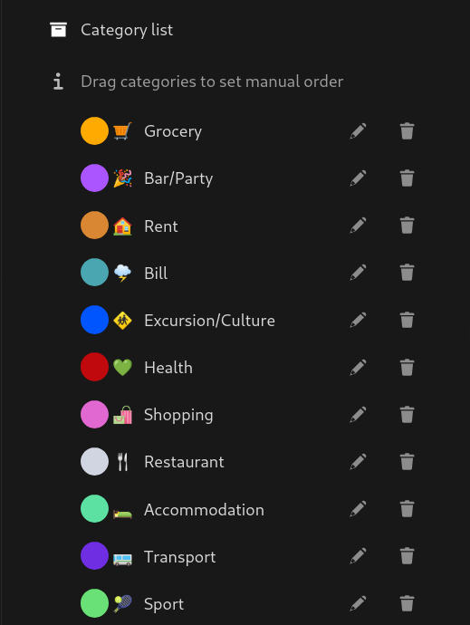

## Devises

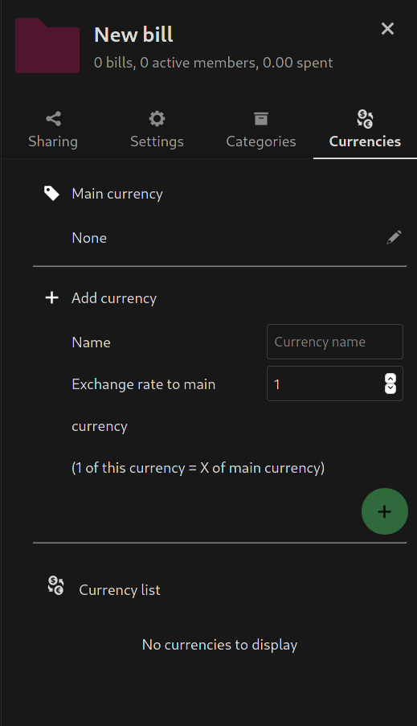

Ici, vous pouvez sélectionner une devise principale, en ajouter une nouvelle ou définir les taux de change.
