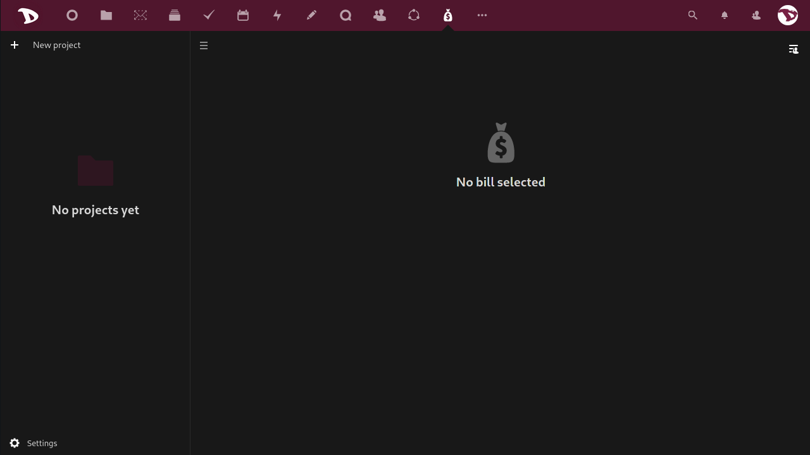
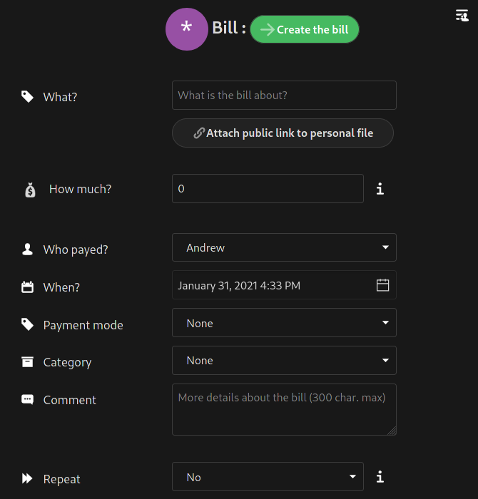
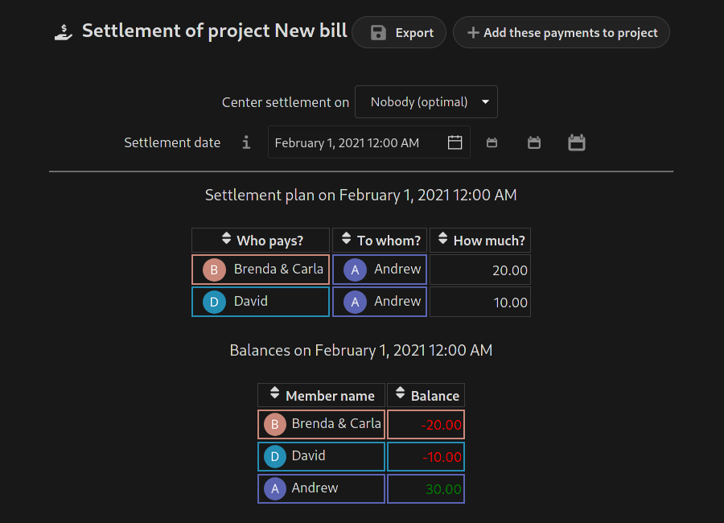
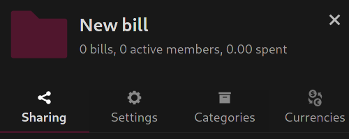
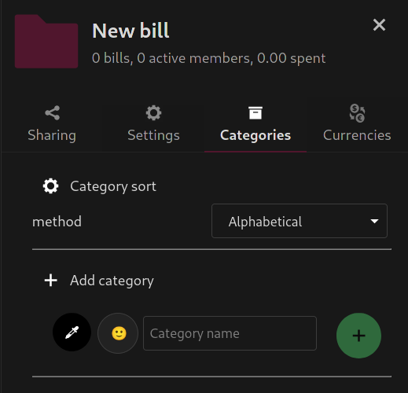

# Come funziona?
Con **Cospend** puoi creare un **Progetto** che è un modo per gestire le spese e le bollette di un gruppo di persone. Un progetto contiene **Membri** (qualsiasi persona o sottogruppo di persone che partecipa al progetto e che ha un peso iniziale di 1) e **Fatture** (qualsiasi spesa effettuata da un membro che coinvolge uno o più membri dello stesso progetto).

Un esempio pratico di base per capire come funziona potrebbe essere il seguente:

**Andrew**, **Brenda**, **Carla** e **David** vogliono organizzare e condividere i costi di un viaggio di vacanza. Ma poiché **Brenda** e **Carla** sono una coppia, vogliono essere aggiunti come **un membro** (**Brenda e Carla**) con un peso di 2.

- **Andrew** (un membro di peso pari a 1) paga una bolletta di 40 euro. Il saldo di **Andrew** salirà a 40.
- Questa fattura coinvolge se stesso, "**Brenda & Carla**" (un membro con un peso di 2) e **David** (un membro con un peso di 1). Finora la somma del peso dei membri è 4, il che significa che devono dividere il conto in 4 parti:
 - **Andrew** dovrà 1 azione (10 euro)
 - "**Brenda & Carla**" dovrà 2 azioni (20 euro) e
 - **David** dovrà anche 1 azione (10 euro)

Questo esempio è piuttosto semplice e intuitivo, ma in uno scenario con un budget più ampio e un numero maggiore di persone, le cose possono complicarsi. È allora che **Cospend** diventa più utile e interessante. 

# Creare un nuovo progetto 

Dopo aver effettuato l'accesso, seleziona l'**App Cospend**

La prima volta che lo usi, sarà vuoto (ovviamente).

Per creare un nuovo progetto basta cliccare sulla casella **+ Nuovo progetto** e digitarne il nome.

Ora a destra del nome del progetto hai due scorciatoie per il **Pannello** e un menu.

- La prima è la scorciatoia **Condivisione**. Fare clic su di esso per aprire il **Pannello** e gestire diverse opzioni di condivisione (le esamineremo più in dettaglio di seguito).

  

- Il secondo apre la scheda **Impostazioni** del progetto nel **Pannello** da cui puoi gestire i membri e un paio di altre opzioni (di nuovo, le esamineremo più in dettaglio di seguito).

  

- L'icona "tre puntini" apre un menu da cui puoi aggiungere membri, vedere le statistiche del progetto, saldarlo (questa opzione ti mostrerà un possibile modo per saldare i conti e riportare il saldo di tutti a 0) ed eliminarlo.

  

## Aggiungi un membro

Per aggiungere un membro basta cliccare sull'icona "tre punti" e selezionare **Aggiungi membro**. Si aprirà il pannello di destra e potrai aggiungere un nuovo membro dall'opzione **Elenco membri** nella scheda **Impostazioni**. Puoi anche aggiungere un utente **Nextcloud** dalla stessa istanza, assegnare un colore, rinominare e impostare il peso del membro.

 Puoi anche associare un membro a un utente **Nextcloud**.

 Per "dissociarli", basta rinominare il nome del membro. 

## Aggiungi una fattura

Per aggiungere una nuova fattura clicca su **+ Nuova fattura**...

... e si aprirà un pannello di destra con le opzioni di fatturazione.

Queste opzioni sono:

- **Cosa?**: qui puoi digitare una sorta di titolo che descriva di cosa tratta il conto.
- **Quanto?**: l'importo della bolletta o la spesa sostenuta. Puoi digitare un importo o semplici operazioni matematiche e premere Invio per ottenere il valore (ad esempio, se scrivi `10+15` e Inserisci il valore sarà `25`).
- **Come si paga?**: seleziona il membro che ha pagato la bolletta.
- **Quando?**: seleziona la data della fattura.
- **Modalità di pagamento**: seleziona come è stato effettuato il pagamento.
- **Categoria**: seleziona una categoria per la fattura.
- **Commento**: qui puoi aggiungere maggiori informazioni o un semplice commento sulla bolletta per gli altri membri.
- **Ripeti**: seleziona se si tratta di una spesa ricorrente e con quale frequenza deve essere ripetuta.  *Il processo di ripetizione della fattura viene eseguito una volta al giorno. Se le tue fatture non vengono ripetute automaticamente, dovresti contattarci in modo che possiamo verificare se c'è un problema con esso*.

Quindi hai le opzioni **Tipo di fattura**. 

Ce ne sono quattro:

1. **Classico, anche diviso**: selezionando questa modalità il conto viene diviso equamente tra i membri. _Ad esempio: **Andrew** paga il conto della spesa e **Brenda & Carla** e **David ** accetta di condividere equamente il costo._

2. **Anche frazionato con parti personali facoltative**: questa modalità è simile alla precedente ma puoi anche aggiungere un importo relativo alle spese "personali" di altri iscritti. _Ad esempio: si effettua un negozio collettivo presso al supermercato ma **David** ha aggiunto alcuni oggetti personali che non dovrebbero essere pagati da **Andrew** e **Brenda & Carla**._

3. **Importo dovuto personalizzato per membro**: l'importo della fattura viene ignorato e devi selezionare un pagatore e inserire un importo dovuto personalizzato per ciascun membro. Quindi fai clic su "**Crea le bollette**" e verranno create più fatture. _Ad esempio: **David** paga il conto della cena al ristorante ma c'è una bella differenza di prezzo tra **Brenda e Carla** e **Andrew** hanno mangiato._

4. **Condivisione personalizzata per membro**: questa modalità è simile alla precedente. La differenza è che invece degli importi imposti le quote. _Ad esempio: **Brenda e Carla** pagano il conto dell'hotel per un mese ma **Andrew** non è stato lì tutto il mese ma due settimane. **Andrew** dovrebbe quindi pagare mezza quota (0,5) mentre **Brenda & Carla** e **David** pagano una quota intera (1)._

## Statistiche
Questa opzione non richiede molte spiegazioni. Cliccaci sopra per accedere a una serie di statistiche che possono aiutarti a gestire il tuo progetto.

## Risolvi un progetto
Se per qualche motivo hai bisogno di saldare i conti in modo tale che il saldo di tutti torni a zero, puoi utilizzare l'opzione **Progetto di liquidazione**.

Puoi scegliere se concentrare la liquidazione su un determinato membro e una data massima dopo la quale le fatture non vengono prese in considerazione.

# Opzioni e impostazioni

 

## Condivisione di un progetto

Nella scheda **Condivisione** puoi:

1. Condividi il progetto con un altro utente **Nextcloud**, un gruppo o una cerchia. Digita semplicemente i nomi utente con cui desideri condividere e selezionali.
2. Imposta i privilegi di accesso per membro:
  - Visualizzatore
  - Partecipante
  - Manutentore
  - Ammin
  - Rimuovere l'accesso al progetto
3. Impostare un collegamento di accesso protetto da password

4. Oppure genera un codice QR per accedere al progetto dall'app [**MoneyBuster**](https://f-droid.org/en/packages/net.eneiluj.moneybuster/).

## Impostazioni del progetto

Nella scheda **Impostazioni** puoi:

- Rinomina un progetto
- Imposta esportazione automatica
- Aggiungi nuovi membri e
- assegna loro un colore
- modificare il nome di un membro
- impostare il peso dell'asta
- o rimuovere un membro

4. Associa un membro del progetto a un utente **Nextcloud**. Per farlo, scegli un membro del progetto e poi un utente **Nextcloud** a cui associarti.

## Categorie

Per essere più organizzato, puoi utilizzare le opzioni della scheda **Categorie**. Qui puoi aggiungere, modificare, creare e gestire le categorie per i tuoi progetti.

## Valute

Qui puoi selezionare una valuta principale, aggiungerne una nuova o impostare i tassi di cambio. 
