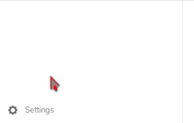
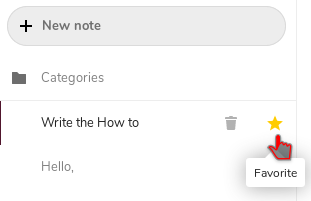
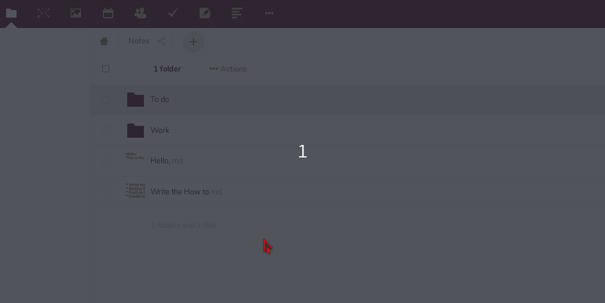
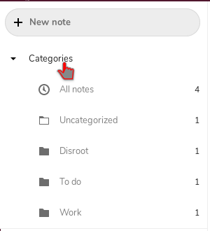

# Notes

Vous pouvez accéder à l'application **Notes** en appuyant sur l'icône notes  {.inline} sur la barre de navigation **Nextcloud**.

## Paramètres

Avant de commencer à créer de nouvelles notes, vous voudrez peut-être d'abord modifier les paramètres.

Dans les paramètres (icône d'engrenage en bas à gauche), vous pouvez choisir le dossier et le format dans lesquels les notes seront enregistrées. Par défaut, les notes seront enregistrées sous forme de fichiers .txt dans le dossier Notes.

 **Remarque : Vous pouvez toujours modifier les paramètres par la suite.**

## Création de notes

Une fois que vos paramètres sont prêts, vous pouvez commencer à créer des notes.

Pour ce faire, il vous suffit de cliquer sur l'icône **+** et de commencer à taper votre note. The note will be saved automatically.

## Favoris

Vous pouvez marquer vos notes comme favorites, afin qu'elles apparaissent en haut de la liste. Vous pouvez le faire en cliquant sur l'icône étoile. 
Clicking the star icon again will remove the Favorite mark.

## Catégories

Il est également possible d'organiser vos notes en catégories. 
Allez dans l'appli fichiers de **Nextcloud** et créez un nouveau dossier avec le nom de la catégorie que vous voulez ajouter dans le dossier Notes. Après cela, vous pouvez déplacer le fichier de notes dans le dossier souhaité.

Maintenant, lorsque vous revenez dans l'application Notes, vous trouverez vos notes classées par catégories.

