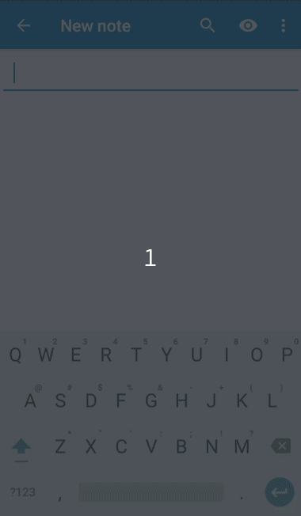
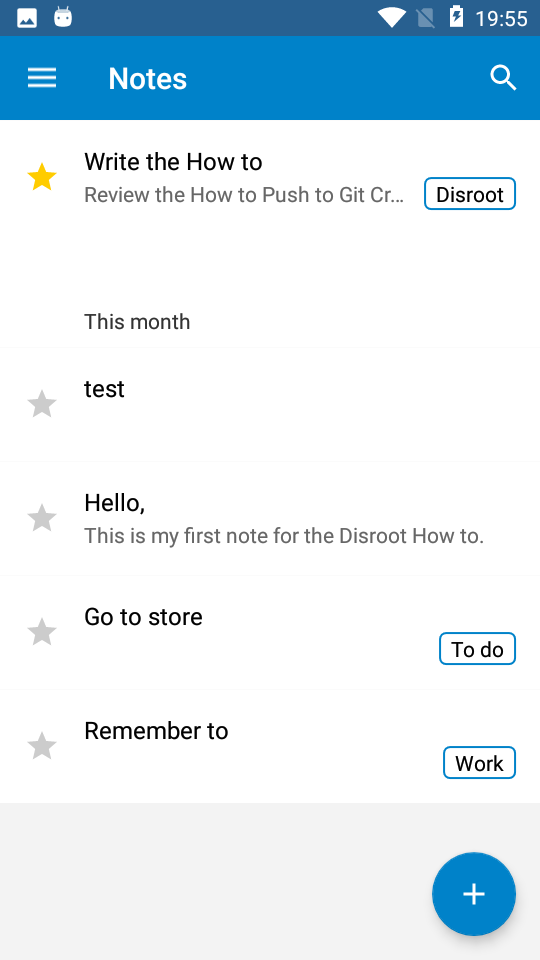

# Note sul cellulare

In questo tutorial ti mostreremo come configurare e utilizzare le note di disroot nel tuo dispositivo Android.

# Installa l'app per le note

Prima di tutto prendi **"Nextcloud Notes"** da [F-Droid](https://f-droid.org/packages/it.niedermann.owncloud.notes/) o da un altro app store commerciale. 

# Aggiungi il tuo account Disroot

Dopo aver avviato l'app *"Note"*, per la prima volta dovrai aggiungere le tue credenziali e l'URL del server cloud disroot. 

- **Indirizzo server:** [https://cloud.disroot.org/](https://cloud.disroot.org/)
- **Nome utente:** Il tuo nome utente Disroot
- **Password:** La tua password Disroot

Dopodiché premi semplicemente "*connetti*".
Le note esistenti dal tuo account cloud disroot dovrebbero ora essere sincronizzate con il tuo telefono. 

# Crea e modifica note

Puoi creare una nuova nota premendo il pulsante *"più"* (**+**) nell'angolo inferiore destro dello schermo. 

L'editor è molto semplice:

* la prima riga della nota è automaticamente il titolo della nota.
* Dopo aver scritto la nota, premi la freccia indietro e l'app salverà automaticamente la nota.
* Avrai alcune opzioni quando premi il menu dei punti dell'albero in alto a destra:
   * **Preferito:** selezionalo se desideri aggiungere la nota ai preferiti
   * **Categoria:** Opzione per classificare la nota in una categoria esistente o nuova
   * **Condividi:** Per condividere la tua nota
   * **Annulla:** per annullare l'ultima modifica
   * **Elimina:** Per rimuovere la nota
* Qualsiasi modifica alle note verrà automaticamente sincronizzata da e verso il disroot cloud. 
L'app Notes utilizza la formattazione Markdown, quindi se la conosci puoi renderli belli. Se ancora non sai cos'è Markdown, dovresti assolutamente controllare [questa pagina](http://lifehacker.com/5943320/what-is-markdown-and-why-is-it-better-for-my-to-do-lists-and-notes). Vedrai che ti cambierà la vita :)

Tutte le note che crei possono essere visualizzate nel menu principale dell'app Nextcloud Note.

* Per modificare un particolare basta premere su di esso.
* Per creare nuove note basta premere il simbolo più. 

# Sfoglia le categorie di note

Se hai ordinato la tua nota in categorie, puoi trovare facilmente le tue note sfogliando le categorie.
Per farlo è necessario toccare il menu dell'hamburger in alto a sinistra. 

Apparirà una barra laterale con tutte le tue categorie.
Seleziona la categoria e verranno elencate tutte le note di quella categoria. 

!! **ATTEZIONE** Eventuali modifiche apportate alle note nell'applicazione Note, note nell'interfaccia Web di Note, note nel client desktop o nel. txt, apparirà in tutti i client e nell'interfaccia web. 
