# Tâches

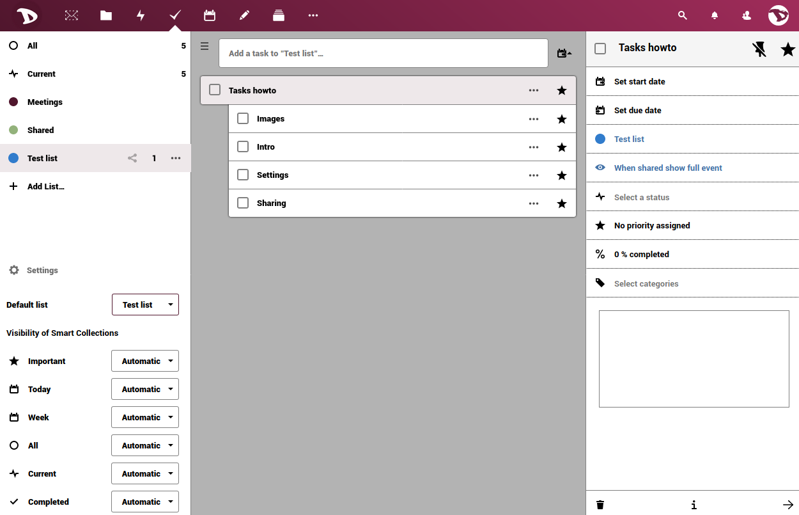

L'application **Tâches** vous permet d'ajouter et de supprimer des tâches, de modifier leur titre, leur description, leur date de début et d'échéance et de les marquer comme importantes. Une tâche peut être le rappel d'une date de réunion, un travail à faire, une activité personnelle ou de groupe et bien d'autres choses encore.

Dans ce petit guide, nous allons voir comment cela fonctionne.

# Ajouter une nouvelle tâche
Pour commencer, cliquez sur **+ Add list...**, écrivez le nom de votre nouvelle liste de tâches et appuyez sur Entrée.

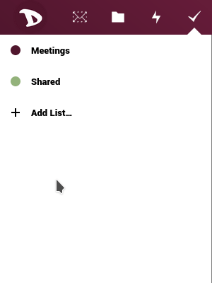

Une fois que tu l'as fait, une nouvelle section apparaîtra à droite.

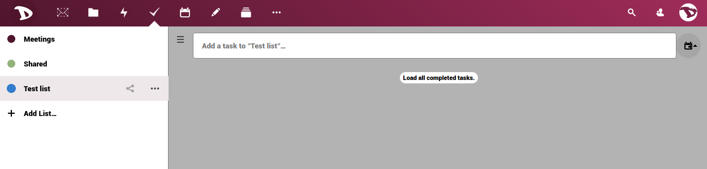

Tapez le nom de la nouvelle tâche que vous voulez ajouter, puis appuyez sur la touche Entrée. Cliquez sur l'icône à trois points à droite si vous voulez ajouter des sous-tâches.

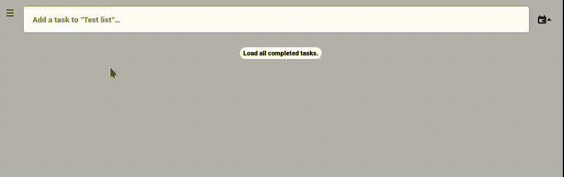

## Options des tâches
Cliquez sur le titre de la tâche ou de la sous-tâche pour accéder aux options.

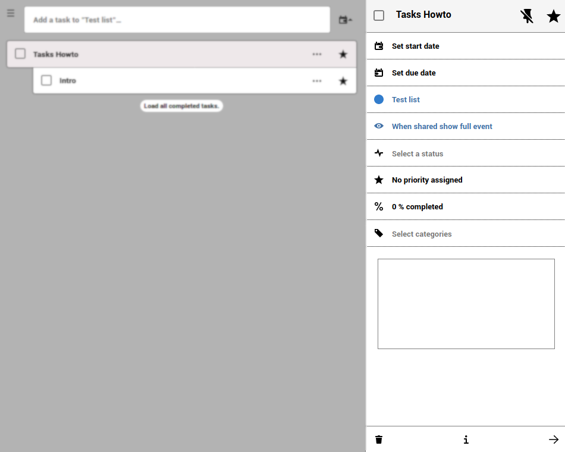

Ici, vous pouvez :

- **Définir la date de début et la date d'échéance** .
En cliquant sur l'option Début/Date d'échéance, vous pouvez définir le jour et l'heure de celle-ci.

  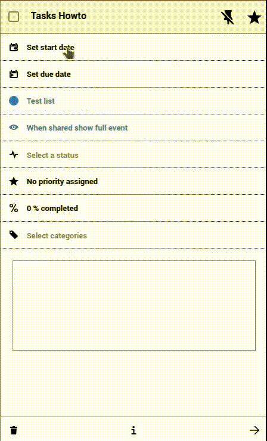

Vous pouvez également définir la tâche comme une activité de toute la journée.

  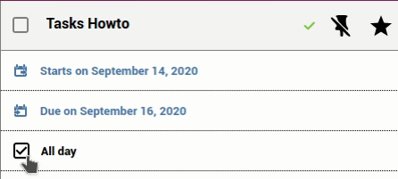

- **Assigner / modifier la liste des tâches** 
Vous pouvez modifier / affecter une tâche ou une sous-tâche à différentes listes ou calendrier. Il suffit d'en sélectionner une dans le menu déroulant et les tâches passeront à la nouvelle liste.

  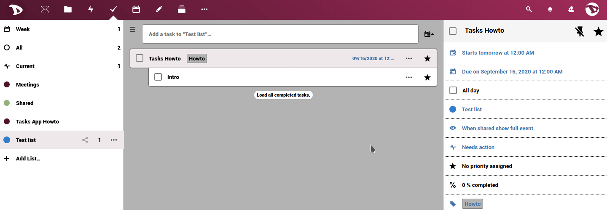

- **Sélectionnez une classification** 
Vous pouvez affecter la liste des tâches à un calendrier précédemment créé et choisir la manière dont elle doit être affichée.

  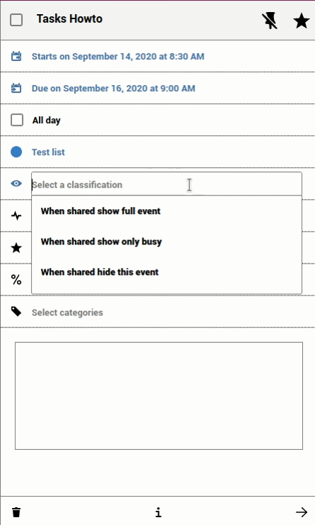

- **Sélectionnez un état** 
Sélectionnez si la tâche **nécessite une action**, si elle est **en cours**, **complétée** ou **annulée**.

  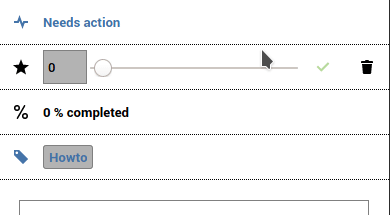

- **Assigner un niveau de priorité à la tâche**.
En déplaçant la barre, vous pouvez définir le niveau de priorité où 1 à 4 est **Haut**, 5 est **Moyen** et 6 à 9 est **Bas**.

  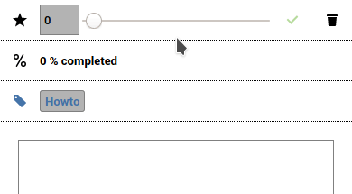

- **Définir et modifier le niveau de progression de la tâche** 
En déplaçant la barre, vous pouvez régler la progression de la tâche de 0% à 100%.

  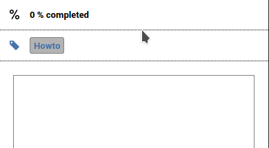

- **Catégories et commentaires** 
L'attribution de catégories et l'ajout de commentaires peuvent être très utiles lorsque vous travaillez en groupe. Cliquez sur **Sélectionner les catégories**, sélectionnez ou créez-en une et appuyez sur Entrée. Pour écrire un commentaire, il suffit de le taper dans la case.

  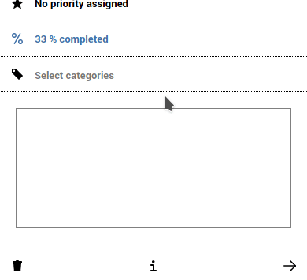

  Lorsque la tâche a une catégorie assignée ou un commentaire ajouté, vous pouvez le voir dans la description, à côté du titre.

  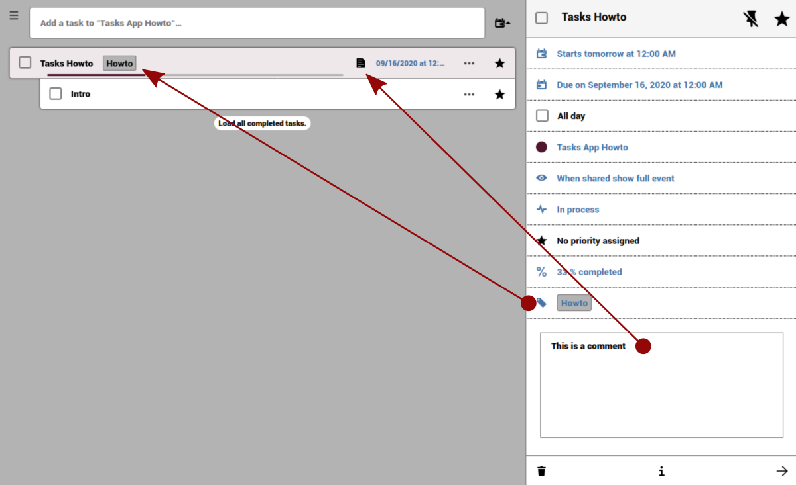

- Enfin, en bas des détails de la tâche, vous verrez une barre avec les options de suppression et d'information.

  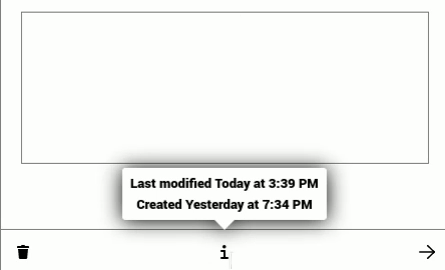
