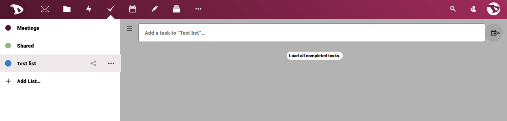
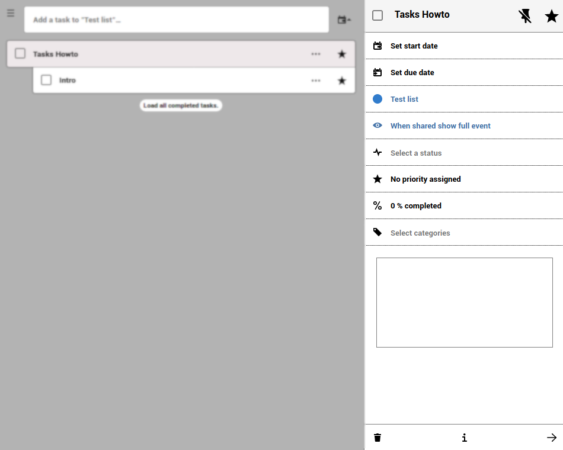
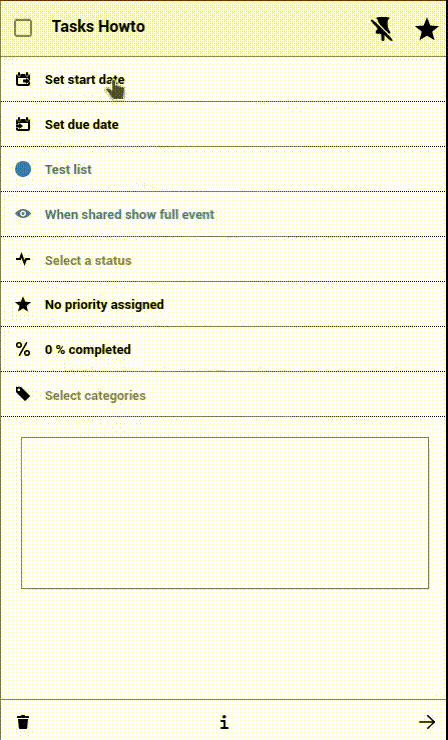
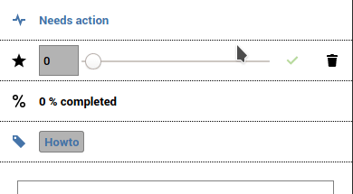
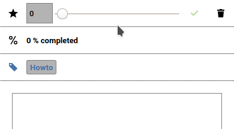
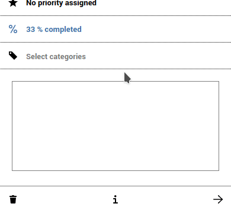

# Tasks

L'app **Attività** ti consente di aggiungere ed eliminare attività, modificarne il titolo, la descrizione, le date di inizio e di scadenza e contrassegnarle come importanti. Un'attività potrebbe essere un promemoria della data di una riunione, un lavoro che deve essere svolto, un'attività personale o di gruppo e molte altre cose.

In questo breve howto vedremo come funziona.

# Aggiungere una nuova attività
Per iniziare, fai clic su **+ Aggiungi elenco...**, scrivi il nome del tuo nuovo elenco di attività e premi invio. 

Una volta fatto, una nuova sezione verrà mostrata a destra. 

Digita il nome della nuova attività che desideri aggiungere e premi invio. Fare clic sull'icona dei tre punti a destra se si desidera aggiungere attività secondarie. 

## Opzioni per le attività
Fare clic sul titolo dell'attività o della sottoattività per accedere alle opzioni. 

Qui si può:

- **Impostare la data di inizio e la data di scadenza** 
Cliccando sull'opzione Inizio/Scadenza puoi impostare il giorno e l'ora. 

 Puoi anche impostare l'attività come attività per tutto il giorno. 

  

- **Assegna/modifica l'elenco delle attività** 
   È possibile modificare/assegnare un'attività o un'attività secondaria a elenchi o calendari diversi. Basta selezionarne uno dal menu a discesa e le attività passeranno a quella nuova. 

- **Seleziona uno stato** 
   Seleziona se l'attività **richiede un'azione**, se è **in elaborazione**, **completata** o **annullata**. 
  

- **Assegna un livello di priorità all'attività**
   Spostando la barra, puoi impostare il livello di priorità dove da 1 a 4 è **Alto**, 5 è **Medio** e da 6 a 9 è **Basso**.   
  

- **Imposta e modifica il livello di avanzamento dell'attività** 
   Spostando la barra, puoi impostare l'avanzamento dell'attività da 0% a 100%. 
   
  

- **Categorie e commenti** 
   L'assegnazione di categorie e l'aggiunta di commenti può essere molto utile quando si lavora in gruppo. Fare clic su **Seleziona categorie**, selezionarne una o crearne una e premere Invio. Per scrivere un commento è sufficiente digitarlo nella casella. 
   
  

Quando all'attività è assegnata una categoria o è stato aggiunto un commento, puoi vederlo nella descrizione, accanto al titolo. 

  

- Infine, nella parte inferiore dei dettagli delle attività vedrai una barra con le opzioni di eliminazione e informazioni. 

  
