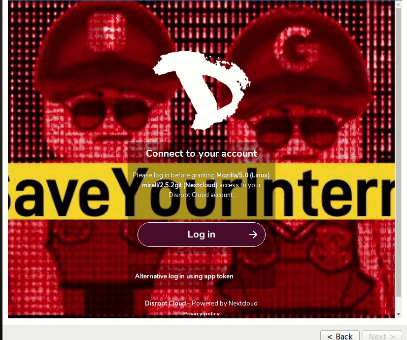
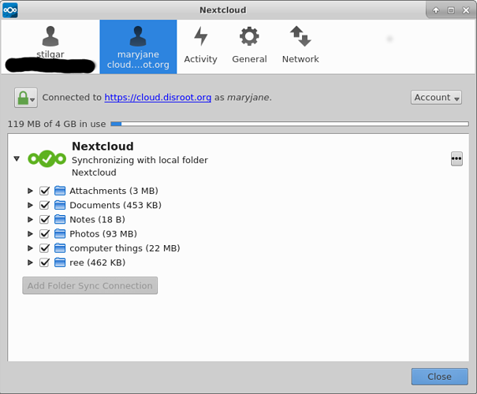

# Cliente para el escritorio de Nextcloud

Utilizar el cliente para escritorio de **Nextcloud** proporciona una manera de sincronizar tus archivos almacenados en tu nube de **Disroot** con una carpeta local en tu ordenador.
Esto significa que puedes acceder/agregar/quitar/editar los archivos en tu cuenta de **Disroot** desde tu escritorio sin necesidad de ingresar a ella a través del navegador. También te permite acceder a ellos sin conexión.

# Instalar la aplicación Nextcloud (cliente)

Si no tienes el cliente de **Nextcloud** instalado en tu ordenador, puedes ver cómo hacerlo [aquí](https://nextcloud.com/install/#install-clients).
Lxs usuarixs de **Ubuntu** y derivados pueden encontrar instrucciones más detalladas [aquí](https://www.c-rieger.de/how-to-install-nextcloud-desktop-client-for-ubuntu/).

# Agregar una nueva cuenta

La primera vez que ejecutas el cliente de **Nextcloud** serás directamente recibido por la configuración de la cuenta.
Agrega la dirección de **Disroot** en el campo Dirección del servidor **https://cloud.disroot.org**, luego presiona "**Siguiente**".

A continuación, ingresa los detalles de tu cuenta de **Disroot**:
Nombre de usuarix: *tu usuarix de Disroot*
Contraseña: *la contraseña de tu cuenta de Disroot*
Luego presiona **"Siguiente"**

Ahora es el momento de elegir qué quieres sincronizar y dónde debería sincronizarse en tu disco duro. Por defecto, el cliente quiere crear una carpeta llamada "Nextcloud" en tu directorio local (/home). Esta carpeta será utilizada para sincronizar todos los archivos que almacenes en tu nube.

Puedes elegir sincronizar todo o seleccionar cuáles carpetas te gustaría tener sincronizadas. Esto es especialmente útil si tu almacenamiento en la nube es enorme y no deseas tener una copia exacta de él en tu ordenador o tu laptop. Esta configuración puede ser cambiada en cualquier momento después.

Una vez que estés feliz con la configuración, sólo haz click en "Conectar".

Y luego **Terminar**
Cualquier archivo que edites en esta carpeta (.txt, hoja de cálculo, documentos) será sincronizado con tu nube de Disroot. Cualquier archivo que quites o agregues será quitado o agregado a tu nube. Esto, claro, funciona también a la inversa. Cualquier modificación realizada a través de la interface de tu nube en Disroot se reflejará en la carpeta sincronizada en tu ordenador, a menos que hayas optado por sincronizar solo un archivo o un directorio en particular.

# Opciones generales

El cliente Nextcloud se abre por defecto en segundo plano. Interactuando con el ícono de Nextcloud en la bandeja de sistema puedes hacer foco en la aplicación.

La aplicación consiste de cuatro pestañas principales:
 - Tu cuenta
 - Actividad
 - General
 - Red

## Tu cuenta
Te da una noción general de cuál es el status actual de tu aplicación. Puedes:
 - ver el estado de cualquier sincronización
 - elegir qué carpetas sincronizar haciendo click en la casilla de selección
 - confirmar la firma de las claves SSL haciendo click en el botón del candado

El botón de Cuenta te permite quitar tu cuenta del cliente de escritorio o agregar una nueva. El cliente funciona con múltiples cuentas. Ni siquiera estás limitadx a utilizar solo cuentas de Disroot. Puedes agregar cualquier cuenta de Nextcloud/Owncloud de cualquier otro servidor (incluso, tu propio servidor, por supuesto).

## Agregando otra cuenta
El procedimiento para agregar una cuenta adicional es el mismo que al agregar la primera. Se te preguntará lo mismo durante la configuración. Lo importante a tener en cuenta: **No puedes usar la misma carpeta de Nextcloud** con varias cuentas activas. Por lo tanto, deberías asegurarte que estás sincronizando en carpetas distintas.

Después de agregar una segunda cuenta, ésta se mostrará en la barra superior de la aplicación. Así es cómo podrás cambiar entre cuentas si necesitas modificar las configuraciones.

## Pestaña Actividad
La pestaña **Actividad** te da una visión general de todos los archivos subidos/descargados/agregados/quitados y los directorios de tus cuentas. Es similar a la aplicación Actividad en la interface de la nube en Disroot.

## Pestaña General
La pestaña **General** te permite:

 - Establecer el límite de tamaño de archivos que descargas a tu carpeta local
 - Establecer mostrar notificaciones en tu escritorio
 - Ejecutar el cliente cuando inicia el sistema

## Pestaña Red

 - Configurar el cliente Nextcloud de escritorio según tus ajustes del proxy (si estás usando uno)
 - Establecer el ancho de banda máximo para descarga y subida (puede ser útil si tu ancho de banda es limitado)

## Compartiendo desde tu escritorio (Sólo MacOS y Windows)

Si usas Windows o MacOS es posible crear links para compartir directamente desde la carpeta local de un archivo o sub-carpeta para ser enviado por correo electrónico a otra persona. Haciendo click derecho sobre el archivo o carpeta

y se presentarán las mismas opciones para compartir que al acceder a los archivos en tu cuenta de Disroot a través del navegador.

Esta característica no existe en Linux :(
Aunque si usas el navegador de archivos Nautilus (GNOME, Unity, etc) podrías instalar un plugin adicional llamado owncloud-client-nautilus (el nombre depende de la distribución, podría ser nextcloud en su lugar).
