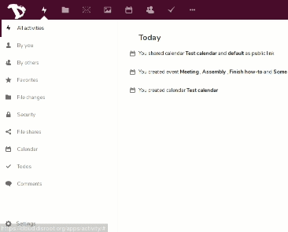
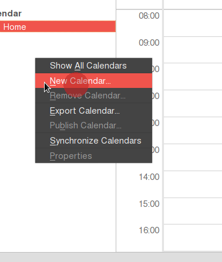
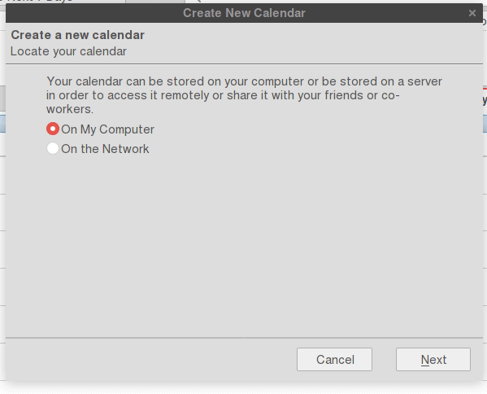
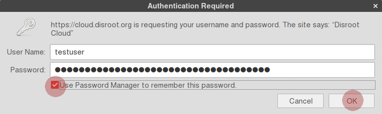
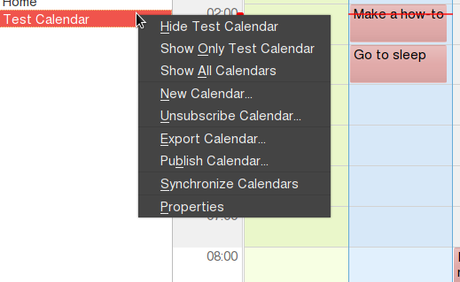
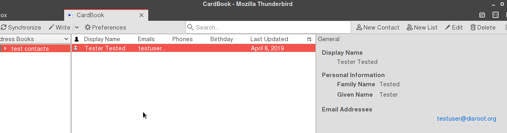
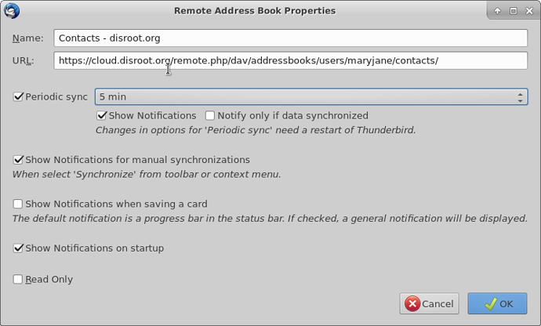

# Sincronizando Contactos, Calendarios y Tareas con Thunderbird

Las funcionalidades **Contactos**, **Calendario** y **Tareas** en la **Nube de Disroot** pueden conectarse a un cliente de correo como **Thunderbird** permitiendo que todos ellos puedan ser gestionados desde un solo lugar en tu escritorio.

# Instalando los complementos (add-ons) necesarios

Para sincronizar tus calendarios, tareas y contactos en **Thunderbird**, necesitarás instalar estos complementos:

- **CardBook** - para sincronizar tus contactos
- **Lightning** - ya viene pre-instalado en **Thunderbird** (si por alguna razón no lo estuviera, puedes seguir el procedimiento que se describe a continuación para hacerlo)

**Instalar CardBook**

- Ve al botón **Mostrar el menú de Thunderbird** en la eaquina superior derecha
- Presiona el botón **Complementos**
- Ve a *Extensiones* en la barra de la izquierda
- Encontrarás una barra de búsqueda. Busca **"Cardbook"** y cuando lo encuentres, presiona *Instalar*
- Reinicia **Thunderbird**

# Integrando el Calendario a Thunderbird

Primero, inicia sesión en tu **[nube de Disroot](https://cloud.disroot.org)**
- Ve a la aplicación **Calendario**
- Selecciona el calendario que desees sincronizar
- Presiona el botón de los **"tres puntos"** a la derecha del calendario
- Presiona **"Link"** y copia el link URL de tu calendario. Lo necesitarás para sincronizar con **Thunderbird**.

Ahora, en **Thunderbird**, puedes ir a:
- Archivo > Nuevo > Calendario o directamente a la ventana Calendario
- Selecciona *"Nuevo calendario"* haciendo click derecho sobre la lista de calendario.

Ahora configura tu nuevo calendario para sincronizar con el remoto
- 1. Selecciona la opción **"En la red"**
- 2. Selecciona la opción **CalDAV**
- 3. En el campo ubicación, pega el link de tu calendario **Disroot** que habías copiado antes.
- Selecciona "Soporte offline", si quieres mantener una copia local de tu calendario, en caso que necesites trabajar fuera de línea
- Presiona **Siguiente**
- Dale a tu calendario un nombre y asígnale un color.
- Luego presiona **Siguiente** y **Finalizar**.

Se te solicitará ingresar las credenciales de tu cuenta de **Disroot**:
- **Usuarix**: *tu_Usuarix_de_Disroot*
- **Contraseña**: *tu_contraseña_de_Disroot*

- Selecciona la opción: **"Usar el Administrador de contraseñas para recordar esta contraseña"**, así no te la solicitará cada vez que abras el cliente.
- Luego presiona **"OK"**

Tu calendario está ahora sincronizado con **Thunderbird** y cualquier evento creado en él aparecerá en la nube de **Disroot** y viceversa.

**¡Nota!**
Si tienes múltiples calendarios en tu cuenta de **Disroot**, simplemente repite este proceso para cada uno de ellos. También puedes asignarles un color diferente a cada uno para mantenerlos separados. Este método funciona para todos los proveedores de **Nextcloud/Owncloud**.
Adicionalmente, puedes sincronizar cualquier calendario de cualquier proveedor en tanto soporten el protocolo caldav (verifica esto con tu proveedor para más detalles).

## Agregando eventos con múltiples calendarios
Si tienes varios calendarios en **Thunderbird**, cuando creas un evento necesitas seleccionar a qué calendario corresponde, de otra manera, quizás termines buscándolo en línea en el lugar equivocado.

## Opciones adicionales
Si haces click derecho sobre los calendarios en **Thunderbird**, tendrás una serie de opciones tales como:

- Mostrar/Ocultar Calendario
- Exportar Calendario
- Dar de baja Calendario (quitarlo de **Thunderbird**)
- Hacerlo de solo lectura (en **Thunderbird**)
- Sincronizar Calendario

# Tareas - Integración con Thunderbird
Las Tareas se sincronizan automáticamente cuando integras un calendario con **Thunderbird**.

Cualquier tarea que crees en **Thunderbird** asociada al calendario en cuestión será sincronizada con la aplicación **Tareas** en tu **nube de Disroot** y viceversa.

# Contactos - Integración con Thunderbird

El procedimiento es similar al de integración de Calendarios en **Thunderbird**. Primero, necesitas obtener el link de los contactos de tu cuenta de **Disroot**.

- Ve a la aplicación **Contactos** en la **nube de Disroot**
- Ve a **Ajustes** (el ícono del "engranaje" abajo en el panel izquierdo).
- Haz click en los **tres puntos** a la derecha de la libreta de direcciones que quieras sincronizar.
- Selecciona **Copiar link**.

El link se ha guardado en el portapapeles de tu máquina, guárdalo, lo necesitarás luego.

En **Thunderbird**:
- Selecciona CardBook (en la barra superior)
- Haz click derecho y selecciona **Nueva Libreta de Direcciones**
- Selecciona **Remoto** y presiona **Siguiente**
- En **URL** pega el link a la libreta de direcciones remota

Ingresa tus credenciales:
- **Usuarix**: *tu_nombre_de_usuarix_de_Disroot*
- **Contraseña**: *tu_contraseña_de_Disroot*
- Presiona **Validar** para verificar que las credenciales sean correctas (no puedes finalizar el proceso sin este paso)
- Click en **Siguiente**

A continuación se te solicitará:
- Seleccionar la Libreta de Direcciones que quieras sincronizar
- Cambiar el nombre de la Libreta si lo deseas (solo afectará a **Thunderbird**)
- Establecer un color para la libreta. En el caso de tener varias libretas de direcciones, podría ser una buena idea utilizar diferentes colores.

- Selecciona **Trabajar fuera de línea** si quieres guardar una copia local en **Thunderbird**
- Haz click en **Siguiente**, y luego en **Finalizar**

Tus contactos en tu cuenta de **Disroot** están ahora sincronizados con la libreta de direcciones remota que creaste en **Thunderbird**.

Cualquier contacto que agregues/quites/edites en tu cuenta será modificado consecuentemente en tu calendario remoto de **Thunderbird** y viceversa.

La sincronización entre el calendario local y el remoto sucede cada pocos minutos pero puedes forzarla haciendo:
- Click derecho on the calendar in question in Thunderbird
- Press **"Synchronize Address Book"**

If you want to move contacts from your Thunderbird Personal Address Book or Collected Addresses to your new remote address book:

- Select and drag the contact to your remote address book.

However it is advised that you create backups of your contacts.

Luego selecciona: Archivo > Nuevo > Libreta de direcciones remota

En el siguiente panel se te solicitará establecer un nombre y la URL:

* El nombre es el que quieras darle a tu libreta de direcciones en **Thunderbird**
* La url es el link que obtuviste ante de la aplicación Contactos en **Disroot**

En este mismo panel puedes establecer sincronizaciones periódicas hasta cada 5 minutos (el valor por defecto es 15 minutos). También puedes configurar que los contactos sean de solo lectura si quieres (si lo haces no podrás editarlos en **Thunderbird**)

Cuando hayas terminado, presiona "ok"

Haz click derecho sobre tu nueva libreta de direcciones remota y selecciona **Sincronizar**.

Se te solicitará ingresar las credenciales de tu cuenta de **Disroot**
**Usuarix**: *tu Usuarix de Disroot*
**Contraseña**: *tu contraseña de Disroot*

Selecciona la opción: **"Usar el Administrador de contraseñas para recordar esta contraseña"**, de esta manera **Thunderbird** la recordará y no la solicitará cada vez que abras el cliente.

Luego presiona **"ok"**

Tus contactos en tu cuenta de **Disroot** están ahora sincronizados con la libreta de direcciones remota que creaste en **Thunderbird**.

Cualquier contacto que agregues/quites/edites en tu cuenta será modificado consecuentemente en tu calendario remoto de **Thunderbird** y viceversa.

Si quieres mover los contactos de tu Libreta de direcciones personal o las Direcciones recopiladas, de **Thunderbird** a tu nueva libreta remota para que sean sincronizadas con tus contactos en **Disroot**, solo selecciona y suelta el contacto a tu libreta remota.

De cualquier manera es aconsejable que hagas respaldos de tus contactos. Por las dudas :wink:
