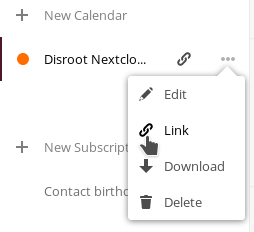

calcurse est "une application de calendrier et de planification pour la ligne de commande",  [d'après son site web](http://calcurse.org/).

Ce tutoriel vous montre comment configurer la synchronisation entre votre calendrier Nextcloud et calcurse.

Note : ce qui suit a été testé sur GNU/Linux avec l'instance Nextcloud hébergée sur Disroot, bien qu'il devrait fonctionner sur d'autres OS de type Unix avec d'autres instances Nextcloud.

## Avant de commencer

Selon le site web du projet, le support CalDAV est actuellement expérimental. Pour cette raison, il est fortement recommandé de faire des sauvegardes, en particulier *avant* la configuration initiale.

Pour plus d'informations sur la façon de sauvegarder (c.-à-d. télécharger une copie locale de) votre calendrier, consultez [cette section](https://howto.disroot.org/en/nextcloud/apps/calendar#delete-edit-download-calendar) dans les pages "Comment faire" howto de l'application Calendrier Nextcloud.

De plus, si vous avez déjà utilisé calcurse localement, vous pouvez sauvegarder le contenu des fichiers de configuration et de la ou des bases de données de calcurse, généralement situés à l'adresse suivante `~/.calcurse/caldav/` (où `~` est votre répertoire personnel).

## Créer un fichier de configuration

Créez un nouveau répertoire à l'adresse suivante `~/.calcurse/caldav/`, créez un nouveau fichier avec le nom `config` à l'intérieur, et copiez et collez le contenu de [cet exemple de fichier de configuration](https://github.com/lfos/calcurse/blob/master/contrib/caldav/config.sample) dedans. Pour le faire rapidement dans le terminal, vous pouvez utiliser les commandes suivantes (cette dernière écrasera votre fichier `config` s'il existe déjà `~/.calcurse/caldav/`):

```
mkdir ~/.calcurse/caldav/
curl https://raw.githubusercontent.com/lfos/calcurse/master/contrib/caldav/config.sample > ~/.calcurse/caldav/config
```

Ensuite, ouvrez le fichier d'exemple de configuration avec votre éditeur de texte favori. S'il s'agit de `nano`, vous pouvez le faire de la façon suivante

```
nano ~/.calcurse/caldav/config
```

Trouvez les lignes suivantes à l'intérieur de `config`:

```
# Host name of the server that hosts CalDAV.
Hostname = some.hostname.com

# Path to the CalDAV calendar on the host specified above.
Path = /path/to/calendar/on/the/server/
```

Remplacez le nom d'hôte par `cloud.disroot.org` et le chemin avec `remote.php/dav/calendars/username/calendar-id/`. Vous pouvez savoir quel est le chemin exact en vous connectant à votre compte Nextcloud, en ouvrant l'application calendrier et, dans la barre latérale gauche, en cliquant sur les trois points à côté du nom du calendrier, puis sur "Lien". Maintenant, vous devriez pouvoir voir et copier un hyperlien qui ressemble à ce qui suit `https://cloud.disroot.org/remote.php/dav/calendars/username/calendar-id/`.



A l'intérieur de `config`, il y a aussi la ligne suivante:

```
DryRun = Yes
```

Ceci est par mesure de sécurité afin que vous puissiez tester votre configuration avant de synchroniser votre calendrier. Laissons les choses en l'état ; nous y reviendrons bientôt.

Maintenant, trouvez les lignes suivantes :

```
#[Auth]
#Username = user
#Password = pass
```

Décommentez les deux premières lignes (y compris l'en-tête). `[Auth]`), c.-à-d. enlever le signe `#` au début de chaque ligne, et remplacer "user" par votre nom d'utilisateur réel.

### Plusieurs façons de gérer votre mot de passe

Une façon de fournir votre mot de passe est de décommenter la ligne pour le mot de passe et de remplacer "pass" par votre mot de passe dans le fichier de configuration. Bien que cela soit pratique car vous n'avez besoin de le faire qu'une seule fois, quiconque a accès à votre dossier d'accueil peut normalement voir quel est votre mot de passe.

Pour cette raison, la [documentation officielle](https://github.com/lfos/calcurse/tree/master/contrib/caldav#usage) mentionne l'utilisation d'un gestionnaire de mots de passe en même temps que l'option `CALCURSE_CALDAV_PASSWORD` à chaque fois que vous démarrez le processus de synchronisation comme alternative. Dans le cas de [pass](https://www.passwordstore.org/), ce serait quelque chose comme :

```
CALCURSE_CALDAV_PASSWORD=$(pass show disroot) calcurse-caldav
```

Si vous utilisez [KeepassXC](https://keepassxc.org/), vous feriez la même chose avec la commande ci-dessous :

```
CALCURSE_CALDAV_PASSWORD=$(keepassxc-cli show mydatabase.kdbx Disroot -k supersecretkeyfile.png -a Password) calcurse-caldav
```

## Tester votre configuration

Pour synchroniser pour la première fois, vous devez lancer la commande `calcurse-caldav` avec l'un des arguments suivants :

```
--init=keep-remote # Supprimee tous les éléments locaux de calcurse et importe les objets distants.
--init=keep-local  # Retire tous les objets distants et pousse les éléments locaux de calcurse.
--init=two-way     # Copie les objets locaux sur le serveur CalDAV et vice versa.
```

En d'autres termes, si, par exemple, vous voulez importer votre calendrier de Nextcloud pour calculer *sans* faire de changements sur Nextcloud la première fois, utilisez `calcurse-caldav --init=keep-remote`.

S'il n'y a pas de message d'erreur, retournez à votre fichier `config` et changer sa valeur de `DryRun` à `No`, et exécutez à nouveau la commande ci-dessus. Pour toute demande de synchronisation ultérieure, `calcurse-caldav` (en option avec la variable `CALCURSE_CALDAV_PASSWORD`, comme nous l'avons déjà mentionné) suffira.

Et c'est tout ! Si tout s'est bien passé, vous devriez avoir une synchronisation entre votre calendrier Nextcloud et calcurse via CalDAV.
