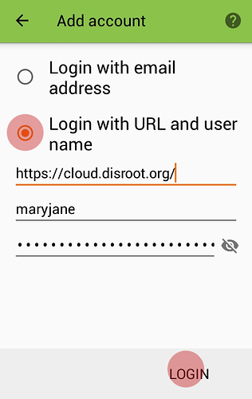
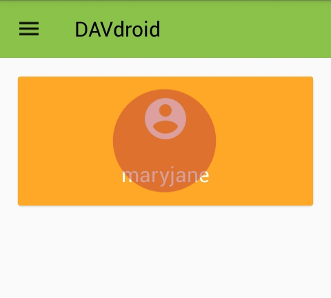
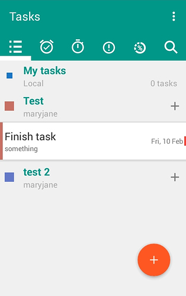
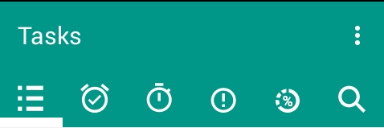

**Disroot** has Calendar, Contacts and Tasks apps enabled.

In this tutorial we'll see how to setup and use them on your **Android** device.

To do this you will need to install the **DAVx⁵** and **Open Tasks** apps.

For **Open Tasks** to work it will need **DAVx⁵** to also be installed, but if you just want to sync your calendar or contacts you don't need to install **Open Tasks**.

----------
# Install DAVx⁵
## From appstore
**DAVx⁵** is available on most app stores. We encourage you to use [F-Droid](https://f-droid.org/).

## From Nextcloud App
If you have **Nextcloud** mobile app installed and linked to your **Disroot** cloud you can install it from there:
 - Open Nextcloud Android App
 - Got to settings > **"Sync calendar and contacts"**

***Nextcloud** App will now fetch, install and configure your account automagically.

 ---------------

## Add your Disroot account to DAVx⁵

If you haven't install **DAVx⁵** via **Nextcloud** App you will have to manually setup an account.
To get started open-up **DAVx⁵** app and press the *"plus"* (**+**) button.

Select "Login with url and username", and fill in with server address and credentials

> Server address: https://cloud.disroot.org 
> Username: your Disroot username 
> Password: your Disroot password

After you setup your account, you need to select which calendars and addressbooks you want to sync from **Disroot** to your **Android** device.
Press the big orange button with the account name.

-------------------

# Calendar
Now your Calendars from**Disroot** will be synced to your device and will appear in your Calendar app of choice. Any event added on the phone will be automatically synced to **Disroot** and vice versa.

After that, the calendars in your **Disroot** account that you selected will be synced and visible in your **Android** device calendar.

---------------------
# Contacts
Your Contacts should be straight away available and synced with **Disroot**.

| **Note**|
|:--:|
|If you want to migrate your **Android** contacts to your **Disroot** contacts and stop syncing with **Google**, then follow [this](https://howto.disroot.org/en/nextcloud/sync-with-your-cloud/android/migrating-contacts-from-google) tutorial.|

---------------------
# Tasks

[Open Tasks](https://f-droid.org/packages/org.dmfs.tasks/) is available in **F-Droid** and other commercial app stores.

If you have already followed previous steps and your **DAVx⁵** account is setup and syncing your calendars from **Disroot** cloud, all the tasks should be available the moment you install and open *"Open Tasks"* app.
All Tasks are assigned to each calendar. Tapping the name of the calendar will reveal the tasks.

**Open Tasks** is easy to use. You can create additional tasks, group them together, add tags, set due dates and notifications, assign priority levels etc.
All changes will be automatically synced back to the cloud. The main page of the app gives you an overview of all current tasks, grouped by:
* Tasks list
* Tasks due
* Tasks starting
* Task priority
* Task in progress

-----------------------
