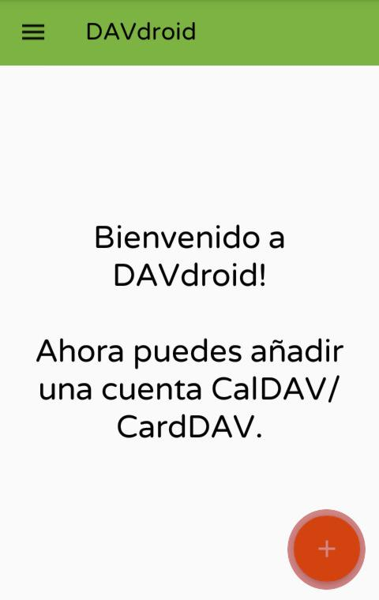
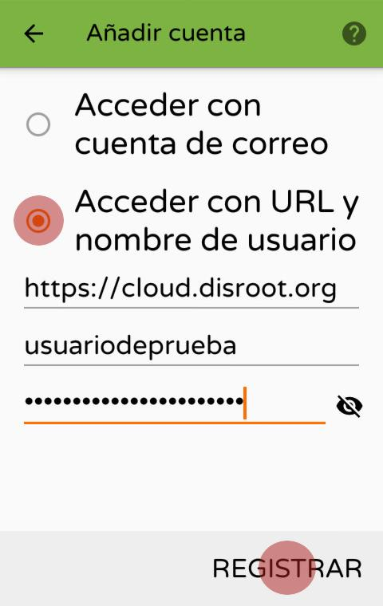
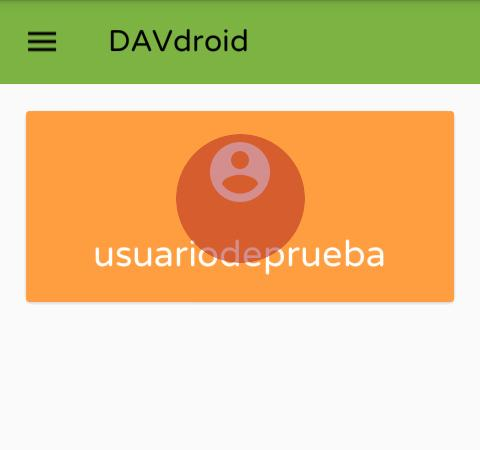
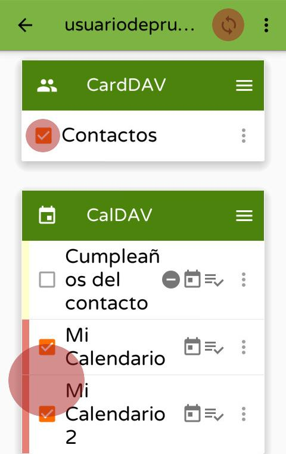
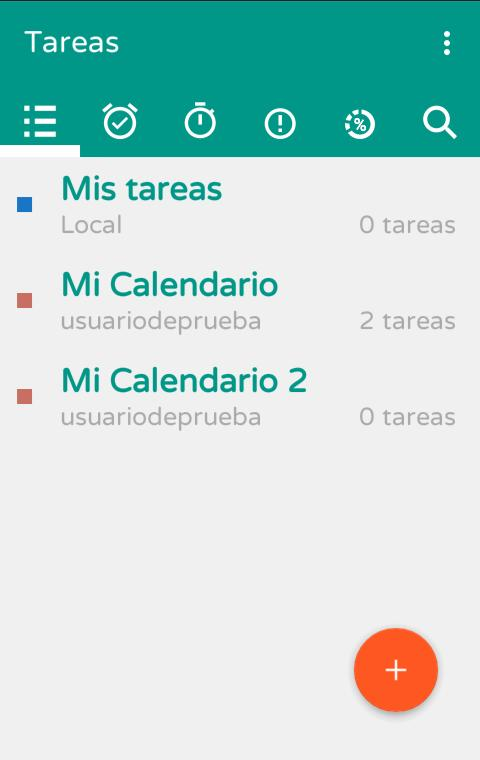
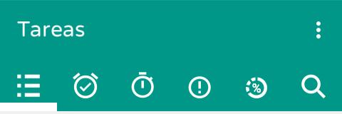

Disroot tiene habilitadas las aplicaciones Calendario, Contactos y Tareas.

En este tutorial te mostraremos cómo configurar y utilizarlas en tu dispositivo con Android.
Para ello, necesitás intalar las aplicaciones DAVdroid y Open Tasks en Android.
Para que Open Tasks funcione, es necesario que la aplicación DAVdroid también sea instalada; pero si sólo quieres sincronizar tu calendario o tus contactos, no necesitas instalar Open Tasks.

----------
# Instalar DAVdroid
## Desde la Tienda de aplicaciones (Appstore)
DAVdroid está disponible en tu Tienda favorita. Nosotros te animamos a utilizar [F-Droid](https://f-droid.org/).

## Desde la aplicación Nextcloud
Si tienes la aplicación para móviles de nextcloud instalada y vinculada a tu nube de Disroot, puedes instalarlas desde allí:
 - Abre la aplicación Nextcloud para Android
 - Ve a Configuración > **"Sincronizar calendario y contactos"**

Ahora, la aplicación de Nextcloud buscará, instalará y configurará tu cuenta automáticamente.

 ---------------

## Agregar tu cuenta de Disroot a DAVdroid

Si no has instalado DAVDroid a través de la aplicación de Nextcloud, tendrás que configurar tu cuenta manualmente.
Para empezar, abre la aplicación "DavDroid" y presiona el botón *"más"* (**+**).

Selecciona "Acceder con URL y nombre de usuario", e introduce la dirección del servidor y tus credenciales

> URL base: https://cloud.disroot.org
> Nombre de usuario: tu nombre de usuario de Disroot
> Contraseña: tu contraseña de Disroot

Luego de configurar tu cuenta, necesitas seleccionar qué calendarios y libretas de direcciones deseas sincronizar desde Disroot a tu dispositivo con Android.
Presiona el botón naranja con el nombre de la cuenta.

-------------------

# Calendario
Ahora tus calendarios de Disroot serán sincronizados a tu dispositivo y aparecerán en la aplicación de Calendario de tu elección. Cualquier evento agregado en el teléfono será automáticamente sincronizado a Disroot y viceversa.

Después de eso, los calendarios en tu cuenta de Disroot que hayas seleccionado serán sincronizados y estarán visibles en el calendario de tu dispositivo con Android.

---------------------
# Contactos
Tus Contactos deberían estar enseguida disponibles y sincronizados con Disroot.
**Nota:**
Si quieres migrar tus contactos de Android a tus contactos de Disroot y dejar de sincronizar con Google, entonces sigue **[este tutorial](../migrating-contacts-from-google)** hecho por @muzirian

---------------------
# Tareas

[Open Tasks](https://f-droid.org/packages/org.dmfs.tasks/) está disponible en F-Droid y otras Tiendas de aplicaciones comerciales.

Si has seguido los pasos previos y tu cuenta de DAVdroid configurada y sincronizada con tus calendarios de Disroot, todas las tareas deberían estar disponibles al momento de instalar y abrir la aplicación *"Open Tasks"*.
Todas las Tareas están asignadas a sus respectivos calendarios. Al tipear el nombre del calendario aparecerán las tareas.

Open tasks es sencillo de usar. Puedes crear tareas adicionales, agruparlas, agregar etiquetas, establecer vencimientos y notificaciones, asignar niveles de prioridad, etc.
Todos los cambios serán automáticamente sincronizados con la nube. La página principal de la aplicación te da un resumen de todas las tareas actuales, agrupadas en:
* lista de tareas
* tareas por vencimiento
* tareas por comienzo
* tareas por prioridad
* tareas por progreso

-----------------------
