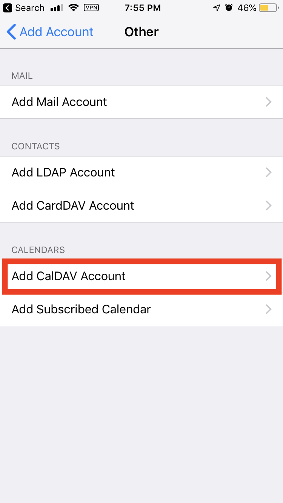

_Ce tutoriel a été mis à jour pour la dernière fois le 15 août 2018_

# But :
**Synchroniser les applications Calendrier iOS et Rappels avec Disroot cloud.**

Cela vous permettra de consulter, mettre à jour et supprimer vos événements et rappels depuis n'importe quel appareil iOS disposant d'une connexion Internet. Une fois que cela fonctionne, et si rien ne buggue, vous n'aurez plus à vous en soucier.

# Exigences

* Votre nom d'utilisateur Disroot
* Mot de passe Disroot
* Un appareil iOS (iPhone, iPad)
* Une connexion Internet fonctionnelle
* 15 minutes

# Configurer le calendrier et la synchronisation des rappels.

1. Allez dans l'application **Paramètres** de votre appareil.
2. Cliquez sur '**Mots de passe et comptes**'.
3. Cliquez sur '**Ajouter un compte**'.
4. Cliquez sur '**Autre**'.

5. Cliquez sur : '**Ajouter un compte CalDAV**'.

6. Sur l'écran suivant, entrez ce qui suit, puis cliquez sur '**Suivant**' :

Dans le menu déroulant :
**Serveur** : `cloud.disroot.org``
**Nom d'utilisateur** : votre nom d'utilisateur (_sans @disroot.org_)
**Mot de passe** : votre mot de passe
**Description** : tout ce que vous voulez.

>Pour plus de sécurité, vous pouvez choisir d'utiliser un mot de passe d'application au lieu de votre mot de passe Disroot principal. Pour ce faire, visitez cloud.disroot.org.
>Une fois connecté, cliquez sur l'image de votre profil en haut à droite, cliquez sur Paramètres, puis sur Sécurité.

7. Sur l'écran suivant, assurez-vous que Calendriers et Rappels sont sélectionnés, puis appuyez sur '**Enregistrer**'.

Maintenant, votre calendrier et les rappels sont ajoutés. Si vous ouvrez maintenant l'application Calendrier, vous verrez vos calendriers. Si vous le souhaitez, allez dans les paramètres de l'application Calendrier et Rappels pour définir vos valeurs par défaut sur Disroot.
