# Nextcloud Desktop Client

Using the **Nexcloud** desktop client provides a way to sync your files stored in your **Disroot Cloud** with a local folder on your computer desktop.
This means you can access/add/remove/edit the files in your **Cloud** from your desktop without the need to log in to your account via web-browser. It also allows you to access them when offline.

---

# Installing the Nextcloud client

The client is already available to install from the Software manager of the following **GNU/Linux** distributions:
- **openSUSE Tumbleweed**
- **Arch Linux** (and distributions based on it)
- **Fedora**

To install it on **Debian/Ubuntu** (and distributions based on it) users can find detailed instructions [**here**](https://launchpad.net/~nextcloud-devs/+archive/ubuntu/client).

To learn how to install the client in other distributions and operating systems, you can check this [**page**](https://nextcloud.com/install/#install-clients).

# Add a new account

The first time you run the **Nextcloud** client an installation wizard will open guiding you through the account setup and some configuration options:

1. Select **Log in**
2. Enter the Server Address: **https://cloud.disroot.org**
3. Press **Next**
4. To connect your account press **Log in**
5. Enter your **Disroot** username and password and **Log in** again
6. **Grant access** to the app
7. Once the client is connected you can close the browser
8. Now you can setup your local cloud folder (we will see this below)

## Two-Factor Authentication login
In case you have enabled the **Two-Factor Authentication (2FA)** method to log in to your **Disroot Cloud**, you will need to enter the code generated by the [**OTP**](https://en.wikipedia.org/wiki/One-time_password) application you use to do so when you configure the **Nexcloud** client and it request access permission:

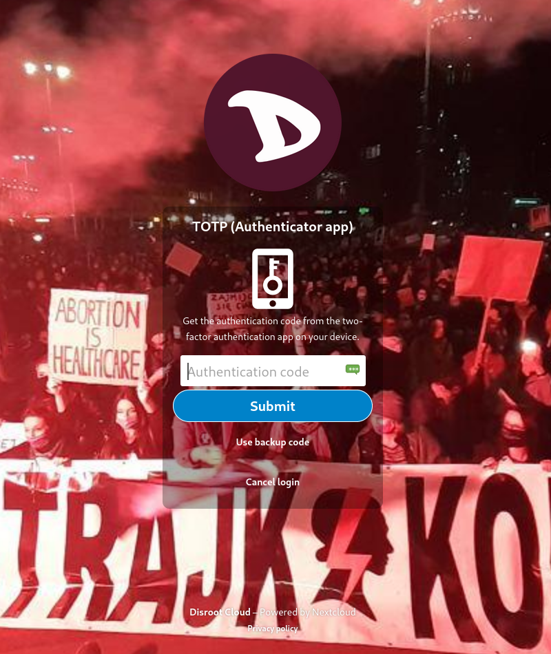

You can read about what it is and how to enable **Two-Factor Authentication** [**here**](https://howto.disroot.org/en/tutorials/cloud/settings#two-factor-authentication).

## Setting up a local folder

Now the final step in adding a new account is to configure the **sync folder** (the local folder where the files you have in the cloud will be synchronized).

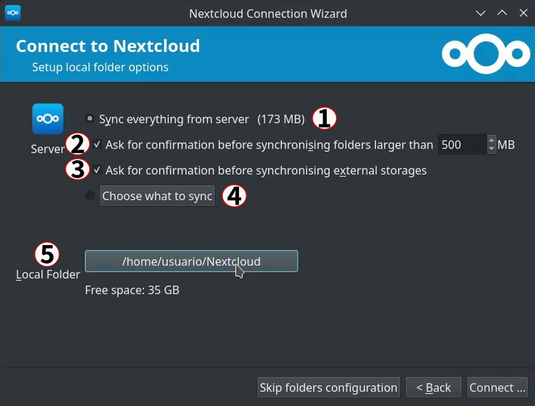

On the local folder options screen you can choose to sync all of your files on the **Disroot Cloud** or select specific folders. The default local sync folder is `Nextcloud`, in your home directory. You can also change it for the folder you want or create a new one.

There are five options in this screen:
  1. By default, the client will try to **Sync everything** on the server. You can also see how much data (measured in MB or GB) you have in your cloud. If you want to sync only specific files or folders, select **Choose what to sync** (4)
  2. Set a limit to not sync any file above a certain size you decided (this can be changed later at any point).
  3. Set to ask for authorization if you want to sync external storages (to know more about External Storage go [**here**](https://howto.disroot.org/en/tutorials/cloud/settings#external-storages))
  4. Select what folders to sync from your **Disroot Cloud** to your machine, by pressing **Choose what to sync**
  5. And select or change the local folder by clicking the Local Folder button.

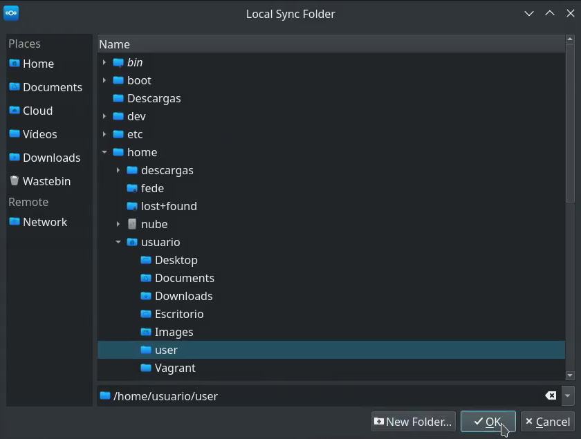

Once you have selected the folder to sync press **OK** and then **Connect...**

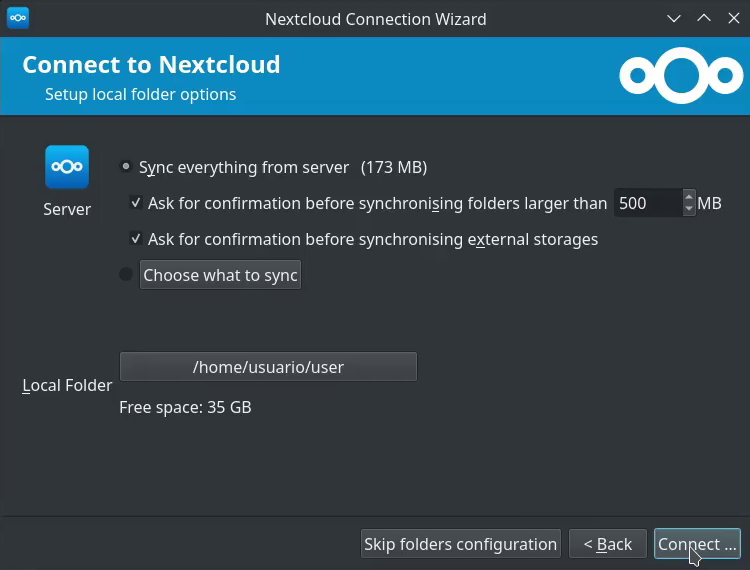

The wizard will close and the client will start synchronizing files and folders (if any) minimized in the desktop task tray.

From the desktop client interface you can access:

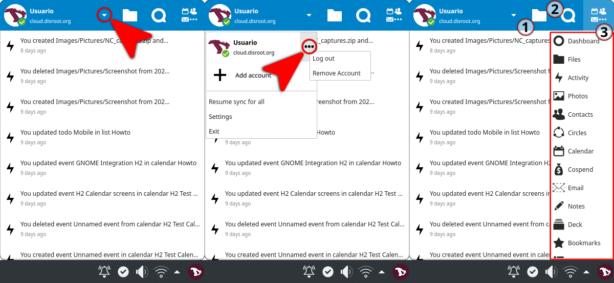

* To a minimal menu from where you can add or remove an account, pause/resume a sync, access the client settings, log out from an account or exit the client by clicking on the down arrow at the right of your username.
* Your local folder (1)
* The **Talk** app (2)*
* The **Apps** (3)*

\* **Talk** and **Apps** will be opened in the browser.

From now on, any file you edit in the local folder on your machine (texts, spreadsheets, pictures, etc) will be synced with your **Disroot Cloud**. So whether you modify, add or remove files in this folder, they will also be modified, added or removed from your **Cloud**. The same will happen with the modifications you make through the web interface and they will be reflected in your local folder, unless you have chosen not to sync a particular file o folder.

## Adding multiple accounts
**Nextcloud** desktop client can work with multiple accounts. You can add any **Nextcloud** account from any other server (including your own server, of course).

To add an extra account the process is the same as the first one.

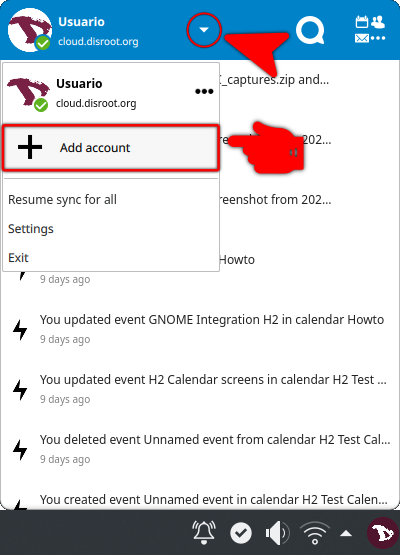

1. Click on the **Nexcloud** client icon in the system tray
2. Select **"Add account"**
3. Follow the same steps as you did to register the first account (you will need to adjust the server address if it is a different server)

!! **NOTE** 
!! Keep in mind that **you cannot use the same Nextcloud folder** with multiple active accounts. 
!! During the configuration process of the second account, **Nextcloud** client will try to create a folder called **Nextcloud2"** in your home directory. Keep an eye to this.

After you add a second account, it will show up on the top bar of the app. This is how you also switch between accounts if you need to change settings.

# Settings

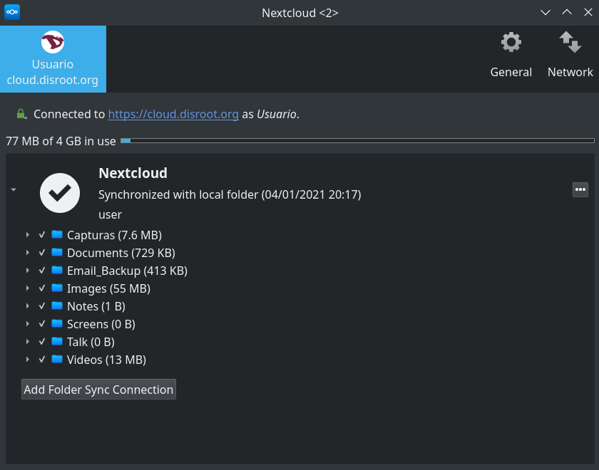

To access the **Nextcloud** client settings just right click on the app icon in the tray and select **Settings**.

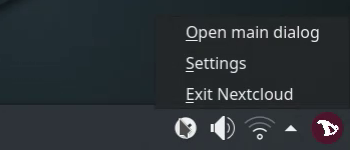

The **Settings** are divided in three main tabs:
1. [Account Settings tab](#account-settings)
2. [General tab](#general-tab)
3. [Network tab](#network-tab)

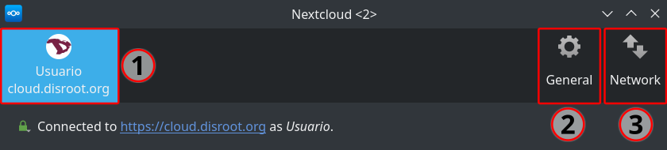

## Account Settings tab
It gives you a general overview of the connected accounts, the synced folders and some options to manage them.

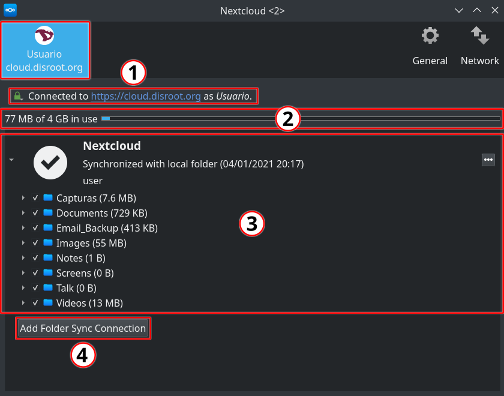

1. **Connected to** 
Indicates the **Nextcloud** server which the client is syncing with, the user account on that server and the signature of the [**SSL keys**](https://en.wikipedia.org/wiki/Public_key_certificate) (you can check it by pressing the green lock icon)

  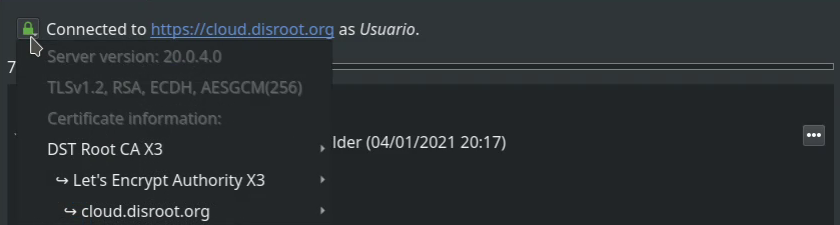

2. **Storage usage** 
  It provides details on the storage used on your **Cloud** account.

3. **Synchronization options** 
  Here you can choose what folders to sync or stop syncing by clicking in the checkbox option and then pressing the **Apply** button on the lower right corner of the window for the changes to take effect.

  By clicking the three dots button you can:

  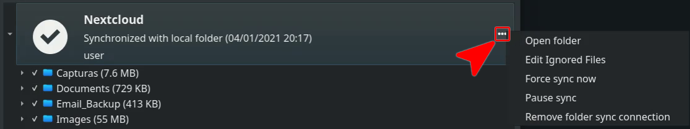

 - Open the local folder

 - Edit Ignored files: click this option to make a list of files which will not be synced between the client and server.

 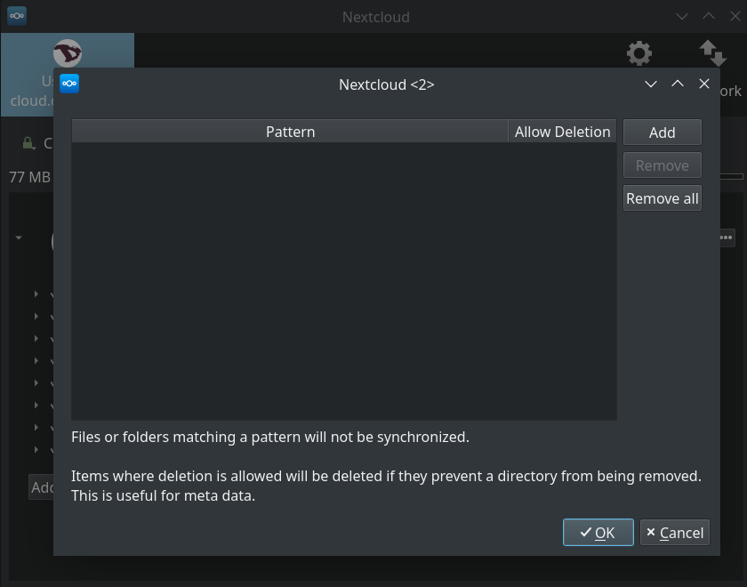

  This option allows you to add patterns for files or directories that you do not want to be included in the sync process. You can use normal characters, wild cards (an asterisk ‘*’ to indicate multiple characters) or a question mark ‘?’ (to indicate a single character).

 - Force/Pause synchronization

 - And remove a selected folder from being synced. This is useful if, for example, you want to sync only one or some folders and not the entire root directory.

4. **Add Folder Sync Connection** 
  You can add another folder to the sync by clicking this button and then selecting the folder on the server to sync with. Keep in mind that the directory and the alias name must be unique, because a server folder can only sync to the client one time. So, if, for example, the sync is to the server root directory it will not be possible to select another folder under the root to sync.

## General tab

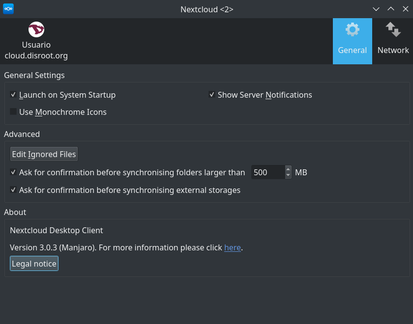

In the **General** tab there are three sections:
1. The **General Settings** section where you can:
  - Set whether or not to launch the **Nextcloud** client when the system starts
  - Set monochromatic icons on the system tray
  - Show (or not) server notifications on the desktop that requires attention

2. The **Advanced** section where you can: 
  - **Edit Ignored Files**: This option works almost the same way as the one on the **Account settings tab**. The client ignores by default some files that are not synced. For example, hidden files or files which their names starts with `~/` or `.`  If you need to change this: 
    a. Press this **Edit Ignored Files** button 
    b. Then select the **Sync hidden files** option (if you want to sync all hidden files) 
    c. Press the checkbox options to edit manually what files to allow to sync 
    d. Click on **Add** to add new rules for files to ignore 
    e. And finally press **OK** when you are done 
    f. You can also set the rules back to the original setting by pressing **Restore Defaults** 

  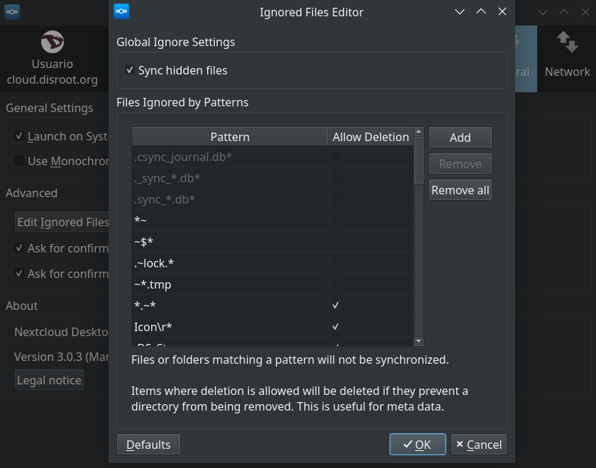

  - Set a size limit for files that you download to your local folder

  - Set if the client should ask permission to sync External Storages

3. The **About** section where you can see the client version and the legal notice

## Network tab

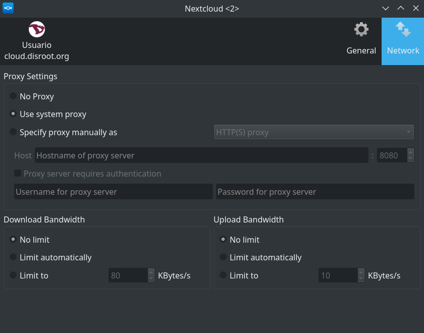

Finally, through this tab you can:
 - Configure the proxy settings for your **Nextcloud** client (if you are using a proxy)
 - And set bandwidth limits for download/upload
