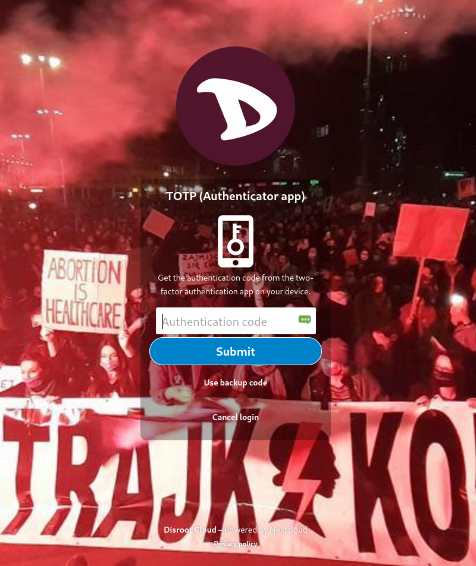
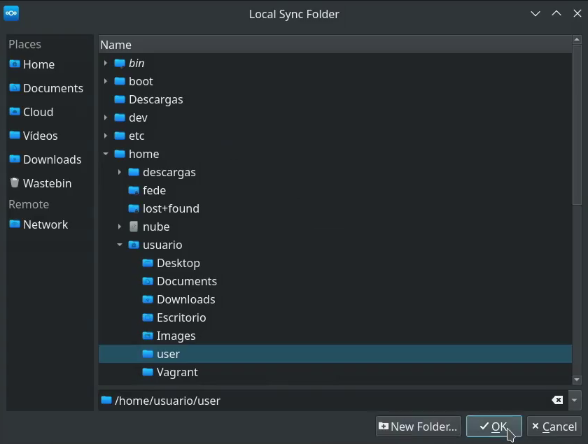
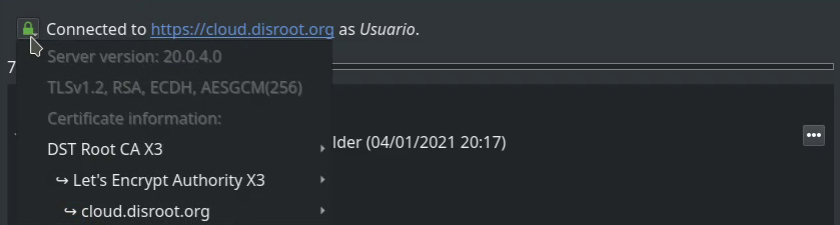
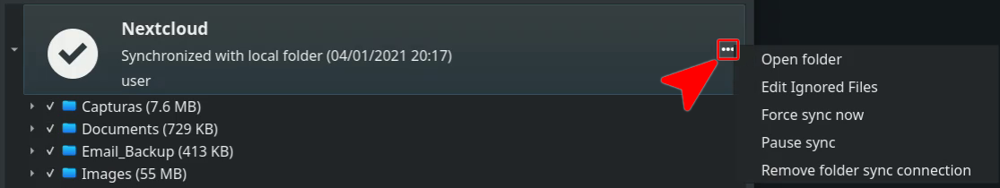
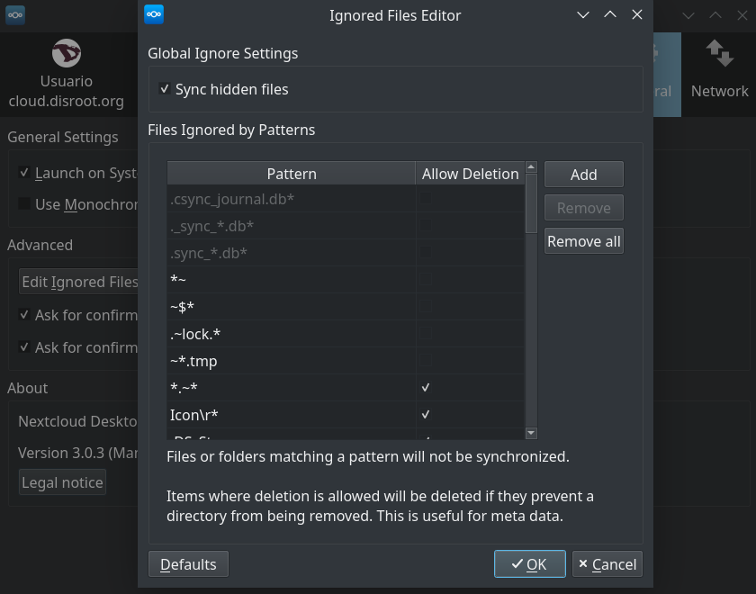

# Client de synchronisation Nextcloud

L'utilisation du client Nextcloud Desktop Client vous permet de synchroniser vos fichiers stockés dans votre cloud Disroot avec un dossier local sur votre bureau.
Ce qui signifie que vous pouvez accéder/ajouter/supprimer/éditer les fichiers de votre compte Disroot sur votre bureau sans avoir besoin de vous connecter à votre compte via un navigateur web.

# Installer l'application Nexcloud (client)

Si vous n'avez pas encore installé Nextcloud-client sur votre bureau, vous pouvez voir comment le faire [ici](https://nextcloud.com/install/#install-clients].
Pour les utilisateurs d'Ubuntu et des distributions basées sur Ubuntu, vous pouvez trouver des instructions plus détaillées [ici](https://www.c-rieger.de/how-to-install-nextcloud-desktop-client-for-ubuntu/].

# Ajouter un nouveau compte

La première fois que vous exécutez le client **Nextcloud**, un assistant d'installation s'ouvre et vous guide à travers la configuration du compte et certaines options de configuration :

1. Sélectionnez **Log in**.
2. Saisissez l'adresse du serveur : **https://cloud.disroot.org**
3. Appuyez sur **Suivant**.
4. Pour connecter votre compte, appuyez sur **Log in**.
5. Entrez votre nom d'utilisateur et votre mot de passe **Disroot** et **Log in** à nouveau.
6. **Accordez l'accès** à l'application
7. Une fois le client connecté, vous pouvez fermer le navigateur.
8. Maintenant vous pouvez configurer votre dossier cloud local (nous verrons cela ci-dessous)

## Connexion par authentification à deux facteurs
Si vous avez activé la méthode d'authentification **à deux facteurs (2FA)** pour vous connecter à votre **Disroot Cloud**, vous devrez saisir le code généré par l'application [**OTP**](https://en.wikipedia.org/wiki/One-time_password) que vous utilisez pour ce faire lorsque vous configurez le client **Nexcloud** et qu'il demande une autorisation d'accès :

Vous pouvez lire ce que c'est et comment activer **l'authentification à deux facteurs** [**ici**](https://howto.disroot.org/en/tutorials/cloud/settings#two-factor-authentication).

## Configuration d'un dossier local

La dernière étape de l'ajout d'un nouveau compte consiste à configurer le **dossier de synchronisation** (le dossier local où les fichiers que vous avez dans le nuage seront synchronisés).

Sur l'écran des options du dossier local, vous pouvez choisir de synchroniser tous vos fichiers sur le **Disroot Cloud** ou sélectionner des dossiers spécifiques. Le dossier de synchronisation locale par défaut est `Nextcloud`, dans votre répertoire personnel. Vous pouvez aussi le changer pour le dossier que vous voulez ou en créer un nouveau.

Il y a cinq options dans cet écran :
  1. Par défaut, le client va essayer de **Synchroniser tout** sur le serveur. Vous pouvez également voir la quantité de données (mesurée en Mo ou Go) que vous avez dans votre cloud. Si vous souhaitez synchroniser uniquement des fichiers ou des dossiers spécifiques, sélectionnez **Choisir ce qui doit être synchronisé** (4).
  2. Définissez une limite pour ne pas synchroniser tout fichier dépassant une certaine taille que vous avez décidée (ceci peut être modifié ultérieurement à tout moment).
  3. Paramétrez pour demander une autorisation si vous voulez synchroniser des stockages externes (pour en savoir plus sur le stockage externe, allez [**ici**] (https://howto.disroot.org/en/tutorials/cloud/settings#external-storages)).
  4. Sélectionnez les dossiers à synchroniser depuis votre **Disroot Cloud** vers votre machine, en appuyant sur **Choisir ce qui doit être synchronisé**.
  5. Et sélectionnez ou modifiez le dossier local en cliquant sur le bouton Dossier local.

Une fois que vous avez sélectionné le dossier à synchroniser, appuyez sur **OK** et ensuite sur **Connect...**.

L'assistant se ferme et le client commence à synchroniser les fichiers et les dossiers (s'il y en a) minimisés dans la barre des tâches du bureau.

Depuis l'interface client du bureau, vous pouvez accéder :

* À un menu minimal à partir duquel vous pouvez ajouter ou supprimer un compte, mettre en pause/reprendre une synchronisation, accéder aux paramètres du client, vous déconnecter d'un compte ou quitter le client en cliquant sur la flèche vers le bas à droite de votre nom d'utilisateur.
* Votre dossier local (1)
* L'application **Talk** (2)
* Les **Apps** (3)*

\* **Talk** et **Apps** seront ouverts dans le navigateur.

À partir de maintenant, tout fichier que vous modifiez dans le dossier local de votre machine (textes, feuilles de calcul, images, etc.) sera synchronisé avec votre **Disroot Cloud**. Ainsi, si vous modifiez, ajoutez ou supprimez des fichiers dans ce dossier, ils seront également modifiés, ajoutés ou supprimés de votre **Cloud**. Il en va de même pour les modifications que vous effectuez via l'interface Web et qui seront répercutées dans votre dossier local, sauf si vous avez choisi de ne pas synchroniser un fichier ou un dossier particulier.

## Ajout de plusieurs comptes
Le client de bureau **Nextcloud** peut fonctionner avec plusieurs comptes. Vous pouvez ajouter n'importe quel compte **Nextcloud** à partir de n'importe quel autre serveur (y compris votre propre serveur, bien sûr).

Pour ajouter un compte supplémentaire, le processus est le même que pour le premier compte.

1. Cliquez sur l'icône du client **Nexcloud** dans la barre d'état système.
2. Sélectionnez **"Ajouter un compte "**.
3. Suivez les mêmes étapes que pour l'enregistrement du premier compte (vous devrez ajuster l'adresse du serveur s'il s'agit d'un serveur différent).

!! **Remarque** 
!! Gardez à l'esprit que **vous ne pouvez pas utiliser le même dossier Nextcloud** avec plusieurs comptes actifs.  !
!! Pendant le processus de configuration du deuxième compte, le client **Nextcloud** essaiera de créer un dossier appelé **Nextcloud2"** dans votre répertoire personnel. Keep an eye to this.

Après avoir ajouté un deuxième compte, celui-ci apparaîtra dans la barre supérieure de l'application. This is how you also switch between accounts if you need to change settings.

# Paramètres

Pour accéder aux paramètres du client **Nextcloud**, il suffit de faire un clic droit sur l'icône de l'application dans la barre des tâches et de sélectionner **Paramètres**.

Les **Paramètres** sont divisés en trois onglets principaux :
1. [Onglet Paramètres du compte](#account-settings)
2. [Onglet général](#general-tab)
3. [Onglet Réseau](#network-tab)

## Onglet Paramètres du compte
Cela vous donne un aperçu général des comptes connectés, des dossiers synchronisés et de certaines options pour les gérer.

1. **Connecté à** 
Indique le serveur **Nextcloud** avec lequel le client se synchronise, le compte d'utilisateur sur ce serveur et la signature des [**clés SSL**](https://en.wikipedia.org/wiki/Public_key_certificate) (vous pouvez la vérifier en appuyant sur l'icône de verrouillage verte).

  

  2. **Utilisation du stockage** 
  Il fournit des détails sur le stockage utilisé sur votre compte **Cloud**.

  3. **Options de synchronisation** 
  Ici, vous pouvez choisir les dossiers à synchroniser ou arrêter la synchronisation en cliquant sur l'option de la case à cocher, puis en appuyant sur le bouton **Appliquer** dans le coin inférieur droit de la fenêtre pour que les changements prennent effet.

  En cliquant sur le bouton à trois points, vous pouvez :

    

  - Ouvrir le dossier local

  - Editer des fichiers ignorés : Cliquez sur cette option pour faire une liste des fichiers qui ne seront pas synchronisés entre le client et le serveur.

   

  Cette option vous permet d'ajouter des modèles pour les fichiers ou les répertoires que vous ne souhaitez pas inclure dans le processus de synchronisation. Vous pouvez utiliser des caractères normaux, des caractères de remplacement (un astérisque '*' pour indiquer plusieurs caractères) ou un point d'interrogation " ?" (pour indiquer un seul caractère).

  - Forcer/Pause de la synchronisation

  - Et retirer un dossier sélectionné de la synchronisation. Ceci est utile si, par exemple, vous voulez synchroniser seulement un ou plusieurs dossiers et non l'ensemble du répertoire racine.

  4. **Ajouter une connexion de synchronisation de dossier** 
  Vous pouvez ajouter un autre dossier à la synchronisation en cliquant sur ce bouton, puis en sélectionnant le dossier sur le serveur avec lequel effectuer la synchronisation. Gardez à l'esprit que le répertoire et le nom d'alias doivent être uniques, car un dossier du serveur ne peut être synchronisé avec le client qu'une seule fois. Ainsi, si, par exemple, la synchronisation se fait avec le répertoire racine du serveur, il ne sera pas possible de sélectionner un autre dossier sous la racine à synchroniser.

  ## Onglet Général

  

  Dans l'onglet **Général**, il y a trois sections :
  1. La section **Paramètres généraux** où vous pouvez :
    - Définir si le client **Nextcloud** doit être lancé ou non au démarrage du système.
    - Définir des icônes monochromes dans la barre d'état système
    - Afficher (ou non) les notifications du serveur sur le bureau qui nécessitent une attention particulière.

  2. La section **Avancée** où vous pouvez : 
  - **Editer les fichiers ignorés** : Cette option fonctionne presque de la même manière que celle de l'onglet **Paramètres du compte**. The client ignores by default some files that are not synced. Par exemple, les fichiers cachés ou les fichiers dont le nom commence par `~/` ou `.`  Si vous devez changer cela: 
      a. Appuyez sur ce bouton **Modifier les fichiers ignorés** 
      b. Sélectionnez ensuite l'option **Synchronisation des fichiers cachés** (si vous voulez synchroniser tous les fichiers cachés) .
      c. Appuyez sur les options de case à cocher pour modifier manuellement les fichiers à autoriser à la synchronisation .
      d. Cliquez sur **Ajouter** pour ajouter de nouvelles règles pour les fichiers à ignorer .
      e. Et enfin appuyez sur **OK** lorsque vous avez terminé 
      f. Vous pouvez également rétablir les règles d'origine en cliquant sur **Restaurer les valeurs par défaut** .

    

  - Définir une taille limite pour les fichiers que vous téléchargez dans votre dossier local.

  - Définir si le client doit demander la permission de synchroniser les stockages externes.

  3. La section **A propos** où vous pouvez voir la version du client et les mentions légales.

  ## Onglet Réseau

  

  Enfin, grâce à cet onglet, vous pouvez :
  - Configurer les paramètres du proxy pour votre client **Nextcloud** (si vous utilisez un proxy).
  - Et définir des limites de bande passante pour les téléchargements et les envois.
