# Mozilla Thunderbird...
... est un client de messagerie multiplateforme gratuit et open-source et un gestionnaire d'informations personnelles avec un client de nouvelles, de RSS et de chat intégré. 
Nous apprendrons à connecter vos contacts, calendriers et tâches **Cloud** à **Thunderbird** afin de les gérer depuis un seul endroit sur votre bureau.

# Installation de Thunderbird
Si vous ne l'avez pas installé, allez sur la [**page Thunderbird**] (https://www.thunderbird.net/en-US/) et sélectionnez le téléchargement correspondant à votre système d'exploitation et à votre langue. En outre, si vous utilisez un système d'exploitation basé sur GNU/Linux, vous le trouverez très certainement dans le gestionnaire de logiciels de votre distribution.

# Configuration d'un calendrier
## 01. Obtenir l'adresse du calendrier
Pour configurer un calendrier dans **Thunderbird**, vous devez d'abord connaître son adresse.

- Connectez-vous au **[Cloud](https://cloud.disroot.org)**.
- Allez dans l'application **Calendrier**.

 

- Sélectionnez ou créez un calendrier que vous voulez synchroniser.
- Appuyez sur le bouton **"trois points "** à droite du calendrier.

 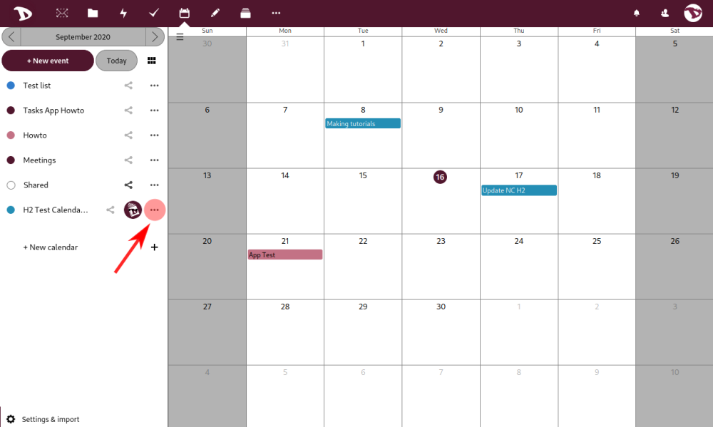

- Appuyez sur **Copier le lien privé**. L'adresse sera enregistrée dans le presse-papiers de l'ordinateur.

 

- Vous verrez le message suivant :

  

Une bonne façon de vérifier que l'URL a été copiée correctement serait de la coller dans un bloc-notes, de la vérifier et de l'enregistrer. Cette première étape étant terminée, nous allons maintenant passer à la configuration de **Thunderbird**.

## 02. Configuration de Thunderbird
- Cliquez sur l'icône **Calendrier** en haut à droite.

  

- Faites un clic droit sur la liste des calendriers et sélectionnez **Nouveau calendrier**.

  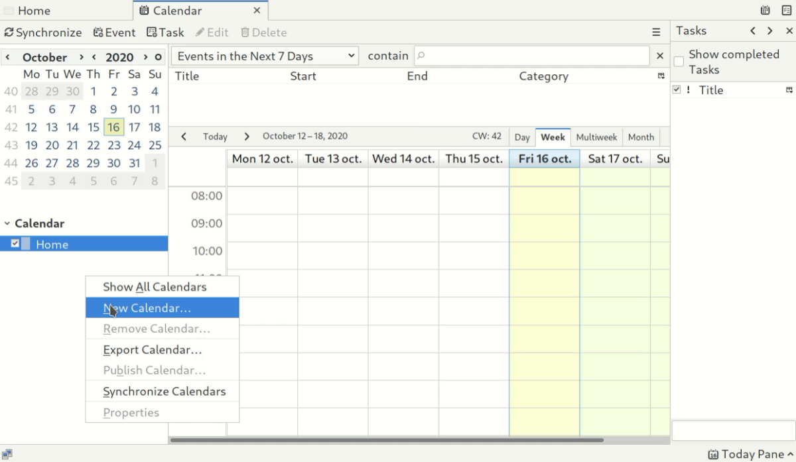

- Le processus **Créer un nouveau calendrier** va démarrer. Sélectionnez **Sur le réseau** (le calendrier est stocké dans le nuage).

  

- Sélectionnez le format **CalDAV** et entrez votre nom d'utilisateur.

  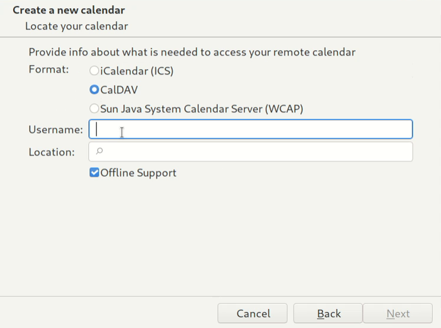

- Dans le champ **Location**, collez le lien de votre **Disroot Calendar**, celui que vous avez précédemment copié du **Cloud**. Sélectionnez **Support hors ligne** si vous souhaitez conserver une copie locale de votre calendrier pour travailler hors ligne. Appuyez sur **Suivant**.

  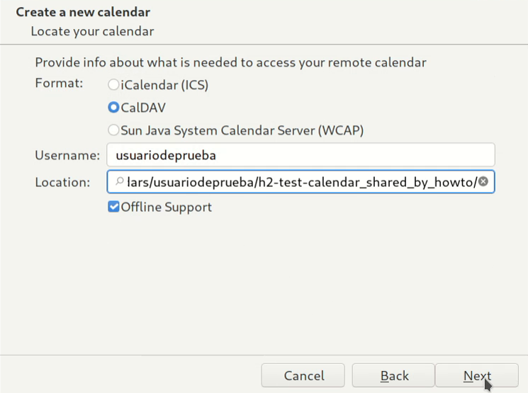

- Donnez un nom à votre calendrier. Vous pouvez également lui attribuer une couleur et activer/désactiver les rappels.

  

- Appuyez ensuite sur **Suivant** puis sur **Fini**.

  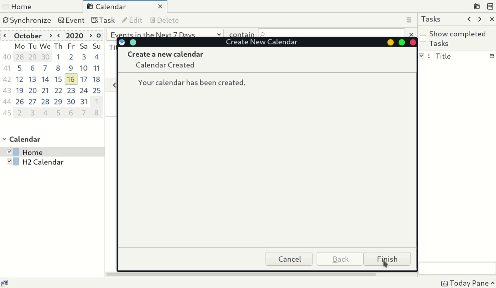

- Vous serez invité à saisir vos informations d'identification :
  - **Nom d'utilisateur:** *Votre_nom_d'utilisateur_désinstallé*.
  - **Mot de passe:** *Votre_Disroot_mot de passe*.
  - You can select the option **Use password manager to remember this password** so you don't get asked for it every time you connect.
  - Press **"OK"**

  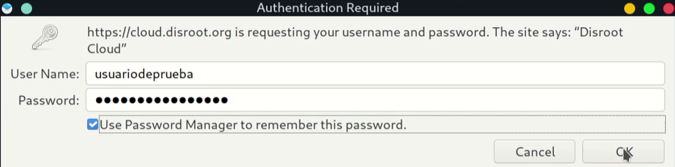

Your calendar is now synced with **Thunderbird**. Any event created in it will appear on **Disroot Cloud** and vice versa.

- 

!! #### Astuce 
!! Si vous avez plusieurs calendriers dans votre compte **Disroot**, il suffit de répéter ce processus pour chaque calendrier. Vous pouvez utiliser une couleur différente pour chaque calendrier afin de les identifier. This method works for any **Nextcloud** provider. 
!! En outre, vous pouvez synchroniser tous les calendriers de n'importe quel fournisseur, tant qu'ils prennent en charge le protocole **CalDAV** (vous pouvez vérifier auprès de votre fournisseur pour plus de détails).

## 03. Ajouter des événements
- Cliquez avec le bouton droit de la souris sur la date à laquelle vous voulez ajouter un événement.

  

- La fenêtre **Nouvel événement** s'ouvre. Vous pouvez maintenant attribuer un nom à l'événement.

  

- Ajoutez ou créez une catégorie pour l'événement.

  

- Sélectionnez dans quel calendrier l'événement va (utile dans le cas où vous avez plusieurs calendriers et que vous voulez éviter de le rechercher en ligne au mauvais endroit).

  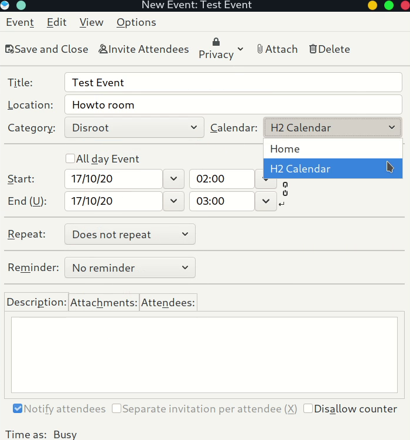

- Vous pouvez également définir :
  - S'il s'agit d'un **Evénement toute la journée**.
  - Le **Début** et **Fin** de l'événement.
  - Si vous voulez/besoin que l'événement soit répété et à quelle fréquence.
  - Définissez un rappel pour l'événement.
  - Ajoutez une description, des pièces jointes ou le nom des participants s'il s'agit d'une réunion, par exemple.

  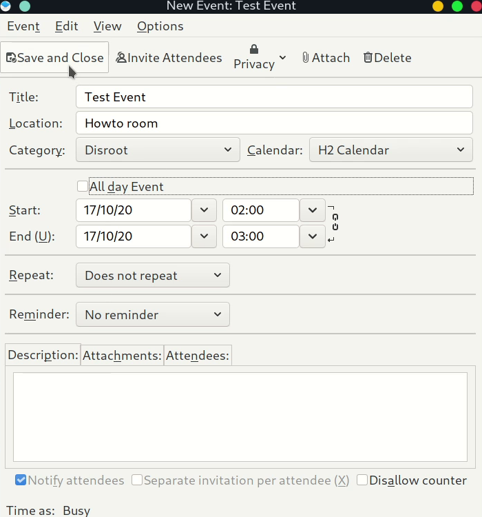

Une fois que vous avez terminé, cliquez sur **Save and Close**.

  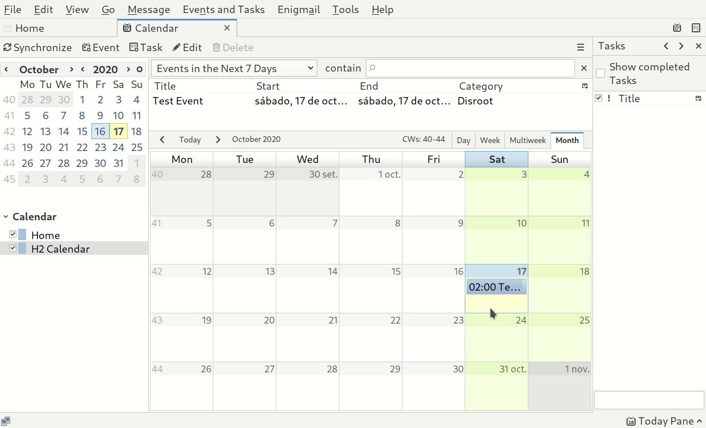

### Options supplémentaires
Si vous faites un clic droit sur un calendrier, vous trouverez un ensemble d'options :

- Afficher/Masquer les calendriers.
- Nouveau calendrier... (Pour en ajouter un nouveau).
- Désabonner le calendrier... (Pour le supprimer de **Thunderbird**).
- Exporter le calendrier...
- Publier le calendrier...
- Synchroniser les calendriers.
- Propriétés d'un Calendrier.

  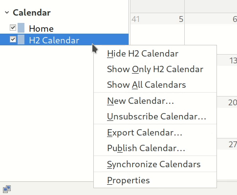

# Tâches
Les tâches sont automatiquement synchronisées lorsque vous intégrez un calendrier dans **Thunderbird**. 
Toute tâche que vous créez dans **Thunderbird** et qui est assignée à un calendrier sera synchronisée avec votre application **Cloud Tasks** et vice versa.

# Contacts
Pour intégrer vos contacts **Cloud** dans **Thunderbird**, vous devrez d'abord installer un module complémentaire appelé **CardBook**.

## 01. Installation du module complémentaire CardBook
- Aller sur **Outils** et sélectionnez **Modules**.

  

- Dans le champ **Trouver d'autres extensions**, écrivez **cardbook** et appuyez sur Entrée.

  

- Select the **CardBook** add-on and add it to **Thunderbird**.

  

  **Thunderbird** téléchargera l'addon, vous demandera si vous voulez l'ajouter et finalement vous demandera de redémarrer.

   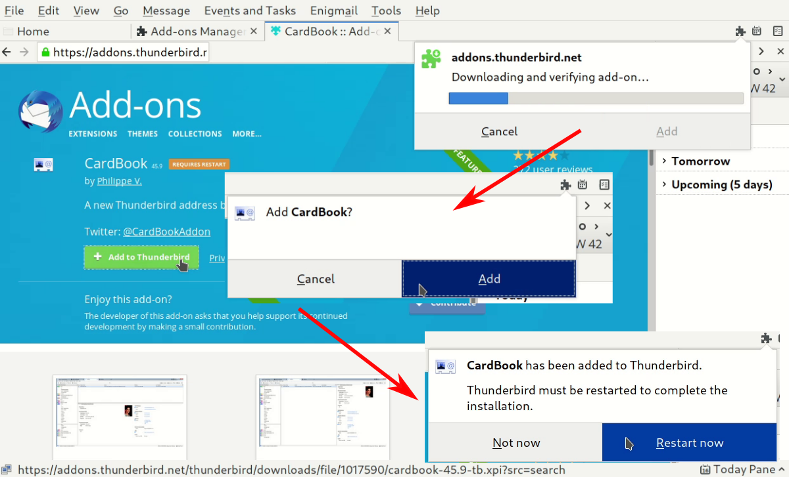

 ## 02. Ajout d'un carnet d'adresses distant
 Le processus est assez similaire à l'intégration des calendriers. Vous devez d'abord obtenir le lien des contacts de votre compte **Disroot**.

 ### Obtenir l'URL du carnet d'adresses
 - Allez dans l'application **Contacts** dans le **Disroot Cloud** (1).
 - Allez ensuite dans les **Paramètres** (2) (l'icône en forme d'engrenage dans le panneau inférieur gauche) et cliquez sur le bouton **trois points** à droite du carnet d'adresses que vous voulez synchroniser.

   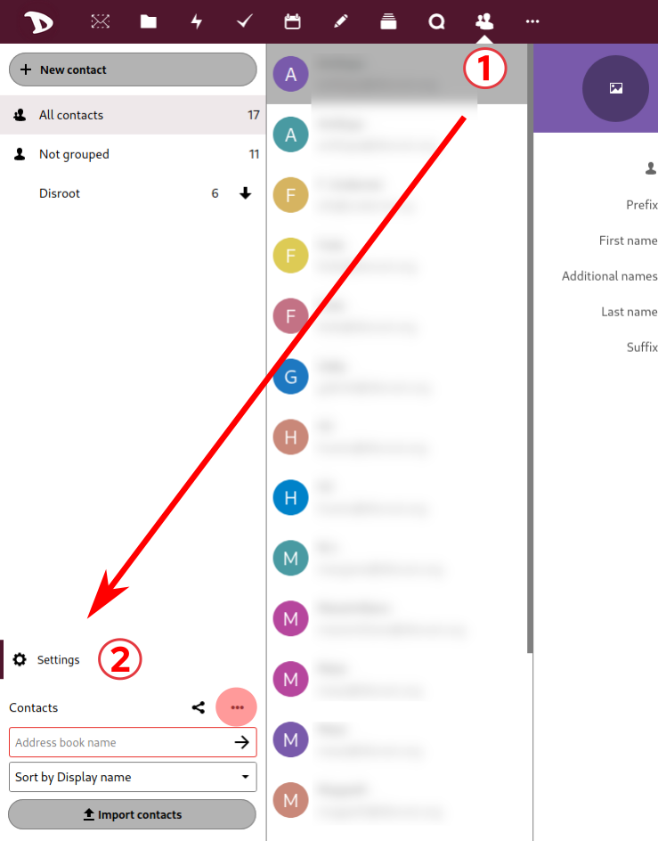

 - Sélectionnez **Copier le lien**.

   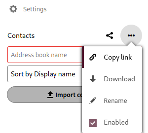

 L'URL est maintenant copiée dans le presse-papiers de votre ordinateur et, comme il a été suggéré auparavant, il est préférable de l'enregistrer, vous en aurez besoin à l'étape suivante.

 ### Configuration des contacts
 - Cliquez sur **CardBook** dans la barre d'outils de messagerie.

   

 - Faites un clic droit et sélectionnez **Nouveau carnet d'adresses**.

   

 - Sélectionnez **Remote** et appuyez sur **Suivant**.

   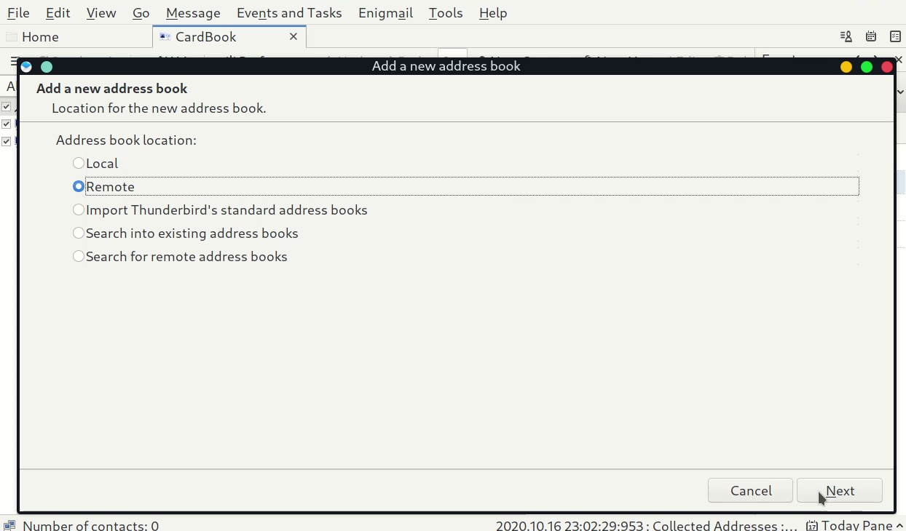

 - Sélectionnez **CardDAV** et collez le carnet d'adresses distant que vous avez copié auparavant dans le champ **URL**.

   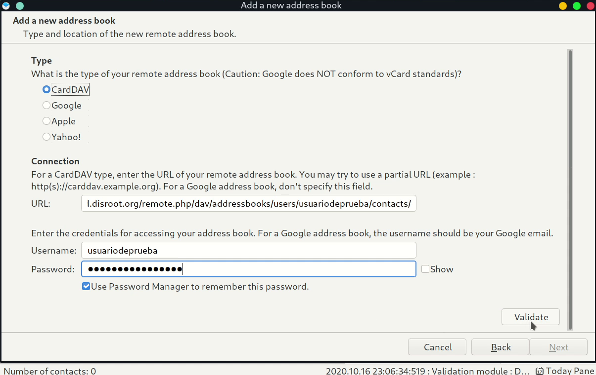

 - Entrez vos informations d'identification
   - Nom d'utilisateur:** *votre nom d'utilisateur_désintoxiqué
   - **Mot de passe:** *votre_Disroot_Mot de passe*.

 - Appuyez sur **Valider** pour vérifier si les informations d'identification sont correctes (vous ne pouvez pas terminer le processus sans cette étape).
 - Une fois les informations d'identification validées, appuyez sur **Suivant**.
 - Vous pouvez maintenant
   - changer le nom du Carnet d'adresses
   - définir une couleur pour lui
   - et sélectionner **Travail hors ligne** si vous souhaitez qu'une copie du Carnet d'adresses soit stockée localement.

  

 - Appuyez sur **Suivant** et ensuite sur **Finish**.

  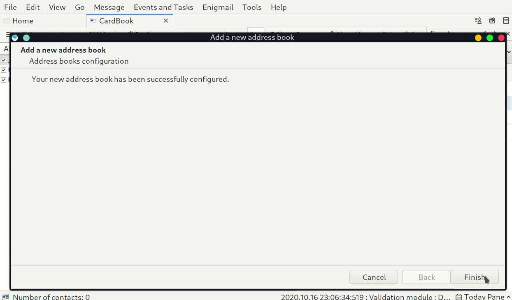

 Vos contacts dans votre **Cloud** sont maintenant synchronisés avec le carnet d'adresses de **Thunderbird**.

  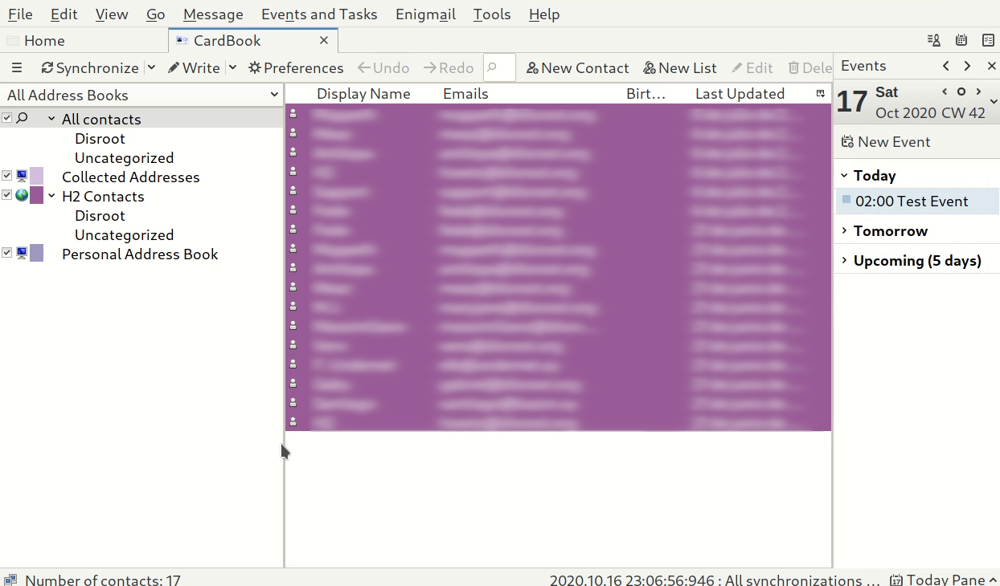

 A partir de maintenant, tous les contacts que vous ajoutez/supprimez/modifiez dans **Cloud** seront modifiés en conséquence dans votre agenda distant **Thunderbird** et vice versa.

 ### Synchronisation
 La synchronisation entre le calendrier local (**Thunderbird**) et le calendrier distant (**Disroot Cloud**) se produit toutes les quelques minutes. Mais vous pouvez la forcer :

 - Faites un clic droit sur le calendrier en question dans **Thunderbird**. Vous trouverez un large éventail d'options. Sélectionnez **Synchroniser le carnet d'adresses**.

   

 Si vous voulez déplacer des contacts de votre **Carnet d'adresses personnel** ou **Adresses collectées** vers votre nouveau carnet d'adresses distant :

 - Sélectionnez et faites glisser le contact vers votre carnet d'adresses distant.

  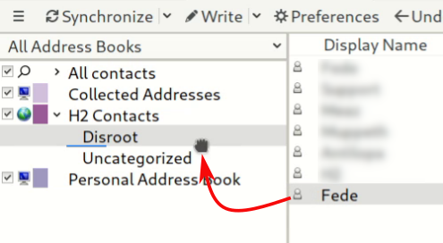

 ! ! **Il est fortement recommandé de ne pas oublier de sauvegarder vos contacts de temps en temps.**
