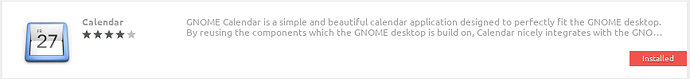

# Gnome Integration

Gnome ist ein sehr populäres, raffinierte, modernes und einfache Desktop-Umgebung für Linux. Es ist der Desktop meiner Wahl und dies hauptsächlich aufgrund seiner fantastischen Integration in Disroots Cloud Services.

Integration in Desktop-Umgebungen bedeutet, dass du dich nicht länger mit dem Browser in Disroots Cloud einloggen musst, um Informationen hinzuzufügen oder abzufragen. Es bedeutet vielmehr, dass alles, was du brauchst, direkt von deinem Desktop aus erreichbar ist. Des Weiteren fühlt es sich im Bezug auf Design und Bedienung mit den anderen Apps vereinheitlicht an, die du während der Arbeit nutzt. **Der** definitive Weg, Dinge zu erledigen.

In diesem Tutorial würde ich dir gerne zeigen, wie einfach und nützlich es ist, deinen Kalender über die Cloud auf deinem Computer einzubinden. Das Setup  sollte nicht länger als 10 Minuten dauern.

# Einrichtung des Online-Kontos

Um das Konto einzurichten musst du folgendes erledigen:

 - Gehe zu Gnome **Einstellungen** (z.B. gib Einstellungen über das Dashboard ein)
 - Öffne **"Online-Konten"**
 - Wähle **"Nextcloud"** aus (Oder Owncloud, falls du eine ältere Version nutzt)
 - Folge den Anweisungen und gib deine Anmeldedaten ein:
    - **Server:** https://cloud.disroot.org
    - **Benutzername:** *deinnutzername*
    - **Passwort:** *dein_geheimes_passwort*

    Wenn du dies richtig gemacht hast, kannst du wählen, welche Funktionen der Cloud du einbinden möchtest. Du kannst sie jederzeit wieder an- oder ausschalten, je nachdem, was du brauchst. In meiner Beispielkonfiguration binde ich alle ein.

# Kalendar

Eine der nützlichen Funktionen ist der Kalender. Du wirst bemerken, dass deine Kalender bereits integriert sind, wenn du auf das **aktuelle Datum** in deiner Leiste klickst.

Um Termine in deinem Kalender hinzuzufügen, zu bearbeiten oder zu löschen oder um einen besseren Überblick über die Gesamtheit der Kalender zu haben empfehle ich dir, die Gnome Kalender App zu installieren.

In Abhängigkeit von deinem Betriebssystem solltest du in deinem App-Store nach ihr suchen.

Wenn du es installierst hast wirst du bemerken, dass deine Kalender dank des Online-Kontos, dass du eingerichtet hast, bereits integriert sind. Die Benutzung ist sehr einfach, auch wenn noch einige Funktionen fehlen (z.B. Wiederholungen), aber du kannst grundlegende Dinge wie das Erstellen, Löschen und Editieren von Kalendereinträgen erledigen. Du kannst ebenso aufwählen, welche Kalender du gern sehen würdest und welche du deaktivierst (Gesetz dem Falle, du hast mehrere Kalender). Deine Kalendereinträge werden mit der Disroot Cloud synchronisiert, was für alle verbundenen Geräte gilt.

