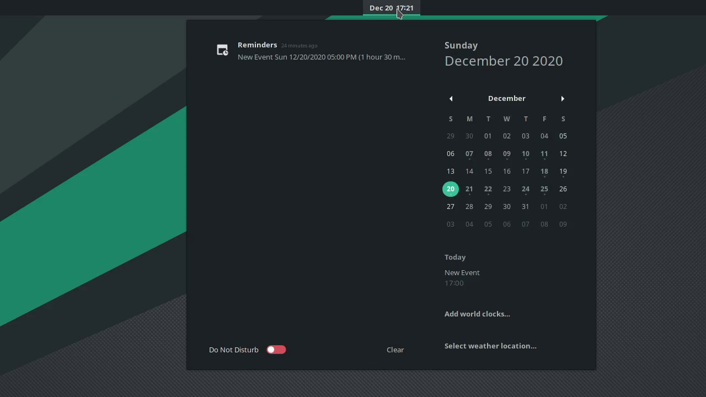

# GNOME Integration

**GNOME** is a free and open source graphical desktop environment for **GNU/Linux** based operating systems. It has an excellent integration with **Disroot**'s cloud services.

In the context of desktop environments, integration is the ability to use a number of web services and applications directly on the desktop as if they were just computer programs. In the case of **GNOME**, moreover, this level of integration makes it look and feel unified with the rest of the applications.

Once you have set up your **Disroot** account with **GNOME** you will not need to configure anything else. On top of that, the process is incredibly simple.

# Setting up an Online Account

 - Open the **GNOME Settings**
 - Go to **Online Accounts**
 - Select **Nextcloud**
 - Fill in the required data:
    - **Server:** https://cloud.disroot.org
    - **Username:** *your_username*
    - **Password:** *your_super_secret_password*
 - Click on **Connect**

If you entered the data correctly, a box will appear with the aspects that you can integrate. By default, they are all active, but you can activate/deactivate them as you wish.

Now services such as the Calendar, the Tasks and the Contacts can be found and used directly on your desktop.

Next we will see how to work with the **Cloud** services integrated in the **GNOME** desktop.

# Calendar

Now that you account is connected you will notice that your calendars are already integrated if you press on the  **current time** in your top bar on the desktop. The calendar window will automatically display all the events (if any) from your **Disroot**'s cloud account. You will of course receive all notifications on upcoming events as well.

To add/edit/remove events or have better overview on all your calendars, you will need to use the GNOME Calendar app.

It should be already installed and accessible from the **Software menu**. If not, you will have to search for it and download it from the system's software centre.

