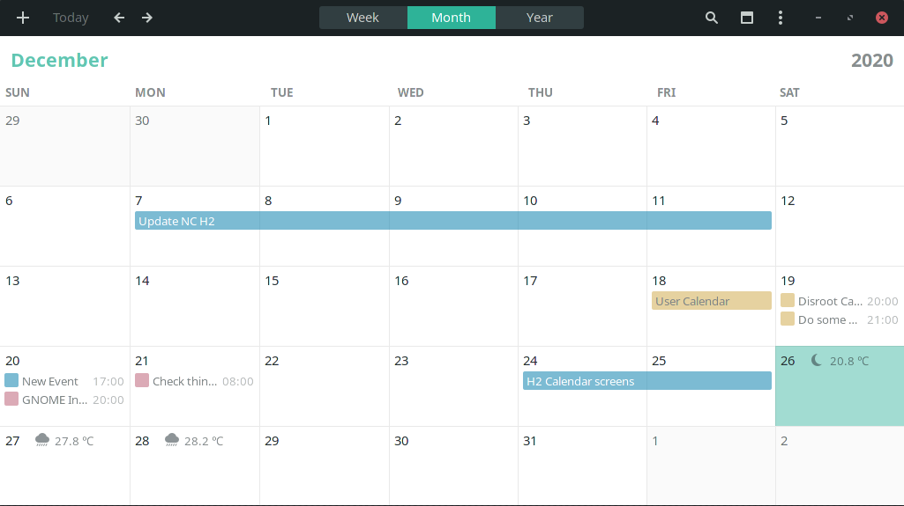
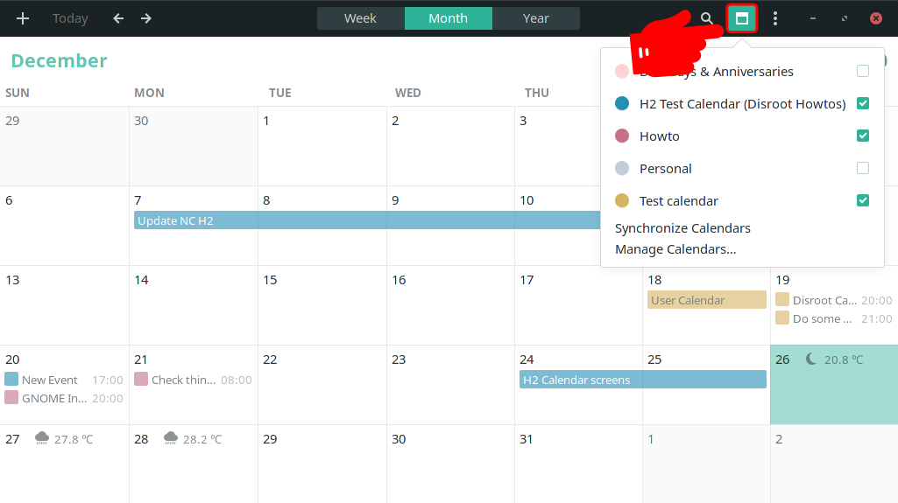
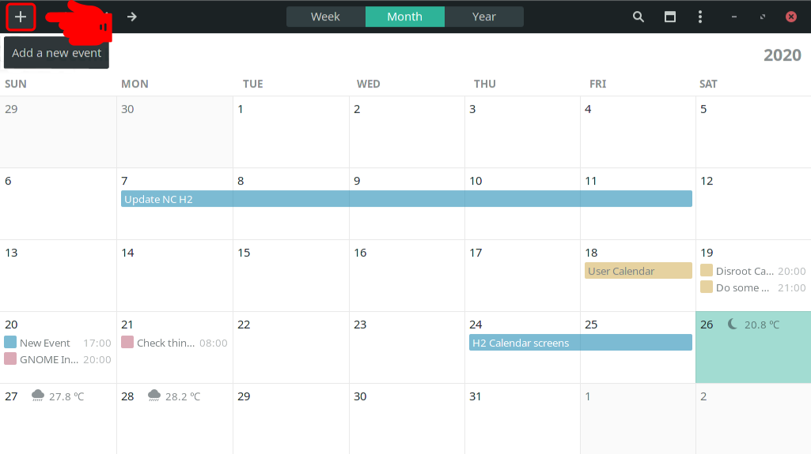
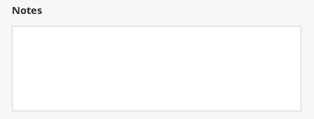
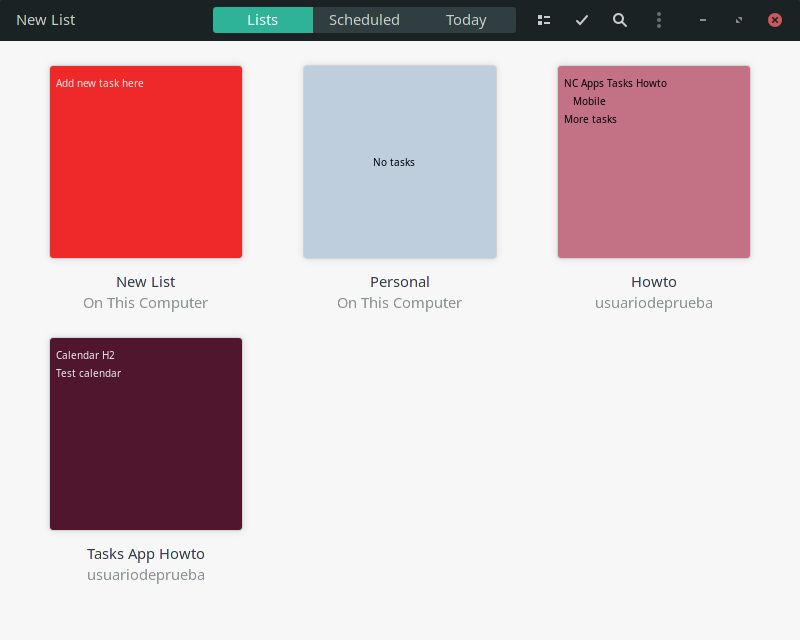
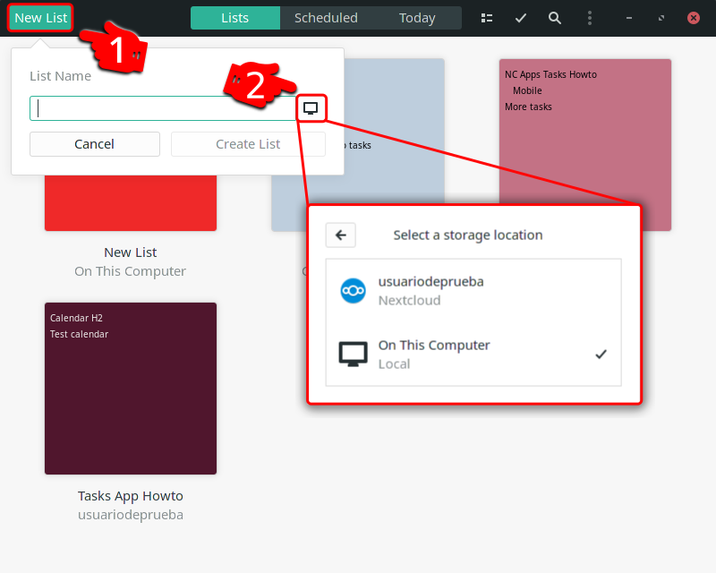
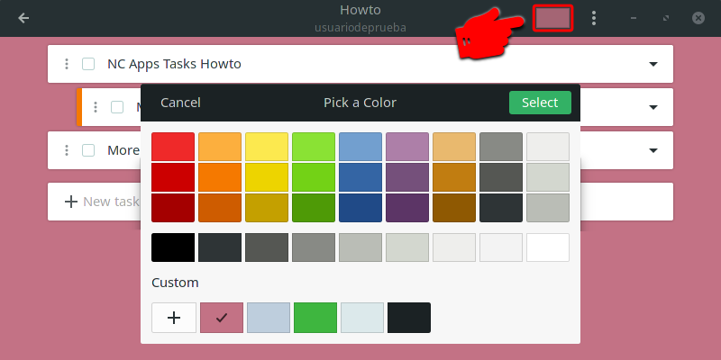
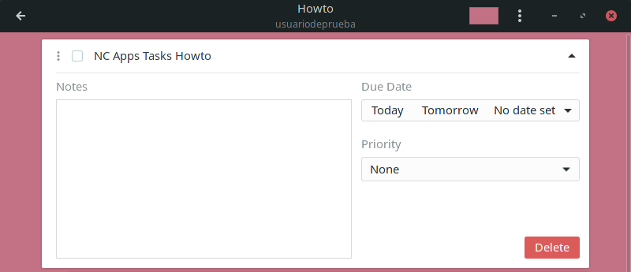
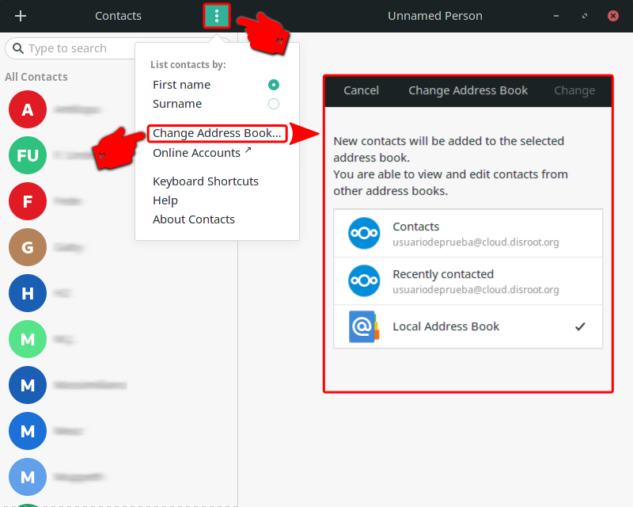
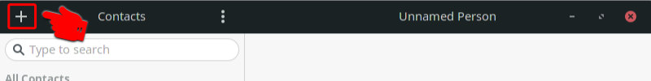

# GNOME Desktop Integration

**GNOME** is a free and open source graphical desktop environment for **GNU/Linux** based operating systems. It has an excellent integration with **Disroot**'s cloud services.

In the context of desktop environments, integration is the ability to use a number of web services and applications directly on the desktop as if they were just computer programs. In the case of **GNOME**, moreover, this level of integration makes it look and feel unified with the rest of the applications.

Once you have set up your **Disroot** account with **GNOME** you will not need to configure anything else. On top of that, the process is incredibly simple.

----

# Setting up an Online Account

 - Open the **GNOME Settings**
 - Go to **Online Accounts**
 - Select **Nextcloud**
 - Fill in the required data:
    - **Server:** https://cloud.disroot.org
    - **Username:** *your_username*
    - **Password:** *your_super_secret_password*
 - Click on **Connect**

If you entered the data correctly, a box will appear with the aspects that you can integrate. By default, they are all active, but you can activate/deactivate them as you wish.

Now services such as the **Calendar**, **Tasks** and **Contacts** can be found and used directly on your desktop.

Next we will see how to work with the **Cloud** services integrated in the **GNOME** desktop.

# Calendar

The Calendar app is quite easy to use. From it you can manage your calendars and perform basic operations such as adding, editing and removing events. To do this you need to have installed the **GNOME Calendar** app.

!! _It should be already installed and accessible from the **Software menu**. If not, you will have to search for it and download it from the system's software centre._

Well, once you have your account connected you will notice that your calendars are already integrated if you press on the **current time** in your top bar on the desktop. The calendar window will automatically display all the events (if any) from your **Disroot**'s cloud account. You will, of course, receive all notifications on upcoming events as well.

## Manage your calendars

If you have already created one or more calendars in the **Cloud**, when you open the **GNOME Calendar** app, you will see them in it along with their respective events (if any).

You can check and manage your calendars by clicking on the calendar icon.

Through this menu you can:

- Mark/unmark the calendars to make them visible in the applicatión and work on them.
- Synchronize them
- Add, import, remove or disconnect a calendar

To add or import a calendar that does not belong to your online account, click on **Add Calendar...**

From this menu you can add a calendar by entering its URL address or upload one that you have previously exported in .ics format, assign it a name and colour.

!! **TIP**
!! To learn how to get the URL address of a calendar in the **Cloud** or export it, you can check this [**Calendar tutorial**](/tutorials/cloud/apps/calendar/web).

## Adding and editing an event

There are several ways to manage an event depending on the time view you are positioned in.

For example, whether you are in the monthly, weekly or annual calendar view, you can always add an event by clicking on the **+** (plus) icon in the upper left of the top bar.

You can also add an event from the weekly view by clicking on the time of a day or from the yearly view by clicking on the **Add event...** button at the bottom right. In any case, a box will open with the basic options (name and calendar to which it belongs) for adding an event.

To add more detailed information about the event, click on **Edit Details...**.

Now you can:

- Select which calendar the event will belong to

  

- Add a name or title for the event and set a location if you want to

  

- Schedule the event. You can set if it is an all-day event or if it is at a particular time on a particular date and if it is recurrent, which means that it happens every day, week, month, etc.

 

 

- Set reminders

  

- And add notes to help you get organized

  

Once you feel that the event information is complete, just click **Done**. It will automatically synchronize with the calendar in the **Cloud** and you will be able to view it on any device where you have it configured.

If you need to edit an event, simply click on it, make the necessary changes and then click **Done** again.

[Back to the top](#top)

# Tasks
The tasks are linked to the calendars so once your online account is synced up, the tasks will be too.

**GNOME** includes a **ToDo** app. Open it to manage the tasks you have linked to your **Disroot** account.

It use is quite intuitive and works basically like the web app.

## Adding lists and tasks

To add a list of tasks:
1. Click on **New List** and write the name of your new list
2. Click on the computer icon and select where the list will be saved
3. Click on **Create List**

You can also select a colour for the list by clicking the colour button at the right of the list title.

To add a task to a list:
1. Select a list
2. Click on the **New task...** field, write the name of the task and press enter

3. Clicking the arrow icon to the right of the task title will display a menu to add notes, set a due date and priority, as well as the option to delete the task.

Like calendars, tasks will be synchronised with the cloud and you can access them from any device or application you have configured.

[Back to the top](#top)

# Contacts
Your contacts in the **Cloud** are also synchronised when you connect your account and are easily accessible from **GNOME** via the **Contacts** application and you can edit them by clicking on a contact name.

## Adding a contact
Before adding a new contact, you can select which address book it should go to by clicking the **three dots** menu in the top bar.

Now to add a new contact just click on the **+** (plus) icon in the upper left of the top bar.

Add all the information you need and when you are done click on **Add**.

[Back to the top](#top)

# Documents
Once your account is connected you can access and work with your documents and files in the cloud from your file manager.

[Back to the top](#top)
