# Intégration bureau GNOME

**GNOME** est un environnement de bureau graphique gratuit et open source pour les systèmes d'exploitation basés sur **GNU/Linux**. Il présente une excellente intégration avec les services en nuage de **Disroot**.

Dans le contexte des environnements de bureau, l'intégration est la capacité d'utiliser un certain nombre de services et d'applications web directement sur le bureau comme s'il s'agissait de simples programmes informatiques. Dans le cas de **GNOME**, en outre, ce niveau d'intégration lui donne une apparence et une sensation unifiées avec le reste des applications.

Une fois que vous avez configuré votre compte **Disroot** avec **GNOME**, vous n'aurez pas besoin de configurer quoi que ce soit d'autre. En plus de cela, le processus est incroyablement simple.

----

# Configuration d'un compte en ligne

 - Ouvrez les **Paramètres de GNOME**.
 - Allez dans **Comptes en ligne**.
 - Sélectionnez **Nextcloud**.
 - Remplissez les données requises :
    - **Serveur:** https://cloud.disroot.org
    - Nom d'utilisateur:** *votre_nom_d'utilisateur*.
    - **Mot de passe:** *votre_mot_de_passe_super_secret*.
 - Cliquez sur **Connecter**.

Si vous avez entré les données correctement, une boîte apparaîtra avec les aspects que vous pouvez intégrer. Par défaut, ils sont tous actifs, mais vous pouvez les activer/désactiver comme vous le souhaitez.

Maintenant, des services tels que le **Calendrier**, **Tâches** et **Contacts** peuvent être trouvés et utilisés directement sur votre bureau.

Nous verrons ensuite comment travailler avec les services **Cloud** intégrés au bureau **GNOME**.

# Calendrier

L'application Calendrier est assez facile à utiliser. Elle vous permet de gérer vos calendriers et d'effectuer des opérations de base telles que l'ajout, la modification et la suppression d'événements. Pour ce faire, vous devez avoir installé l'application **GNOME Calendar**.

! ! Elle doit être déjà installée et accessible depuis le **menu Logiciels**. Si ce n'est pas le cas, vous devrez la rechercher et la télécharger depuis le centre logiciel du système.

Bien, une fois votre compte connecté, vous remarquerez que vos calendriers sont déjà intégrés si vous appuyez sur l' **heure actuelle** dans votre barre supérieure sur le bureau. La fenêtre du calendrier affichera automatiquement tous les événements (le cas échéant) de votre compte cloud **Disroot**. Vous recevrez, bien sûr, toutes les notifications sur les événements à venir.

## Gérer vos calendriers

Si vous avez déjà créé un ou plusieurs calendriers dans le **Cloud**, lorsque vous ouvrez l'application **GNOME Calendar**, vous les verrez apparaître avec leurs événements respectifs (s'il y en a).

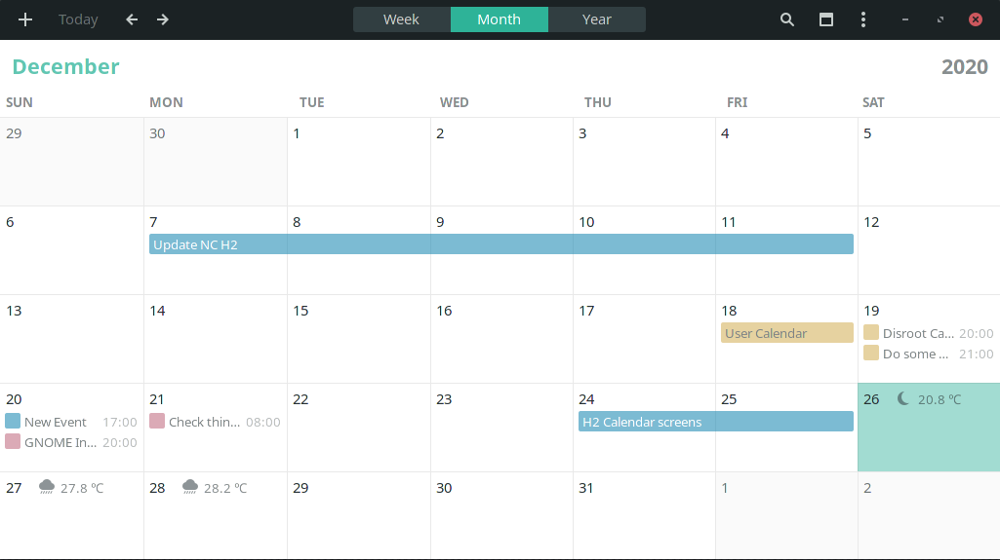

Vous pouvez vérifier et gérer vos calendriers en cliquant sur l'icône du calendrier.

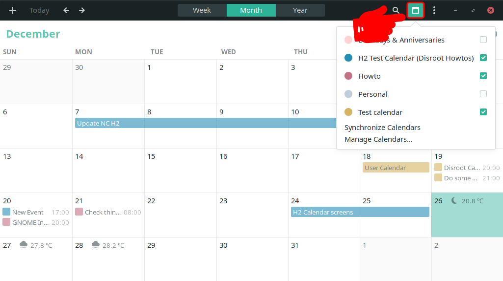

Grâce à ce menu, vous pouvez :

- Marquer/démarquer les calendriers pour les rendre visibles dans l'applicatión et travailler dessus.
- Les synchroniser
- Ajouter, importer, supprimer ou déconnecter un calendrier

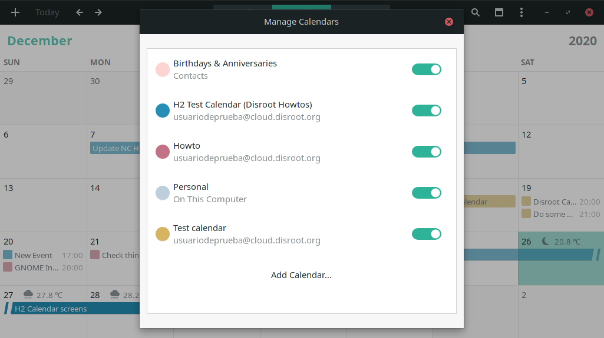

Pour ajouter ou importer un calendrier qui n'appartient pas à votre compte en ligne, cliquez sur **Ajouter un calendrier...**.

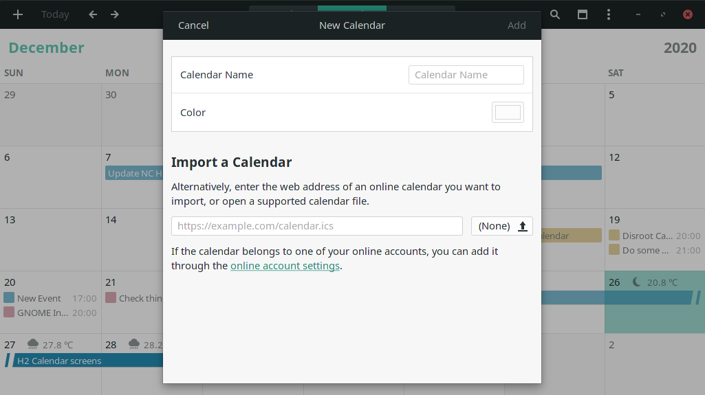

À partir de ce menu, vous pouvez ajouter un calendrier en saisissant son adresse URL ou en télécharger un que vous avez préalablement exporté au format .ics, lui attribuer un nom et une couleur.

!! **TRUC**
!! Pour apprendre comment obtenir l'adresse URL d'un calendrier dans **Cloud** ou l'exporter, vous pouvez consulter ce [**Tutoriel sur le calendrier**](/tutorials/cloud/apps/calendar/web).

## Ajouter et modifier un événement

Il existe plusieurs façons de gérer un événement en fonction de la vue temporelle dans laquelle vous vous trouvez.

Par exemple, que vous soyez dans la vue calendrier mensuelle, hebdomadaire ou annuelle, vous pouvez toujours ajouter un événement en cliquant sur l'icône **+** (plus) en haut à gauche de la barre supérieure.

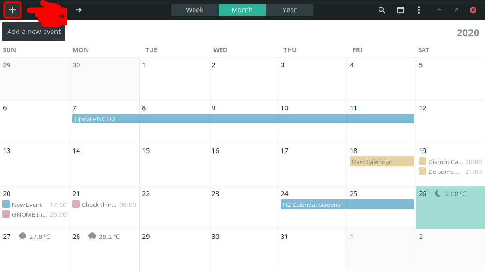

Vous pouvez également ajouter un événement depuis la vue hebdomadaire en cliquant sur l'heure d'un jour ou depuis la vue annuelle en cliquant sur le bouton **Ajouter un événement...** en bas à droite. Dans tous les cas, une boîte s'ouvrira avec les options de base (nom et calendrier auquel il appartient) pour ajouter un événement.

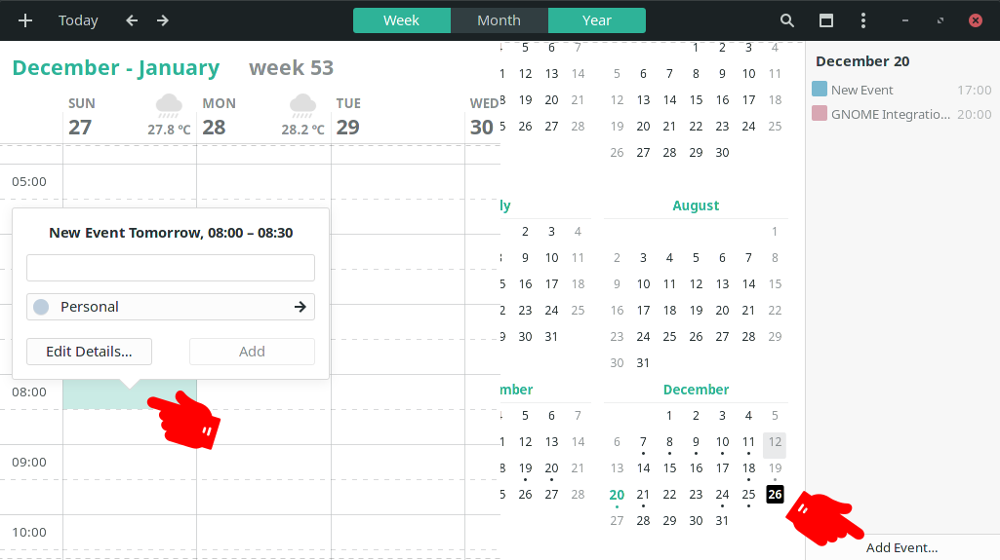

Pour ajouter des informations plus détaillées sur l'événement, cliquez sur **Modifier les détails...**.

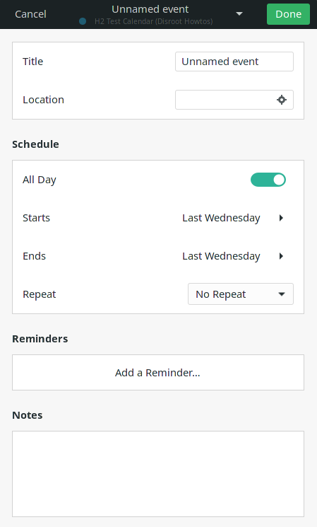

Vous pouvez maintenant :

- Sélectionner le calendrier auquel l'événement appartiendra

  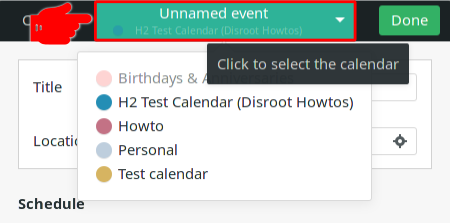

- Ajouter un nom ou un titre pour l'événement et définir un lieu si vous le souhaitez.

  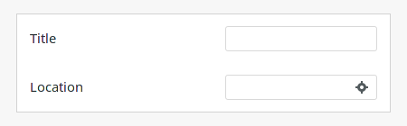

- Programmez l'événement. Vous pouvez définir s'il s'agit d'un événement qui dure toute la journée ou s'il a lieu à une heure et à une date précises et s'il est récurrent, ce qui signifie qu'il a lieu tous les jours, toutes les semaines, tous les mois, etc.

 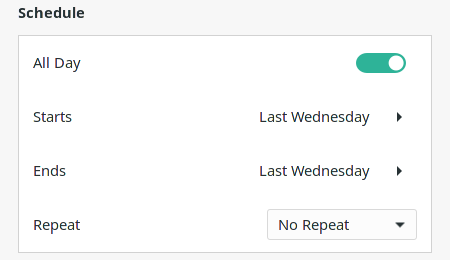

 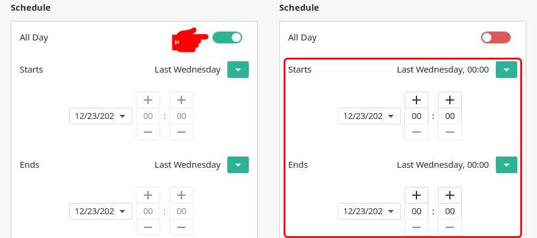

- Définir des rappels

  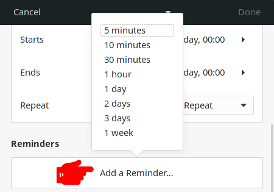

- Et ajoutez des notes pour vous aider à vous organiser

  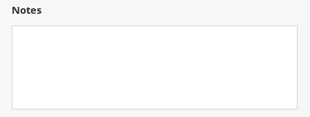

Une fois que vous estimez que les informations sur l'événement sont complètes, cliquez simplement sur **Fait**. Il sera automatiquement synchronisé avec le calendrier dans le **Cloud** et vous pourrez le consulter sur n'importe quel appareil où vous l'avez configuré.

Si vous devez modifier un événement, il vous suffit de cliquer dessus, d'apporter les modifications nécessaires, puis de cliquer à nouveau sur **Fait**.

[Retour en haut](#top)

# Tâches
Les tâches sont liées aux calendriers, donc une fois que votre compte en ligne est synchronisé, les tâches le seront aussi.

**GNOME** inclut une application **ToDo**. Ouvrez-la pour gérer les tâches que vous avez liées à votre compte **Disroot**.

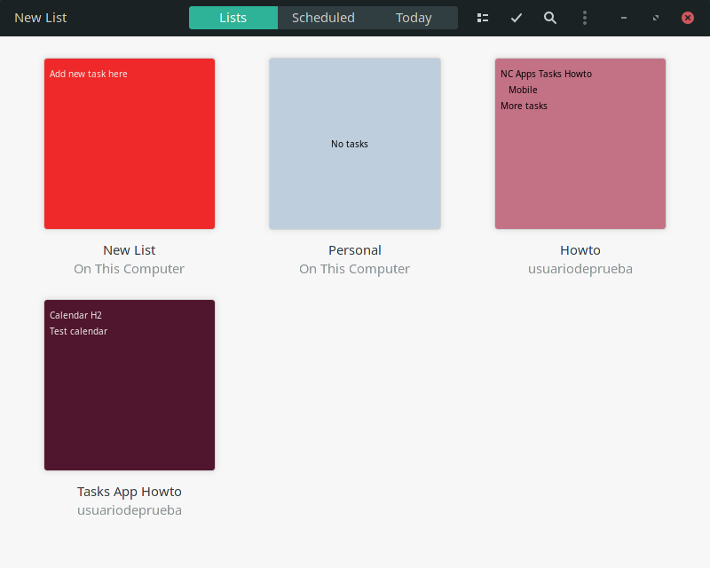

Son utilisation est assez intuitive et fonctionne fondamentalement comme l'application web.

## Ajouter des listes et des tâches

Pour ajouter une liste de tâches :
1. Cliquez sur **Nouvelle liste** et écrivez le nom de votre nouvelle liste.
2. Cliquez sur l'icône de l'ordinateur et sélectionnez l'endroit où la liste sera enregistrée.
3. Cliquez sur **Créer la liste**.

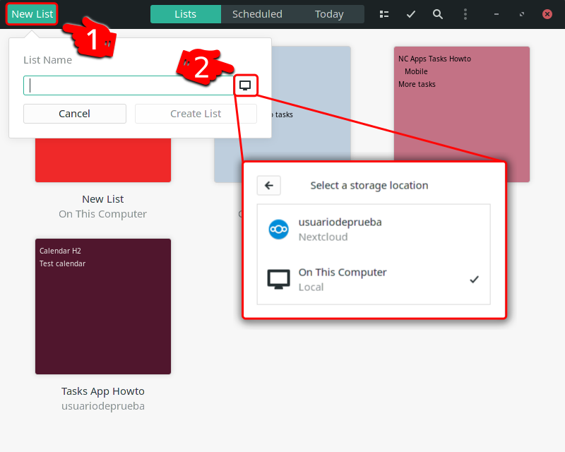

Vous pouvez également sélectionner une couleur pour la liste en cliquant sur le bouton couleur à droite du titre de la liste.

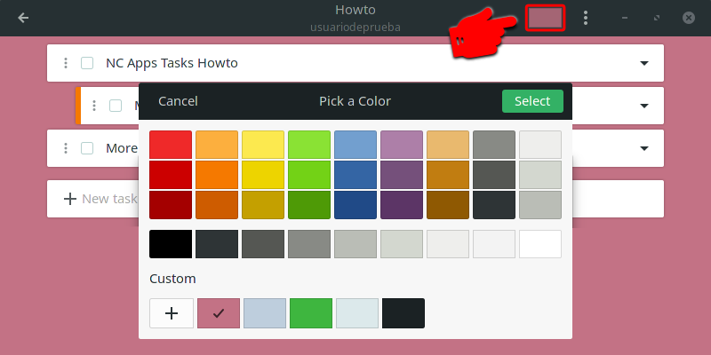

Pour ajouter une tâche à une liste :
1. Sélectionnez une liste
2. Cliquez sur le champ **Nouvelle tâche...**, écrivez le nom de la tâche et appuyez sur Entrée.

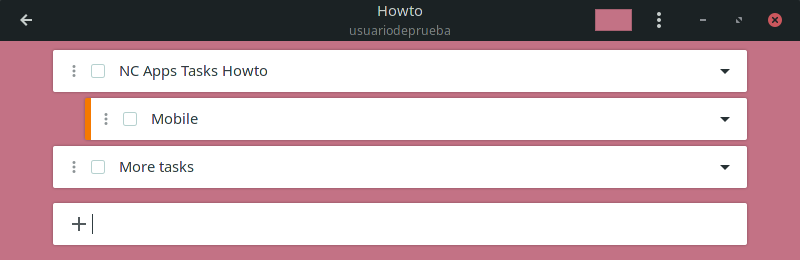

3. En cliquant sur l'icône de la flèche à droite du titre de la tâche, un menu s'affiche pour ajouter des notes, définir une date d'échéance et une priorité, ainsi que l'option de supprimer la tâche.

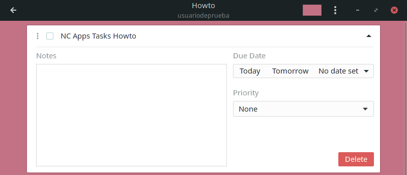

Comme les calendriers, les tâches seront synchronisées avec le nuage et vous pourrez y accéder depuis n'importe quel appareil ou application que vous aurez configuré.

[Retour en haut](#top)

# Contacts
Vos contacts dans le **Cloud** sont également synchronisés lorsque vous connectez votre compte et sont facilement accessibles depuis **GNOME** via l'application **Contacts** et vous pouvez les modifier en cliquant sur le nom d'un contact.

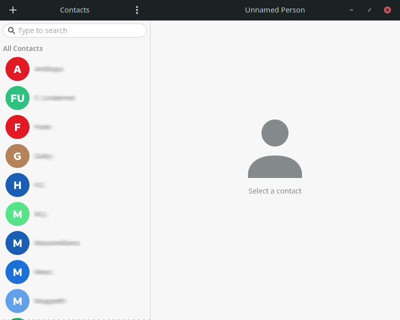

## Ajouter un contact
Avant d'ajouter un nouveau contact, vous pouvez choisir dans quel carnet d'adresses il doit aller en cliquant sur le menu **trois points** dans la barre supérieure.

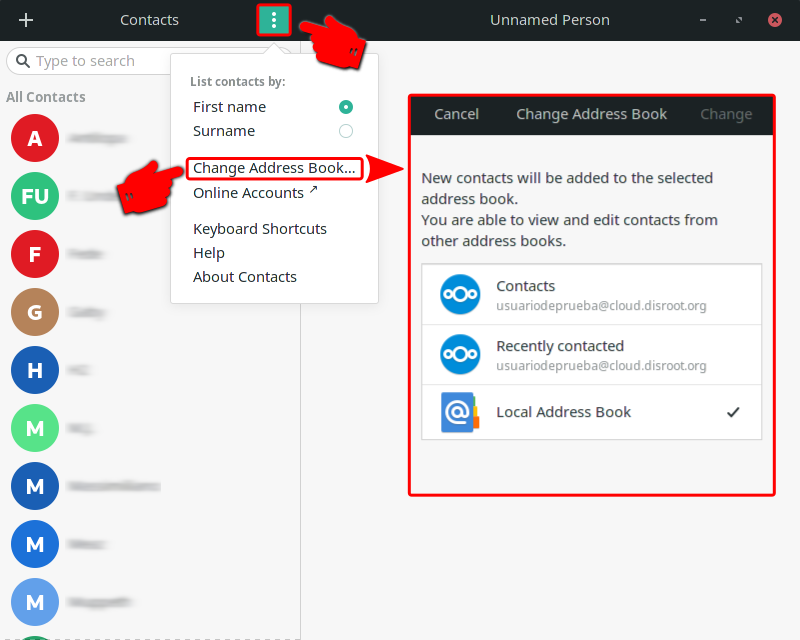

Maintenant, pour ajouter un nouveau contact, il suffit de cliquer sur l'icône **+** (plus) en haut à gauche de la barre supérieure.

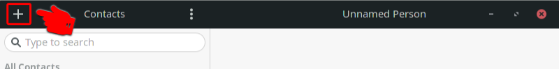

Ajoute toutes les informations dont tu as besoin et quand tu as fini, clique sur **Ajouter**.

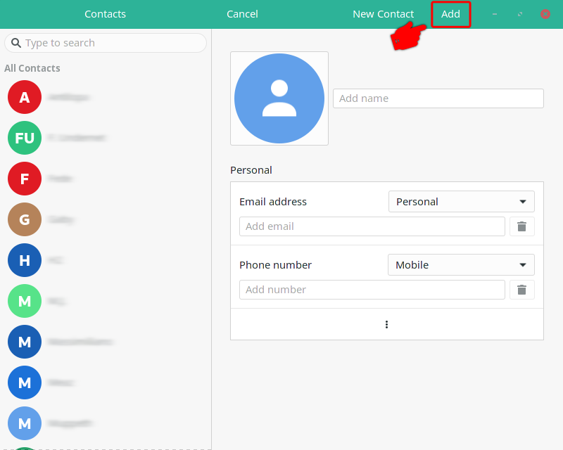

[Retour au début](#top)

# Documents
Une fois que votre compte est connecté, vous pouvez accéder et travailler avec vos documents et fichiers dans le nuage à partir de votre gestionnaire de fichiers.

[Retour au début](#top)
