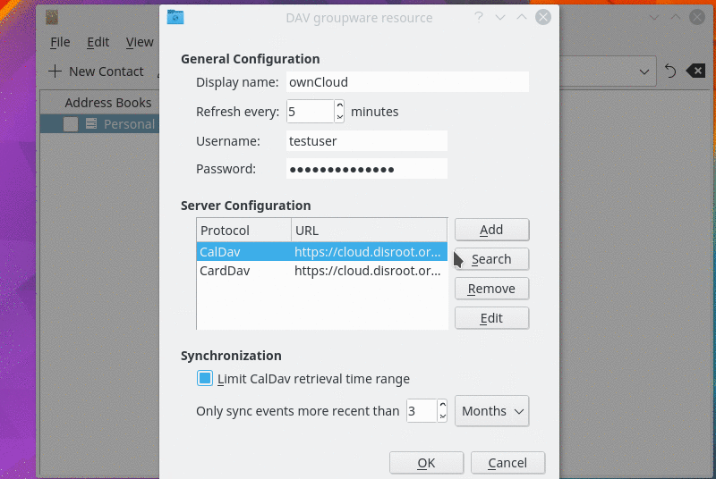

# Sync Calendar
First setup an account in the app Kaddressbook.

* In order to set it up all you need to do is:
* Go to Kaddressbook
* Select File > New > Add Address Book
* Select DAV Groupware resource
* Follow instructions to fill in all your credentials:
 * **Username:** _yourusername_
 * **Password:** _your_super_secret_password_
* In the option "select one of these servers", select: **Nextcloud**
* Host: place the address [cloud.disroot.org](https//:cloud.disroot.org)
* Installation path: leave it blank
* Select the option: "use secure connection"
* Press:
 * Next
 * Test connection
 * And if the connection checked ok, press finish

After this you need to manually add the URL links for contacts and calendars, in the general settings.

The general settings will automatically appear after you have pressed finish.
Then you need to:

* Select CalDAV and edit
 * Replace the remote URL, with the URL of your Disroot calendar: https://cloud.disroot.org/remote.php/dav/calendars/YOUR_USERNAME/YOUR_CALENDARS/
 * Press "Fetch" and then "Ok"

You can find the correct URL in your Disroot calendar and contacts apps share options

In the general settings you can also:

* Change the name of the general display
* Remove the time retrieval limits on calendars so it will sync all your events

# Calendar
You can use the KOrganizer app, it has both calendar and tasks.

Your events will already be synchronized.
Adding/removing/editing events is very similar to the Calendar app described before, any changes will be synchronized with your disroot calendar.

