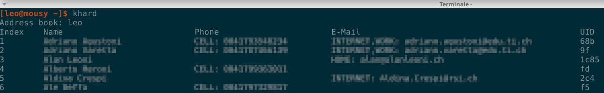
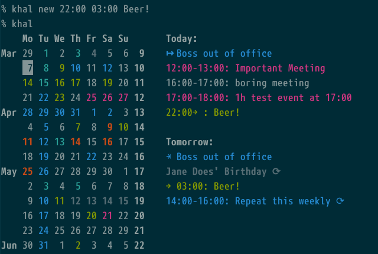

# General information

The goal of this tutorial is to explain how to synchronize calendar and contacts between the Nextcloud server and your client using the command line.
For this operation the software that will be used are:

- **Vdirsyncer**: a command-line tool for synchronizing calendars and addressbooks between a variety of servers and the local filesystem. More info [here](https://vdirsyncer.pimutils.org/en/stable/)

- **Khard** an address book for the GNU/Linux console. It creates, reads, modifies and removes carddav address book entries at your local machine. Khard is also compatible to the email clients like Mutt. More info [here](https://github.com/scheibler/khard)

- **Khal** is a standards based CLI and terminal calendar program, able to synchronize with CalDAV servers through vdirsyncer. More info [here](https://github.com/pimutils/khal)


# Vdirsyncer
Install vdirsyncer for your GNU/Linux distribution.
If there is no suitable package for your distribution, you’ll need to install [vdirsyncer manually](https://vdirsyncer.pimutils.org/en/stable/installation.html#manual-installation)

## Configuration
Path of the configuration file: *"~/.config/vdirsyncer/config"*  
Contents of the *config* file:

```
[general]
# A folder where vdirsyncer can store some metadata about each pair.
status_path = "~/.vdirsyncer/status/"

# CARDDAV
[pair YOUR-USERNAME]
# A `[pair <name>]` block defines two storages `a` and `b` that should be
# synchronized. The definition of these storages follows in `[storage <name>]`
# blocks. This is similar to accounts in OfflineIMAP.
a = "Local"
b = "Remote"

# Synchronize all collections available on "side B" (in this case the server).
# You need to run `vdirsyncer discover` if new calendars/addressbooks are added
# on the server.

# Omitting this parameter implies that the given path and URL in the
# corresponding `[storage <name>]` blocks are already directly pointing to a
# collection each.
collections = ["from b"]

# Synchronize the "display name" property into a local file (~/.contacts/displayname).
metadata = ["YOUR-USERNAME"]

# To resolve a conflict the following values are possible:
#   `null` - abort when collisions occur (default)
#   `"a wins"` - assume a's items to be more up-to-date
#   `"b wins"` - assume b's items to be more up-to-date
conflict_resolution = "a wins"

[storage Local]
# A storage references actual data on a remote server or on the local disk.
# Similar to repositories in OfflineIMAP.
type = "filesystem"
path = "~/.contacts/"
fileext = ".vcf"

[storage Remote]
type = "carddav"
url = "https://cloud.disroot.org/remote.php/dav/addressbooks/users/YOUR-USERNAME/contatti/"
username = "YOUR-USERNAME"
# The password can also be fetched from the system password storage, netrc or a
# custom command. See http://vdirsyncer.readthedocs.org/en/stable/keyring.html
password = "YOUR-PASSWORD"

# CALDAV
#[pair Calendar]
a = "CalendarLocal"
b = "CalendarRemote"
## collections = ["private", "work"]
collections = ["from b"]

## Calendars also have a color property
metadata = ["YOUR-USERNAME"]

## To resolve a conflict the following values are possible:
## `null` - abort when collisions occur (default)
## `"a wins"` - assume a's items to be more up-to-date
## `"b wins"` - assume b's items to be more up-to-date
conflict_resolution = "a wins"

[storage CalendarLocal]
type = "filesystem"
path = "~/.calendars/"
fileext = ".ics"

[storage CalendarRemote]
type = "caldav"
url = "https://cloud.disroot.org/remote.php/dav/"
username = "YOUR-USERNAME"
password = "YOUR-PASSWORD"
```

After having completed the configuration file, run this commands:

*vdirsyncer discover*

*You will be asked if you want to create the missing directories. Answer yes*

*vdirsyncer sync*

To synchronize the contacts and calendars just give the following command:

*vdirsyncer sync*

This command can be automated using [cron](https://en.wikipedia.org/wiki/Cron)


Now you have synchronized your calendars and your contacts.
In your local machine contacts are stored in `~/.contacts/` with the *.vcf* format.<br>
Calendars are stored in `~/.calendars/` with the *.ics* format.

# Khard



Install khal for your GNU/Linux distribution.
If there is no suitable package for your distribution, you’ll need to install [Khard manually](https://github.com/scheibler/khard/)

## Configuration
Path of the configuration file: `~/.config/khard/khard.conf`.<br>
Contents of the *khard.conf* file:

```
[addressbooks]
[[YOUR-USERNAMENE]]
path = ~/.contacts/contatti/

[general]
editor = vim
merge_editor = vimdiff
default_action = list
show_nicknames = no
```

* Show contacts: *khard list*
* Show details: * khard details*
* Search contacts: *khard details [-- strict-search] name of contact*
* For more information: **khard -h**

# Khal



Install khal for your GNU/Linux distribution.  
If there is no suitable package for your distribution, you’ll need to install [Khal manually](https://lostpackets.de/khal/install.html)

## Configuration
Path of the configuration file: `~/.config/khal/config`
Contents of the *config* file:

```
[calendars]
[[CALENDAR1]]
   path = ~/.calendars/CALENDAR1/
   color = dark cyan

[[CALENDAR2]]
   path = ~/.calendars/CALENDAR2/
   color = dark magenta


[locale]
timeformat = %H:%M
dateformat = %Y-%m-%d
longdateformat = %Y-%m-%d
datetimeformat = %Y-%m-%d %H:%M
longdatetimeformat = %Y-%m-%d %H:%M

local_timezone = Europe/Berlin
default_timezone = Europe/Berlin

firstweekday = 0
```
*CALENDAR1 AND CALENDAR2 are the name of your calendars in Nextcloud"*.

* Show calendar: *khal*
* Interactive khal (let's browse and edit calendars and events): *ikhal*
* For more information: **khal -h**
