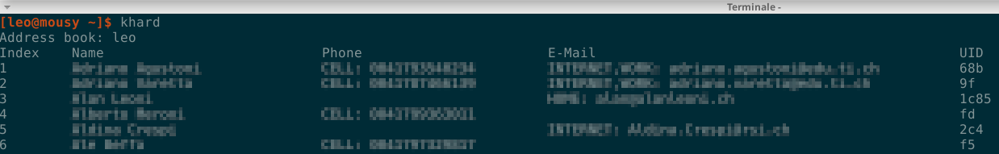
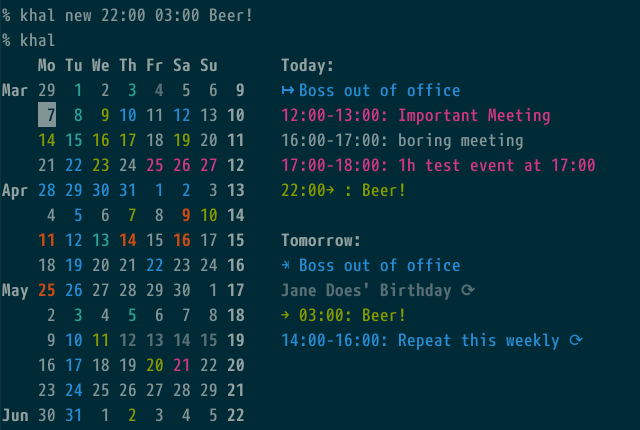

# Informations générales

Le but de ce tutoriel est d'expliquer comment synchroniser le calendrier et les contacts entre le serveur Nextcloud et votre client en utilisant la ligne de commande.

Pour cette opération, les logiciels qui seront utilisés sont :

- **Vdirsyncer** : un outil en ligne de commande pour synchroniser les calendriers et carnets d'adresses entre une variété de serveurs et le système de fichiers local. Plus d'infos [ici](https://vdirsyncer.pimutils.org/en/stable/)

- **Khard** : un carnet d'adresses pour la console GNU/Linux. Il crée, lit, modifie et supprime les entrées du carnet d'adresses carddav sur votre machine locale. Khard est également compatible avec les clients de messagerie comme Mutt. Plus d'infos [ici](https://github.com/scheibler/khard)

- **Khal** est un programme de calendrier basé sur les standards CLI et terminal, capable de se synchroniser avec les serveurs CalDAV via vdirsyncer. Plus d'informations [ici](https://github.com/pimutils/khal)


# Vdirsyncer
Installez vdirsyncer pour votre distribution GNU/Linux.
S'il n'y a pas de paquetage approprié pour votre distribution, vous devrez installer [vdirsyncer manuellement](https://vdirsyncer.pimutils.org/en/stable/installation.html#manual-installation)

## Configuration
Chemin du fichier de configuration : *"~/.config/vdirsyncer/config "*  
Contenu du fichier *config* :


```
[general]
# Un dossier où vdirsyncer peut stocker quelques métadonnées sur chaque paire.
status_path = "~/.vdirsyncer/status/"

# CARDDAV
[pair YOUR-USERNAME]
# Un bloc `[paire <nom>]` définit deux stockages `a` et `b` qui doivent être
# synchronisées. La définition de ces stockages suit dans les blocs `[stockage <nom>]`.
# blocs. Ceci est similaire aux comptes dans OfflineIMAP.
a = "Local"
b = "Remote"

# Synchroniser toutes les collections disponibles sur le "côté B" (dans ce cas le serveur).
# Vous devez lancer `vdirsyncer discover` si de nouveaux calendriers/carnets d'adresses sont ajoutés
# sur le serveur.

# L'omission de ce paramètre implique que le chemin et l'URL donnés dans le `[stockage <name`] correspondant seront utilisés.
# blocs `[stockage <name>]` correspondants pointent déjà directement vers une
# collection chacun.
collections = ["from b"]

# Synchroniser la propriété " nom d'affichage " dans un fichier local (~/.contacts/displayname).
metadata = ["VOTRE_NOM_UTILISATEUR"]

# Pour résoudre un conflit, les valeurs suivantes sont possibles :
# `null` - s'interrompt en cas de collision (par défaut)
# `"a wins"` - suppose que les éléments de a sont plus à jour.
# `"b wins"` - suppose que les éléments de b sont plus à jour.
conflict_resolution = "a wins"

[storage Local]
# Un stockage référence des données réelles sur un serveur distant ou sur le disque local.
# Similaire aux référentiels dans OfflineIMAP.
type = "filesystem"
path = "~/.contacts/"
fileext = ".vcf"

[storage Remote]
type = "carddav"
url = "https://cloud.disroot.org/remote.php/dav/addressbooks/users/YOUR-USERNAME/contatti/"
username = "VOTRE_NOM_UTILISATEUR"
# Le mot de passe peut également être récupéré depuis le stockage des mots de passe du système, netrc ou une commande personnalisée.
# commande personnalisée. Voir http://vdirsyncer.readthedocs.org/en/stable/keyring.html
password = "VOTRE_MOT_DE_PASSE"

# CALDAV
#[pair Calendar]
a = "CalendarLocal"
b = "CalendarRemote"
## collections = ["private", "work"]
collections = ["from b"]

## Les calendriers ont également une propriété de couleur
metadata = ["VOTRE_NOM_UTILISATEUR"]

## Pour résoudre un conflit, les valeurs suivantes sont possibles :
## `null` - s'interrompt en cas de collision (par défaut)
## `"a wins"` - suppose que les éléments de a sont plus à jour.
## `"b wins"` - suppose que les éléments de b sont plus à jour.
conflict_resolution = "a wins"

[storage CalendarLocal]
type = "filesystem"
path = "~/.calendars/"
fileext = ".ics"

[storage CalendarRemote]
type = "caldav"
url = "https://cloud.disroot.org/remote.php/dav/"
username = "VOTRE_NOM_UTILISATEUR"
password = "VOTRE_MOT_DE_PASSE"
```

Après avoir complété le fichier de configuration, exécutez cette commande :

*vdirsyncer discover*

*Il vous sera demandé si vous voulez créer les répertoires manquants. Réponse oui*

*vdirsyncer sync*

Pour synchroniser les contacts et les calendriers, il suffit de donner la commande suivante:

*vdirsyncer sync*

Cette commande peut être automatisée en utilisant [cron](https://en.wikipedia.org/wiki/Cron)


Maintenant vous avez synchronisé vos calendriers et vos contacts.
Dans votre machine locale, les contacts sont stockés dans `~/.contacts/` avec le format *.vcf*.<br>
Les calendriers sont stockés dans `~/.calendars/` avec le format *.ics*.

# Khard



Installez khal pour votre distribution GNU/Linux.
S'il n'y a pas de paquetage approprié pour votre distribution, vous devrez installer [Khard manuellement](https://github.com/scheibler/khard/)

## Configuration
Chemin du fichier de configuration : `~/.config/khard/khard.conf`.<br>
Contenu du fichier *khard.conf* :

```
[addressbooks]
[[VOTRE_NOM_UTILISATEUR]]
path = ~/.contacts/contatti/

[general]
editor = vim
merge_editor = vimdiff
default_action = list
show_nicknames = no
```

* Voir les contacts: *khard list*
* Voir les détails: *khard details*
* Chercher des contacts: *khard details [-- strict-search] nom_du_contact*
* Pour plus d'informations: **khard -h**

# Khal



Installez khal pour votre distribution GNU/Linux.  
S'il n'y a pas de paquetage approprié pour votre distribution, vous devrez installer [Khal manuellement](https://lostpackets.de/khal/install.html)

## Configuration
Chemin du fichier de configuration : `~/.config/khal/config`.
Contenu du fichier *config* :

```
[calendars]
[[CALENDRIER1]]
   path = ~/.calendars/CALENDRIER1/
   color = dark cyan

[[CALENDRIER2]]
   path = ~/.calendars/CALENDRIER2/
   color = dark magenta


[locale]
timeformat = %H:%M
dateformat = %Y-%m-%d
longdateformat = %Y-%m-%d
datetimeformat = %Y-%m-%d %H:%M
longdatetimeformat = %Y-%m-%d %H:%M

local_timezone = Europe/Berlin
default_timezone = Europe/Berlin

firstweekday = 0
```
*CALENDRIER1 ET CALENDRIER2 sont les noms de vos calendriers dans Nextcloud"*.

* Montrer le calendrier: *khal*
* khal en interactif (parcourir et modifier les calendriers et les événements): *ikhal*
* Pour plus d'informations: **khal -h**
