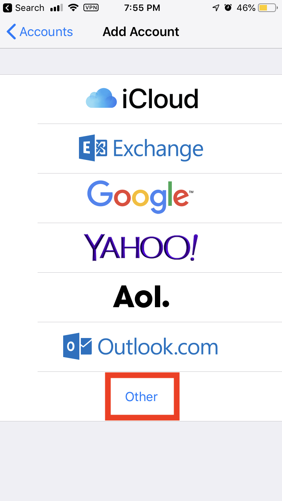
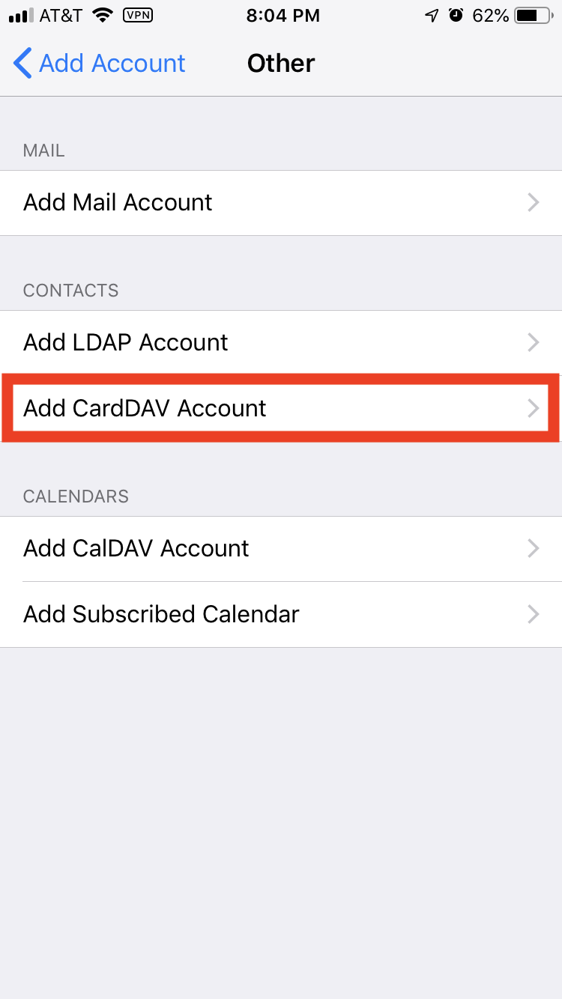
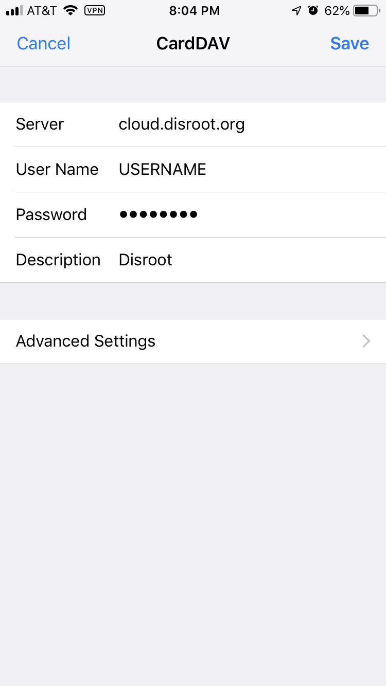

# Goal:
**Sync the iOS Contacts app with Disroot cloud.**

This will allow you to check, update and remove your contacts from any iOS device with an internet connection. Once it runs, and nothing breaks, you'll forget it is there.

# Requirements

* Your Disroot login name
* Your Disroot password
* An iOS device (iPhone, iPad)
* A working internet connection
* 15 minutes

# Set up Contacts Syncing.

1. Go to the  **Settings** app on your device.
2. Click on '**Passwords & Accounts**'.
3. Click '**Add Account**'.
4. Click '**Other**'.

5. Click: '**Add CalDAV Account**

6. On the next screen enter the following, then click '**Next**':

Use these settings:
* **Server**: `cloud.disroot.org`
* **User Name**: your username  (_without @disroot.org_)
* **Password**: your password
* **Description**: whatever you'd like

7. Done!

Now your contacts are added. If you open the Contacts app you will see your contacts. If you would like, go to the Contacts app settings to set your default to Disroot.
