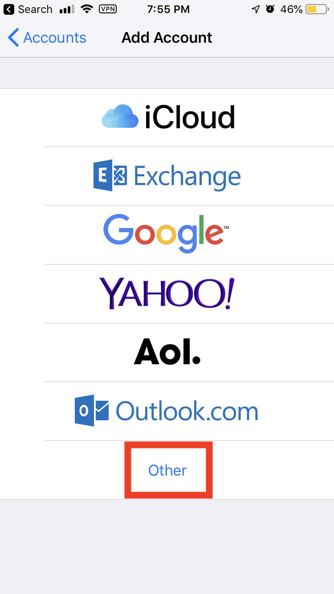
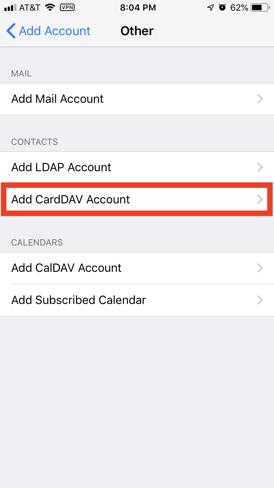

# Objectif :
**Synchroniser l'application Contacts iOS avec Disroot cloud.**

Cela vous permettra de vérifier, mettre à jour et supprimer vos contacts depuis n'importe quel appareil iOS disposant d'une connexion Internet. Une fois qu'il fonctionne, et que rien ne casse, vous oublierez qu'il est là.

# Exigences

* Votre nom de connexion Disroot
* Votre mot de passe Disroot
* Un appareil iOS (iPhone, iPad)
* Une connexion Internet qui fonctionne
* 15 minutes

# Configurer la synchronisation des contacts.

1. Allez dans l'application **Paramètres** de votre appareil.
2. Cliquez sur '**Mots de passe et comptes**'.
3. Cliquez sur "**Ajouter un compte**".
4. Cliquez sur "**Autres**".

5. Cliquez sur : '**Ajouter un compte CalDAV**

6. Sur l'écran suivant, saisissez les éléments suivants, puis cliquez sur '**Suivant**' :

Utilisez ces paramètres :
* **Serveur** : `cloud.disroot.org`.
* **Nom d'utilisateur** : votre nom d'utilisateur (_sans @disroot.org_)
**Password** : votre mot de passe
**Description** : ce que vous voulez.

7. C'est fait !

Vos contacts sont maintenant ajoutés. Si vous ouvrez l'application Contacts, vous verrez vos contacts. Si vous le souhaitez, allez dans les paramètres de l'application Contacts pour définir votre valeur par défaut sur Désarmer.
