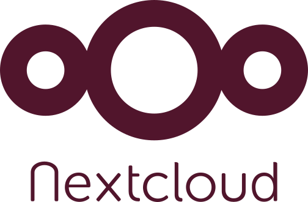

**Nextcloud** est un logiciel gratuit et open source qui vous permet de télécharger et de stocker des fichiers sur un serveur (il pourrait s'agir d'un serveur de votre choix), et de les synchroniser avec différents appareils auxquels vous pouvez accéder en toute sécurité de n'importe où via internet. Certaines des fonctionnalités qu'il offre sont : la synchronisation des calendriers, des contacts et des signets, la conférence téléphonique/vidéo, un tableau de projet de base, un fil d'actualité et plus encore. 
C'est le service de base de **Disroot** et la principale interface utilisateur que nous essayons d'intégrer à la plupart des applis que nous proposons.

Dans les chapitres suivants de ce howto **Cloud**, nous allons découvrir l'interface, les bases de son fonctionnement et les principales fonctionnalités de **Nextcloud**, ainsi que quelques actions de base sur les fichiers et les paramètres personnels.
