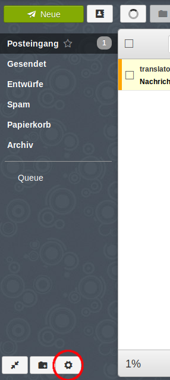
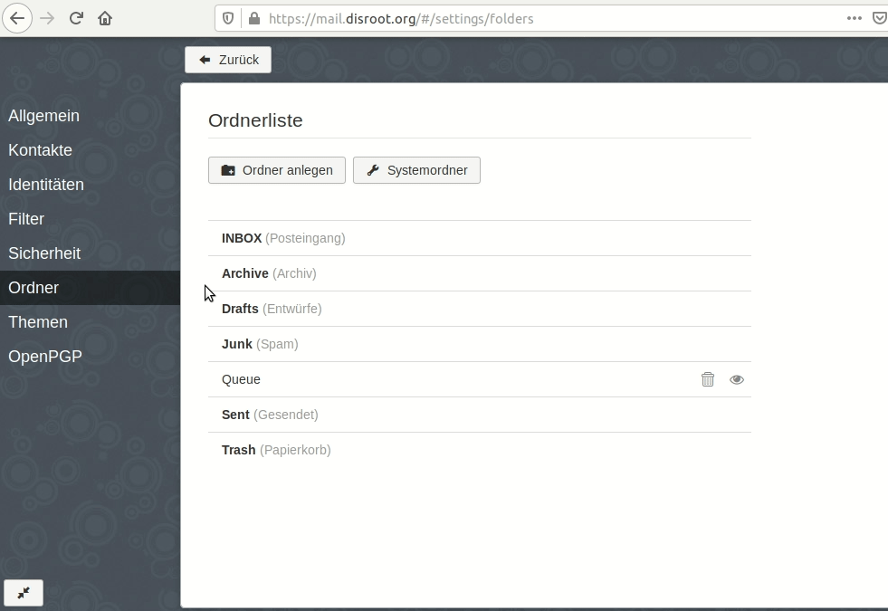
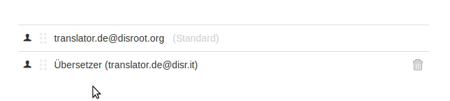
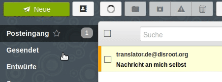

# Alias in Webmail einrichten
Melde Dich als erstes in Deinem Webmail-Konto an und gehe zu Deinen Email-Einstellungen (unteres linkes Icon).

In den Einstellungen gehst Du in den *Identitäten*-Reiter, klickst auf *Identität hinzufügen* und füllst die Eingabefelder. Wenn Du Du die notwendigen ANgaben gemacht hast, klickst DU auf den *Hinzufügen*-Button.

*(Jeder* **Disroot**-*Nutzer bekommt automatisch ein* benutzername@disr.it *Alias zur freien Nutzung bereitgestellt)*

# Standard setzen
Du kannst Deine Standard-Identität verwalten, indem Du ganz einfach die gewünschte Identität an die Spitze der Liste ziehst.

# Email senden
Um eine Email mit der neuen Identität zu senden, klicke beim Erstellen einer Email einfach auf das *Von*-Feld und wähle aus dem Dropdown-Menü das Alias aus, das Du nutzen möchtest.

