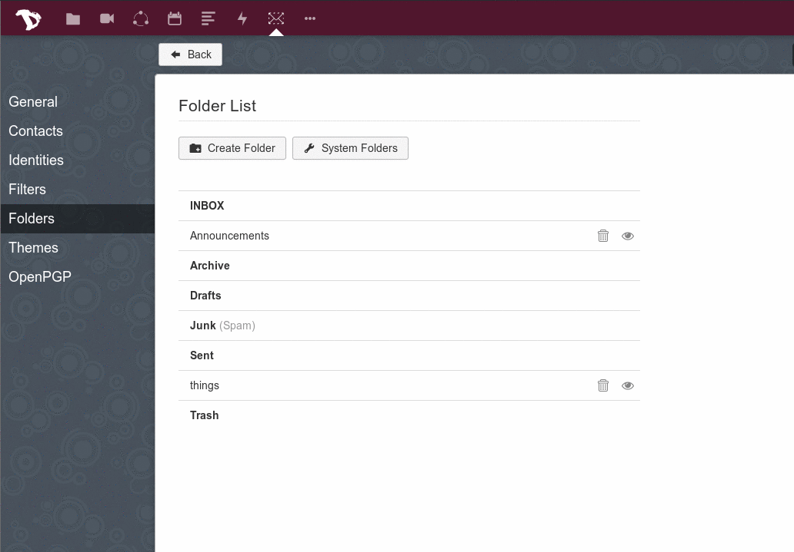
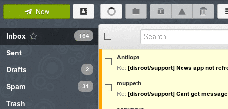

## Configuración
Primero, accede a tu webmail y ve a tus configuraciones de correo (icono abajo a la izquierda)

Cuando estés en Configuraciones, ve a la pestaña "**Identidades**", click en "**Agregar una Identidad**" y completa el formulario. Una vez hecho, presiona el botón "**Agregar**".
*(Todo usuario de disroot tiene por defecto un alias* usuario@disr.it *que puede utilizar)*

## Establecer como predeterminado
Puedes administrar tu identidad predeterminada, simplemente arrastrándola hasta arriba de la lista.

## Enviar correo
Para enviar un correo con tu nuevo alias, sólo haz click en el campo "**De**" y selecciona el alias que desees utilizar desde el menú desplegable, cuando estés redactando un correo.

