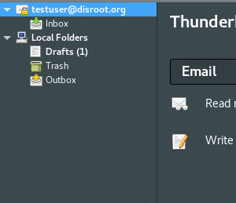

# Imposta alias su Thunderbird

Innanzitutto, avvia **Thunderbird** e vai alle impostazioni dell'account facendo clic con il pulsante destro del mouse sul tuo account. 

In basso a destra della finestra delle impostazioni, hai il pulsante delle impostazioni **"Gestisci identità..."**.

Una volta in Identity Manager, puoi aggiungere un nuovo alias premendo il pulsante **"Aggiungi..."** e compilando il modulo: 

# Imposta default
Se desideri impostare un nuovo alias e-mail come predefinito, seleziona l'alias e-mail e fai clic sul pulsante **"Imposta predefinito"**. 

# Invia una email
Per inviare e-mail con il tuo nuovo alias, fai clic sul campo **"Da"** e seleziona l'alias che desideri utilizzare dal menu a discesa, durante la composizione della posta. 

