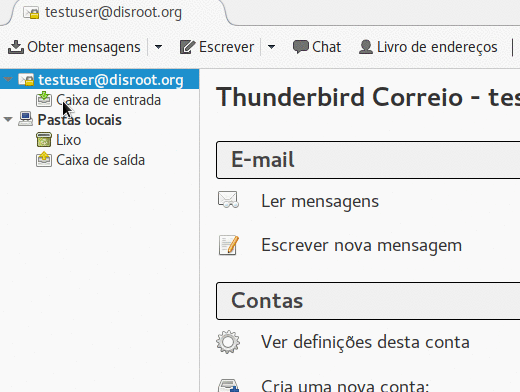
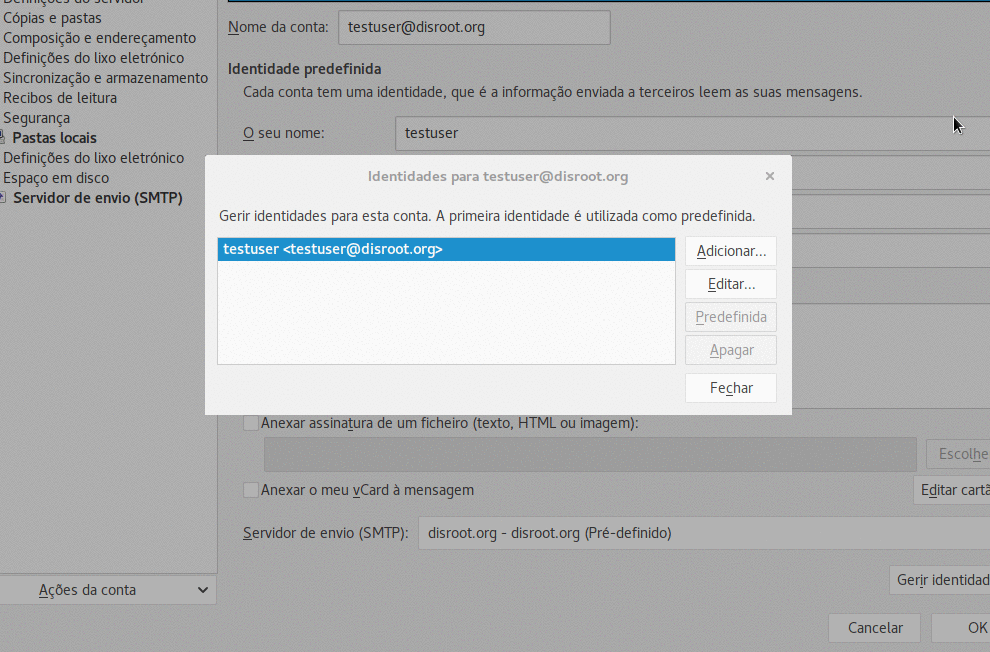
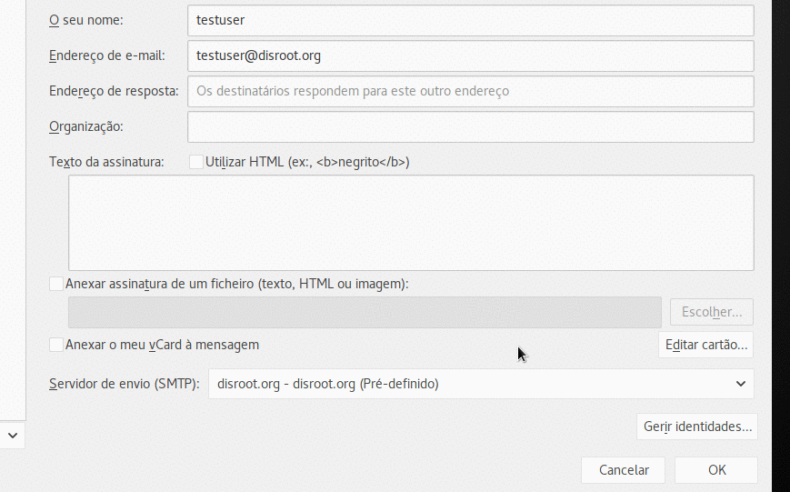
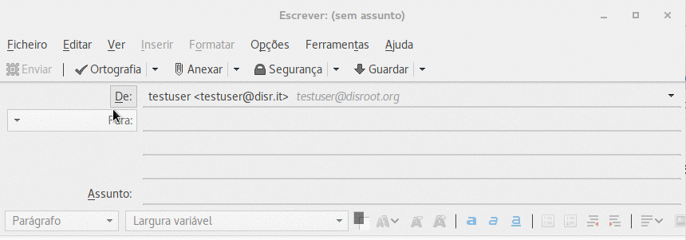

# Configurações
Primeiro, inicie o Thunderbird e vá a "Definições" carregando com a tecla direita do rato na sua conta de email.

No canto inferior direito da janela de configurações da sua conta existe o botão **"Gerir Identidades..."**

Uma vez no painel de gestão de identidades, pode adicionar novos alias carregando em **"Adicionar..."** e preenchendo a informação no formulário e carregando em OK no fim:

# Set default
Se quiser colocar o seu novo alias de email como a identidade predefinida do seu email, selecione o alias de emails e carregue no botão **"Predefinição"**.

# Enviar email
Para enviar um email com o seu novo alias carregar no campo **"De:"** e escolher o alias que quer utilizar quando está a compor o seu email.

