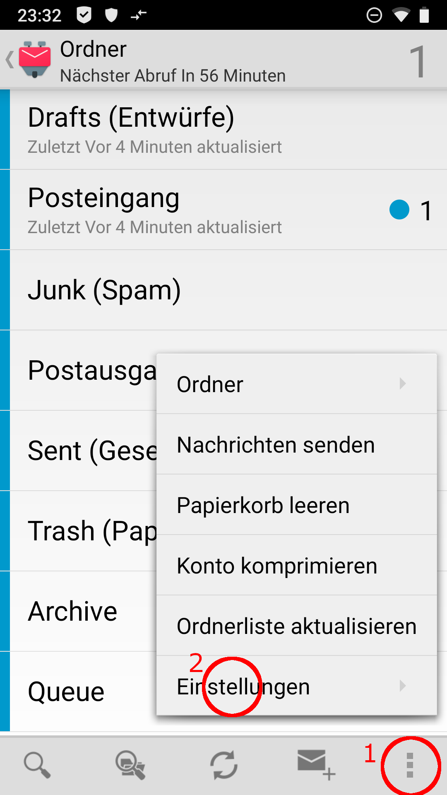
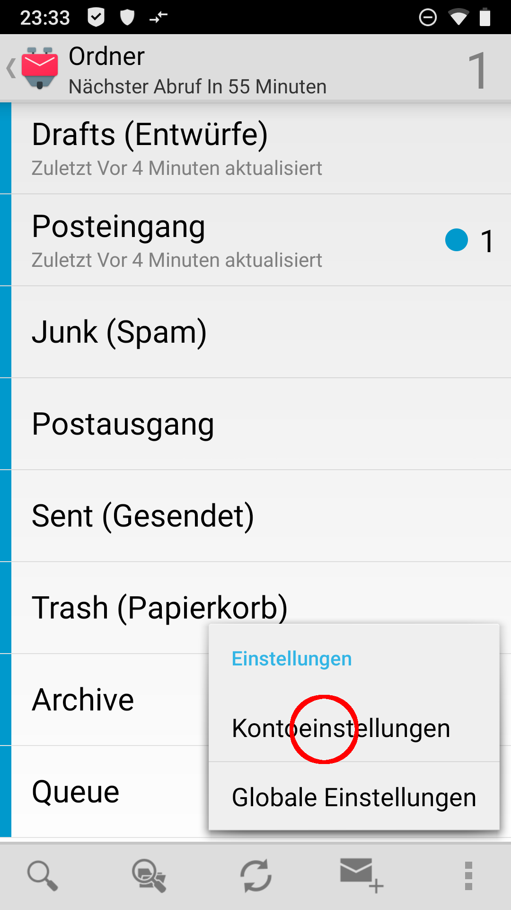
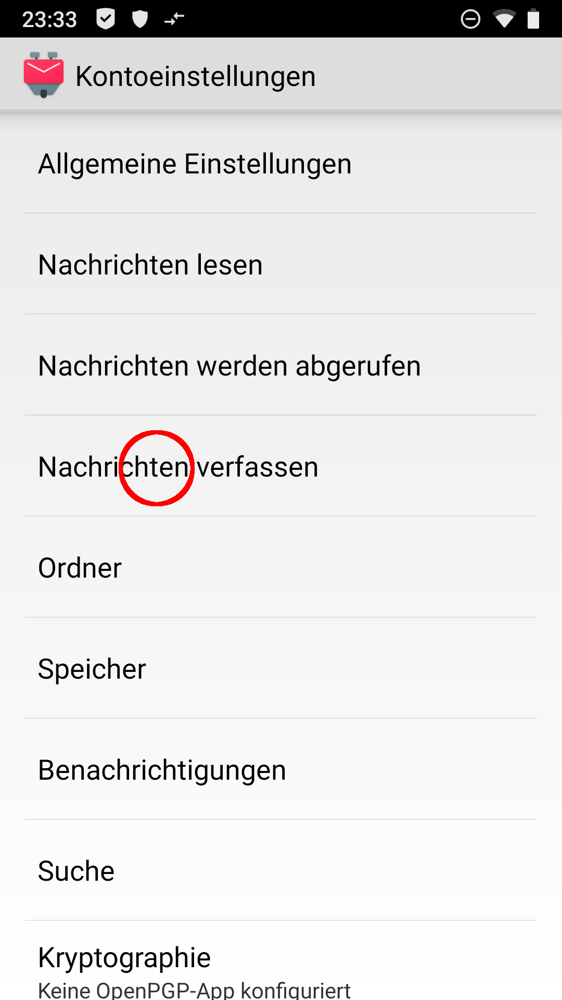
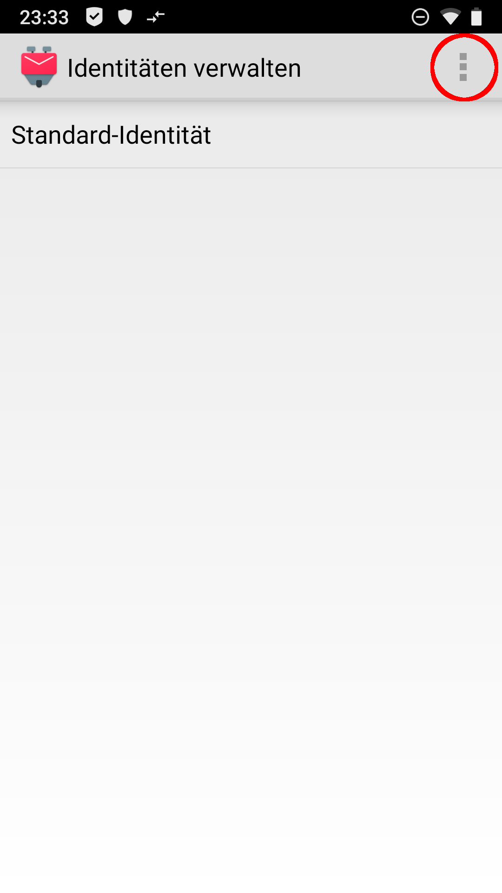
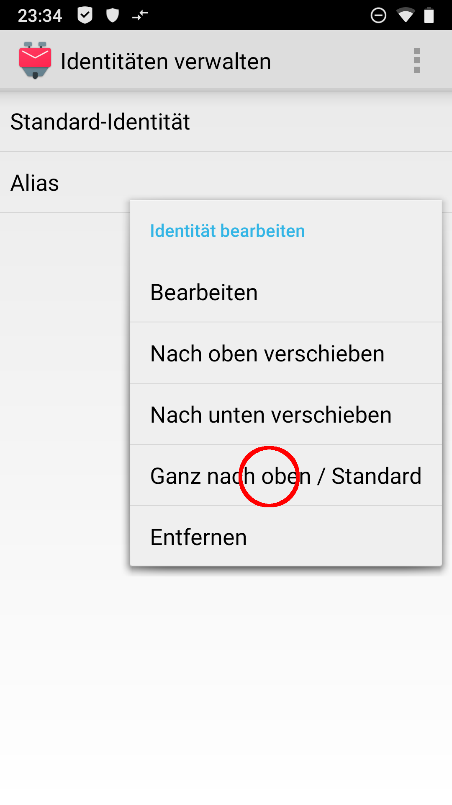

# Alias in K-9 Mail

Als erstes öffnest Du **K-9 Mail** und gehst in die *Kontoeinstellungen* (Konto auwählen '>' 3 Punkte unten rechts '>' Einstellungen '>' Kontoeinstellungen).

 

In den Einstellungen gehst Du auf *Nachrichten verfassen* und dort auf *Identitäten verwalten*.

 

Wenn Du nun auf die drei Punkte in der oberen rechten Ecke tippst, findest Du dort den Menüpunkt *Neue Identität erstellen*.

*(Jeder* **Disroot**-*Nutzer hat automatisch ein* benutzername@disr.it *Alias zur Verfügung)*

 

In der erscheinenden Eingabemaske gibst Du nun mindestens die neue Alias-Adresse ein.

# Standard setzen

Um die Standard-Identität zu ändern, bleibst Du im Menü *Identitäten verwalten*. Tippe auf das von Dir bevorzugte Alias und halte es. Im nun erscheinenden Menü wählst Du *Ganz nach oben / Standard*

# Email verfassen
Um eine Email mit Deinem neuen Alias zu versenden, tippe bei der Email-Erstellung auf das *Von:*-Eingabefeld und wähle das von Dir gewünschte Alias aus dem Dropdown-Menü aus.

