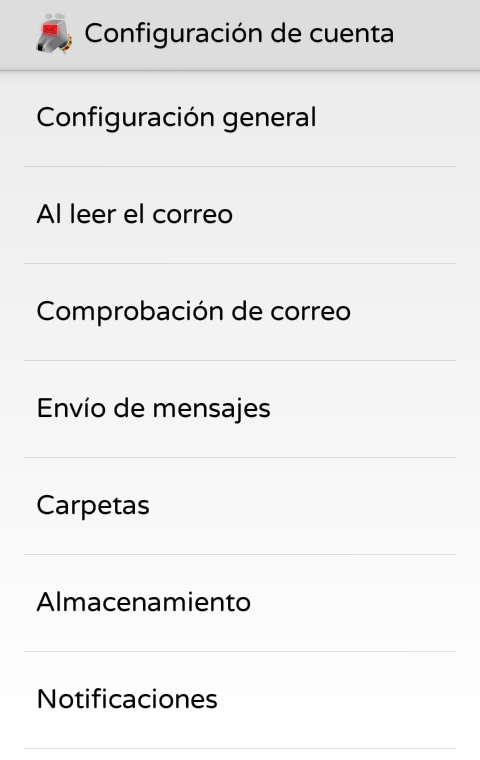
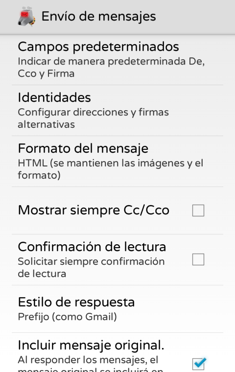
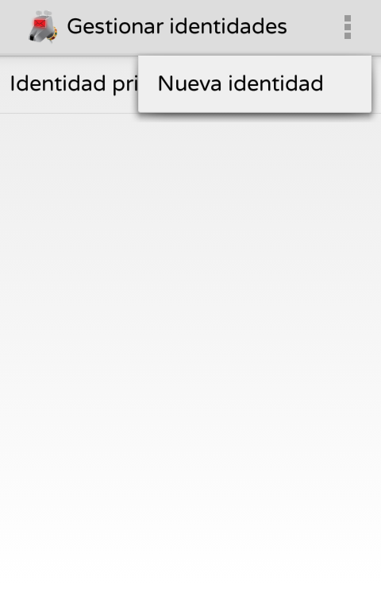
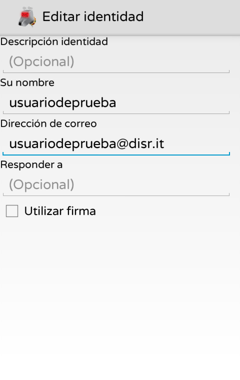
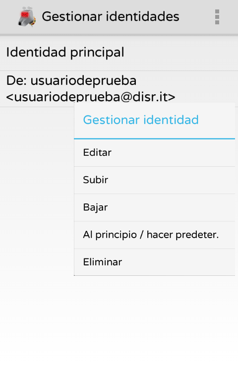

## Configuración
Primero, inicia **K9** y ve a tus configuraciones de cuenta

Cuando estés en Configuraciones, ve a la pestaña "**Envío de mensajes**" y teclea en "**Identidades**".

Selecciona "**Nueva identidad**" tecleando sobre el icono de los "tres puntos" arriba a la derecha.
*(Todo usuario de disroot tiene por defecto un alias usuario@disr.it que puede utilizar)*

Completa el formulario proporcionando el nuevo alias de dirección

## Establecer como predeterminado
Para cambiar la identidad predeterminada, en las configuraciones "**Administrar Identidades**", sólo teclea y presiona el alias que deseas establecer y selecciona la opción "**Mover al inicio / hacer predeterminada**".

## Enviando correo
Para enviar correo con tu nuevo alias, sólo haz click en el campo "**De**" y selecciona el alias que desees utilizar desde el menú desplegable, cuando estés redactando un correo.
