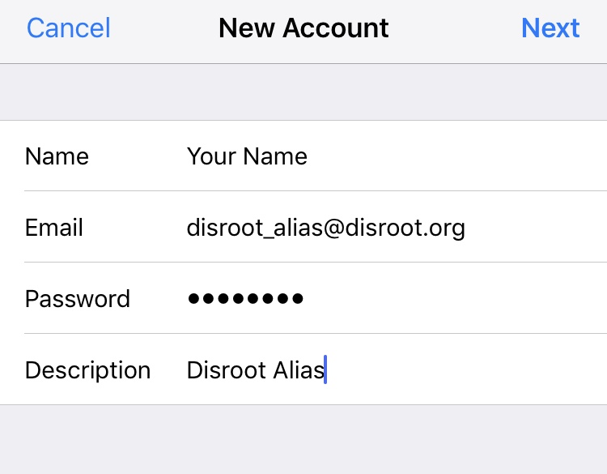

# Alias mit Mail iOS einrichten

Zunächst öffne **Einstellungen** und öffne **Passwort and Benutzerkonten**

wähle dort **neues Konto hinzufügen** aus ...

... wähle **weitere**...

... nun **E-Mail Konto hinzufügen**.

 

Auf der **Neues Konto** Seite, trage deine Alias Informationen ein (Name, Alias, Passwort and Beschreibung) anschließend **weiter**.

Auf der nächsten Seite musst du die **IMAP** und **SMTP** Serverinformationen eintragen. Lasse die ersten Felder wie sie sind.

Unter **Eingehender Mail Server** sowie **Ausgehender Mail Server**, trage deine Disroot Username ein (Nicht dein Alias!).

!! Achtung:

!! Für **IMAP** und **SMTP**, müssen alle Felder eingetragen sein (auch wenn dort "optional" steht).

klicke **weiter**.

Jetzt kannst du wenn du eine E-Mails schriebst im "*von*" Feld dein Alias auswählen.

