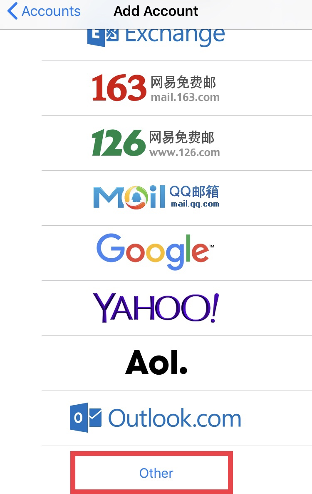

# Setup Alias on Mail iOS

First off, open **Settings** and go to **Password and Accounts** section

Once in **Settings**, select **Add a new account**...

... then **Other**...

... and finally, choose **Add Mail Account**.

 

On the **New Account** screen, fill in the details of your alias account (name, username, password and account description) and then click **Next**.

The next screen will require you to fill in the details of **IMAP** and **SMTP** servers. Leave the first fields just like they appear.

At **Incoming Mail Server** as well as **Outgoing Mail Server**, fill in the username of your base account (not the alias).

!! NOTE:

!! Both for **IMAP** and **SMTP**, all details must be filled in (even though it says "optional").

Then click on **Next**.

From now on, when sending an email, you can select your alias by tapping on the "*From*" field and choosing it.

