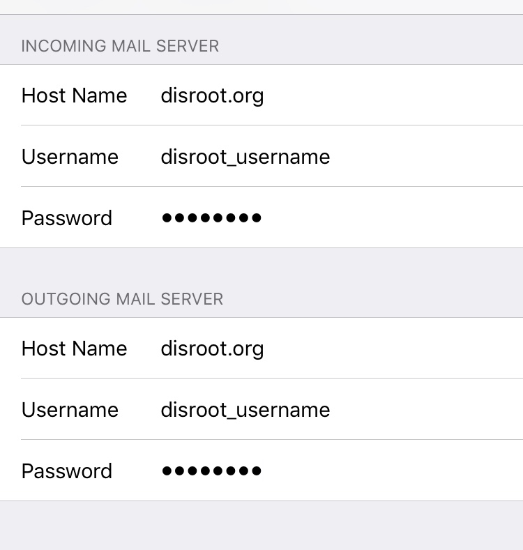

# Configurer un alias dans Mail iOS

Tout d'abord, ouvrez **Paramètres** et allez dans la section **Mot de passe et comptes**.

Une fois dans **Paramètres**, sélectionnez **Ajouter un nouveau compte**...

... puis **Autres**...

... et enfin, choisissez **Add Mail Account**.

 

Sur l'écran **Nouveau compte**, remplissez les détails de votre compte alias (nom, nom d'utilisateur, mot de passe et description du compte), puis cliquez sur **Suivant**.

L'écran suivant vous demandera de remplir les détails des serveurs **IMAP** et **SMTP**. Leave the first fields just like they appear.

Dans **Serveur de courrier entrant** ainsi que **Serveur de courrier sortant**, indiquez le nom d'utilisateur de votre compte de base (pas l'alias).

!! ATTENTION !

!! Pour **IMAP** et **SMTP**, tous les détails doivent être remplis (même si cela dit "facultatif").

Cliquez ensuite sur **Suivant**.

À partir de maintenant, lorsque vous envoyez un e-mail, vous pouvez sélectionner votre alias en appuyant sur le champ "*From*" et en le choisissant.

