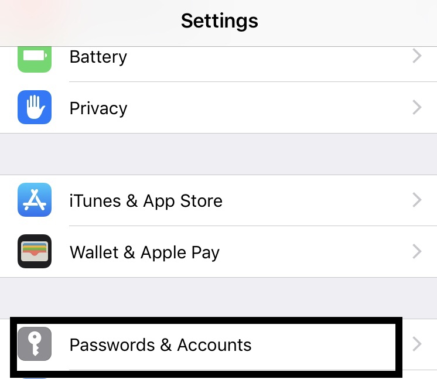
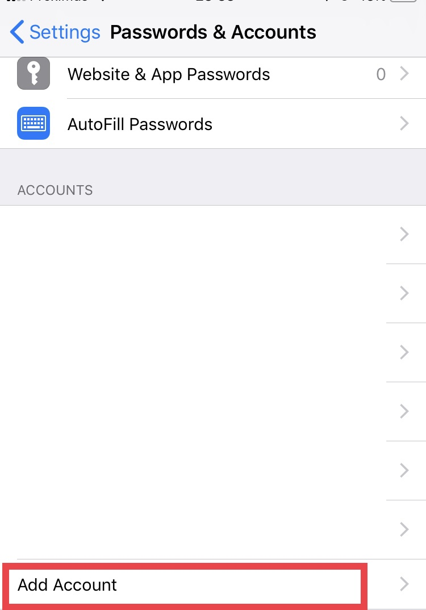
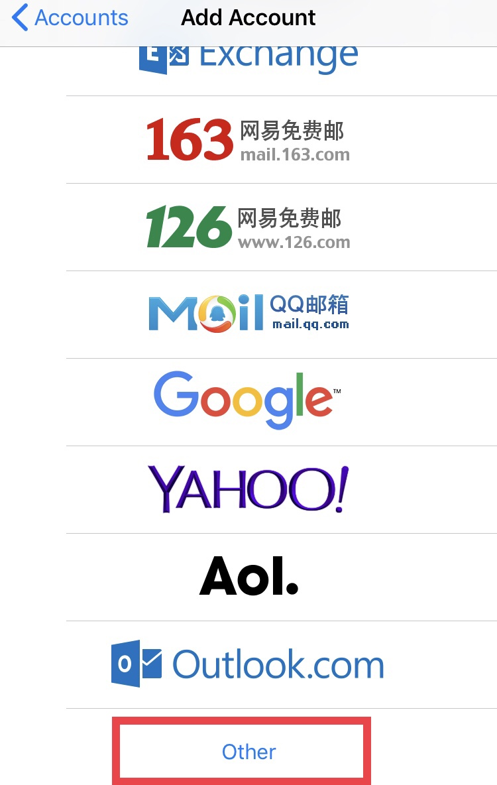
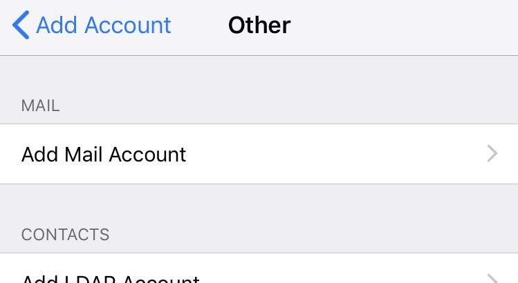
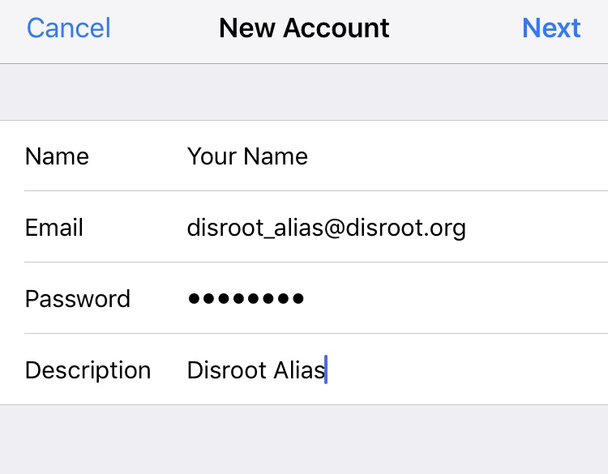
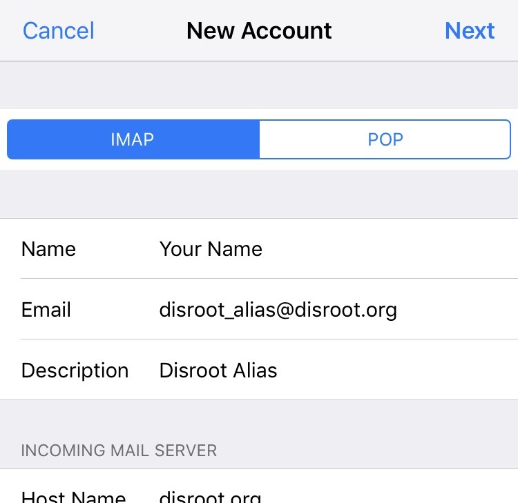
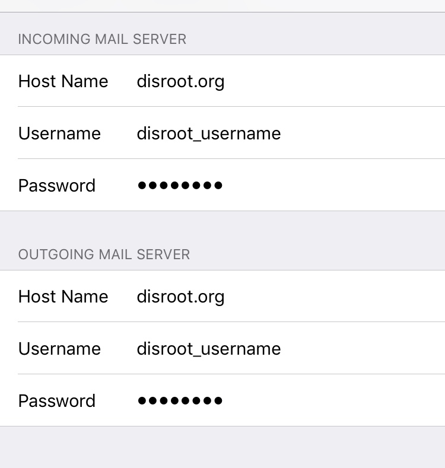
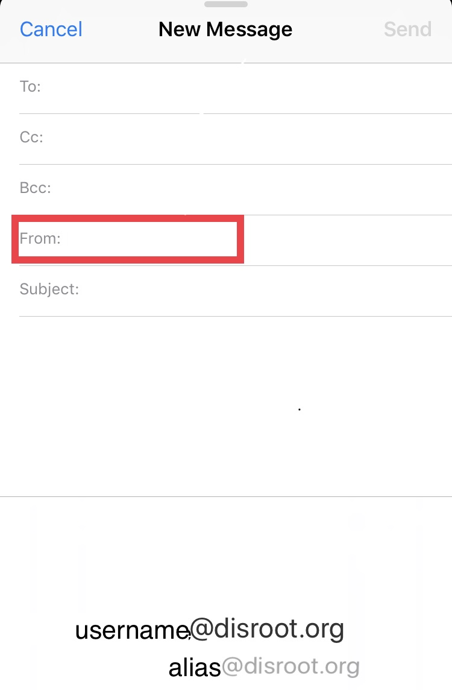

# Configurar alias de correo en Mail iOS

Primero, abre las **Configuraciones** y ve a **Contraseñas y Cuentas** section

Una vez allí, selecciona **Agregar una nueva cuenta**...

... luego **Otra**...

... y, finalmente, elige **Agregar Cuenta de Correo**.

 

En la pantalla de **Nueva Cuenta**, completa los detalles de tu alias (nombre, nombre de usuario, contraseña y descripción de la cuenta) y luego click en **Siguiente**.

La siguiente pantalla te solicitará que completes la información de los servidores **IMAP** y **SMTP**. Deja los primeros campos tal cual aparecen.

En **Servidor de Correo Entrante** al igual que en **Servidor de Correo Saliente**, escribe el nombre de usuario de tu cuenta principal (no el alias).

!! AVISO:

!! Tanto en **IMAP** como **SMTP** se deben completar los datos (aún cuando dice "Opcional").

Luego presiona **Siguiente**.

De ahora en adelante, cuando envies un correo, puedes seleccionar tu alias presionando el campo "*De*" y eligiéndolo.

