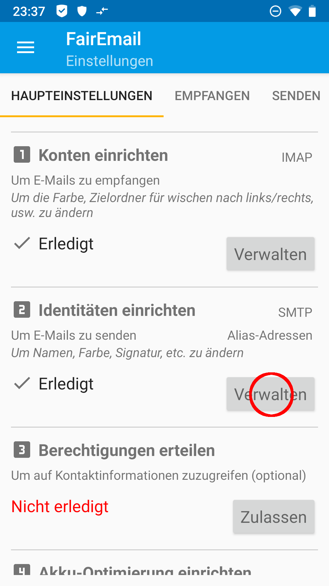
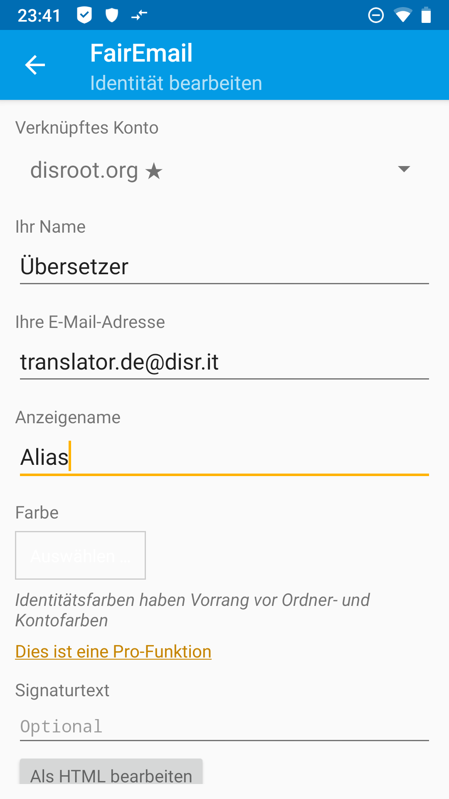
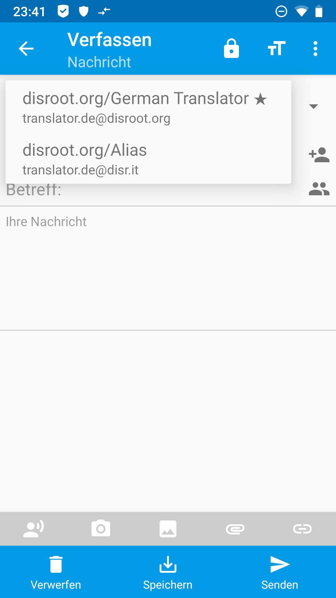

# Alias in FairEmail

Als erstes öffnest Du **FairEmail** und öffnest in den Haupteinstellungen Punkt 2, "Identitäten einrichten", indem Du auf den *Verwalten*-Button tippst (3 Punkte oben links '>' Einstellungen '>' Reiter "Haupteinstellungen").

In den Einstellungen drückst Du lange auf Dein **Disroot**-Emailkonto, bis sich ein Menü öffnet. Dort gehst Du auf *Kopiere...*.

Du gelangst nun in die Eingabemaske für eine Identität, die mit Deinem **Disroot**-Konto verknüpft ist. Gebe Deine Daten ein bzw. ändere die automatisch befüllten Felder entsprechend Deiner Wünsche ab.

*(Jeder* **Disroot**-*Nutzer hat automatisch ein* benutzername@disr.it *Alias zur Verfügung)*

Beende Deine Engabe, indem Du unter der Eingabemaske auf den *Speichern*-Button tippst. Dein Alias ist nun angelegt.

 

# Email verfassen
Um eine Email mit Deinem neuen Alias zu versenden, tippe bei der Email-Erstellung auf das *Von:*-Eingabefeld und wähle das von Dir gewünschte Alias aus dem Dropdown-Menü aus.

