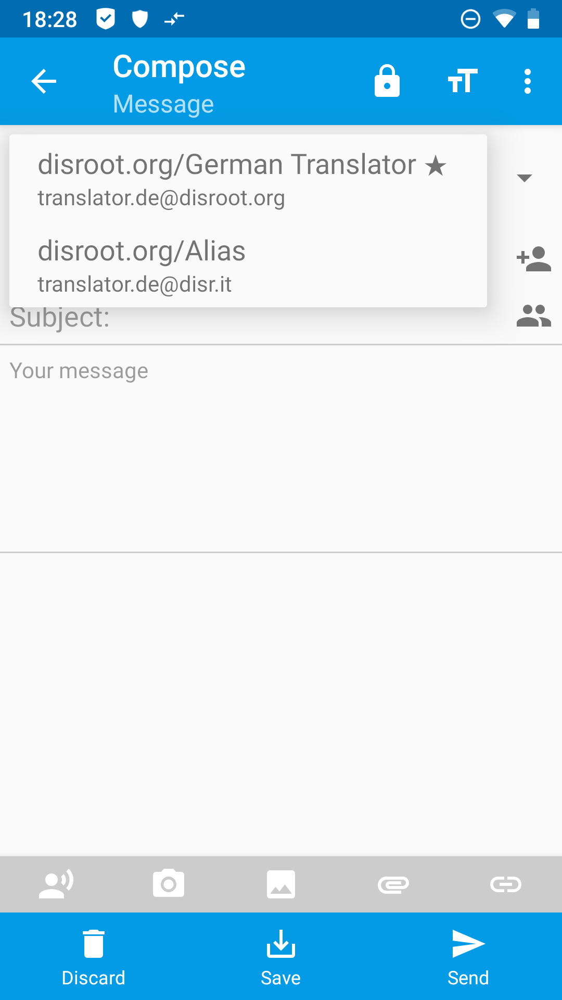

# Alias on FairEmail

First of all, you open **FairEmail** and go to "Create Identity" in the principal settings, point 2, by tapping on the "Manage" button (3 dots top left '>' Settings '>' tab "principal settings").

In the settings you'll tap and hold on your **Disroot**-Account until a menu opens. In this menu you'll choose *Copy...*.

In the following input dialog you are presented an identity, which is connected to your existing **Disroot** account. Fill in your data or change the automatically filled information as you wish.

*(Every* **Disroot** *user has an* username@disr.it *alias to use by default)*

Finish your input by tapping by tapping on the *Save* button at the bottom of the menu. Your ALias is now set up.

 

# Create email
To send an email with your new alias tap on the *From:* field and choose the alias you want to use from the appearing dropdown menu.

