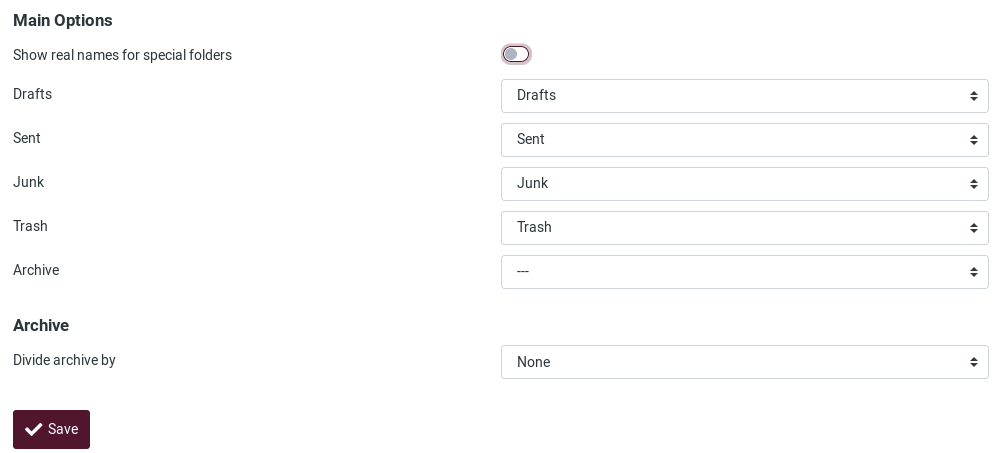
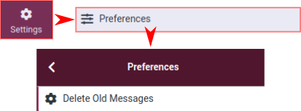
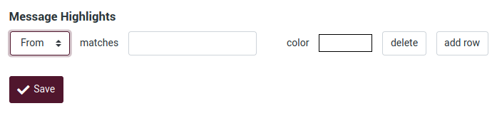

# Paramètres

## Préférences

Les préférences de l'utilisateur vous permettent de régler diverses options et paramètres qui contrôlent le comportement et l'interface utilisateur de l'application webmail. *Si vous souhaitez en savoir plus, consultez la [documentation Roundcube](https://docs.roundcube.net/doc/help/1.1/en_US/settings/preferences.html)*.

Après avoir modifié les préférences, n'oubliez pas de les sauvegarder en cliquant sur le bouton **Save** situé sous le formulaire des paramètres.

### 01. Interface utilisateur
Pour modifier les configurations de votre interface utilisateur, allez dans **Paramètres**, **Préférences** et choisissez **Interface utilisateur**.

C'est la section **Interface utilisateur** :

#### Les options principales sont :

- **Langue** : La langue de l'interface webmail est automatiquement sélectionnée à partir de celle du système d'exploitation de votre ordinateur. Cependant, si ce n'est pas le cas ou si vous voulez la changer pour une langue spécifique, vous pouvez le faire ici.

- **Fuseau horaire** : Le client traduit automatiquement les dates dans votre fuseau horaire local. Par défaut, il est réglé sur **Auto**, ce qui permet au webmail d'utiliser le fuseau horaire configuré sur votre ordinateur. Si vous voulez/besoin de le changer, il suffit de sélectionner un fuseau horaire spécifique dans la liste.

- **Format de l'heure** : Sélectionnez le mode d'affichage de l'heure.

- **Format de la date** : Sélectionnez le mode d'affichage des dates.

- **Dates proches** : Cette option "traduit" les dates proches d'aujourd'hui en termes relatifs comme "Aujourd'hui", "Hier", etc.

- **Afficher l'entrée suivante de la liste après une suppression/déplacement** : Activez cette option si vous voulez aller directement au message suivant après en avoir supprimé/déplacé un au lieu du dossier du message.

- **Rafraîchir (vérifier les nouveaux messages, etc.)** : Sélectionnez la fréquence à laquelle le client recherchera de nouveaux messages.

#### Skin de l'interface
C'est ici que vous pouvez choisir l'apparence du client web. **Beetroot** est la saveur par défaut de **Disroot Webmail**.

#### Options du navigateur
- **Traiter les popups comme des fenêtres standard** : Que vous souhaitiez écrire un message ou l'ouvrir, vous pouvez choisir de le faire dans la même fenêtre, dans une nouvelle fenêtre ou dans un nouvel onglet. Lorsque cette option est activée, le client se comportera en fonction des paramètres de votre navigateur.

- **Enregistrement du gestionnaire de protocole** : vous pouvez enregistrer cette application webmail pour qu'elle soit ouverte lorsque vous cliquez sur un lien e-mail quelque part sur le web.

### 02. Vue de la boîte aux lettres
Pour définir ou modifier les options concernant la boîte aux lettres, allez dans **Paramètres**, **Préférences** et choisissez **Vue de la boîte aux lettres**.

#### Options principales de la boîte aux lettres :

- **Marquer les messages comme lus** : Définit combien de temps après la sélection d'un message le client doit le marquer comme lu.

- **Sur demande d'accusé de réception** : Définit ce que le client doit faire si l'expéditeur d'un message demande un accusé de réception de lecture.

- **Développer les fils de messages** : Lorsque vous listez les messages dans les fils de discussion, cette option contrôle la façon dont les groupes de conversation sont développés dans la liste.

- **Rangs par page** : Le nombre de messages affichés dans la boîte aux lettres.

#### Options de nouveau message

- **Vérifier tous les dossiers pour les nouveaux messages** : Lorsque cette option est activée, le client vérifie la présence de nouveaux messages dans tous les dossiers. Ceci est utile lorsque vous avez des filtres actifs qui transfèrent le courrier entrant vers d'autres dossiers que la **boîte de réception**. S'il est désactivé, alors par défaut, seule la *boîte de réception* est vérifiée périodiquement pour les nouveaux messages.

- **Afficher les notifications du navigateur sur les nouveaux messages** : Activez ou désactivez les notifications sur votre navigateur lorsqu'un nouveau message arrive.

- **Afficher les notifications du bureau sur les nouveaux messages** : Activez ou désactivez les notifications sur votre bureau lorsqu'un nouveau message arrive.

- **Lancer le son sur le nouveau message** : Activez ou désactivez une notification sonore à l'arrivée d'un nouveau message.

- **Fermer la notification du bureau** : Choisissez après combien de temps la notification du bureau doit être fermée.

### 03. Affichage des messages

Vous trouverez ici les paramètres concernant la façon dont le client doit traiter les messages.

Pour accéder à ces options, allez dans **Paramètres**, **Préférences** et choisissez **Affichage des messages**.

!Affichage des messages](en/pref_displaying.png)

#### Options principales

- **Ouvrir le message dans une nouvelle fenêtre** : Lorsque cette option est activée, un double-clic sur un e-mail l'ouvrira dans une nouvelle fenêtre.

- **Afficher l'adresse e-mail avec le nom d'affichage** : Si cette option est activée, l'adresse e-mail de l'expéditeur sera affichée à côté de son nom lorsqu'un message est ouvert.

- **Afficher le HTML** : Activez cette option pour afficher les messages formatés en texte riche. Si elle est désactivée, les messages formatés seront convertis en texte brut.

- **Autoriser les ressources distantes (images, styles)** : Les messages formatés (HTML) peuvent contenir des références à des ressources tierces. Autoriser le chargement de ce type de contenu par défaut peut représenter un risque sérieux pour la vie privée. Choisissez comment vous préférez que le client les traite.

- **Afficher les images jointes sous le message** : Cochez cette option si vous souhaitez que les images jointes apparaissent sous le message.

- **Afficher les émoticônes dans les messages en texte brut** : Lorsque cette option est activée, le client "traduira" des motifs de caractères tels que ** :)** ou ** :(** en émoticônes.

##### Options avancées

- Jeu de caractères par défaut** : Un jeu de caractères est un ensemble complet de caractères (chiffres, lettres, signes de ponctuation, symboles spéciaux) et leurs codes numériques qui peuvent être reconnus par un dispositif informatique. Vous pouvez sélectionner ici le jeu de caractères/langue que la majorité de vos correspondants utilisent.

- **Afficher les messages PGP/MIME (cryptés)** : Lorsque le cryptage est activé côté serveur, cocher cette option permet d'afficher le contenu crypté d'un message dans la vue de la boîte aux lettres.

### 04. Composer des messages

Dans **Paramètres**, **Préférences**, choisissez **Composition des messages**.

Ces options et paramètres déterminent l'aspect et l'expérience de la composition d'un message électronique.

- **Composer dans une nouvelle fenêtre** : Activez cette option pour ouvrir le compositeur de messages dans une nouvelle fenêtre au lieu de la fenêtre/onglet actuel.

- **Composer des messages en HTML** : Cochez cette option pour activer l'éditeur de texte riche (HTML) lors de la composition d'un nouveau message. Il s'agit uniquement du paramètre par défaut pour la composition de messages HTML. Il peut être activé à tout moment pendant la rédaction.

- **Sauvegarde automatique du brouillon** : Lorsque vous rédigez un nouveau message, une copie est enregistrée dans le dossier *Brouillons* toutes les quelques minutes.

- **Toujours demander un accusé de réception** : Active par défaut l'option d'envoi du **Reçu de retour** pour les nouveaux messages.

- **Toujours demander une notification de l'état de la livraison** : Active l'option d'envoi de la **Notification de l'état de la livraison** par défaut pour les nouveaux messages.

- **Placez les réponses dans le dossier du message auquel vous répondez** : Choisissez le dossier actuel pour y enregistrer le message de réponse au lieu de l'enregistrer dans le dossier "Sent".

- **Lorsque vous répondez** : Cette option contrôle si et où le texte original cité doit être placé lors de la réponse à un message.

- Transfert des messages** : Contrôle la façon dont les messages sont transférés par défaut lorsque vous cliquez sur le bouton **Présenter** sans choisir un mode de transfert.

- **Police par défaut du message HTML** : Lorsque vous écrivez un message formaté (HTML), cette police et cette taille sont utilisées pour le formatage du texte par défaut.

- Action par défaut du bouton [Répondre à tous]** : Lorsque vous répondez à des messages provenant de listes de diffusion, ce paramètre contrôle la manière d'y répondre.

- **Activer les émoticônes** : Permet l'utilisation d'émoticônes dans le message lorsqu'il arrive à destination.

#### Options de signature
- **Ajouter automatiquement la signature** : Sélectionnez dans quels cas le texte de la signature de votre identité d'expéditeur est ajouté à un nouveau message.

- **Placez la signature sous le message cité** : Lorsque vous répondez à une chaîne, cela permet de placer votre signature en dessous de celle-ci.

- **Lorsque vous répondez, supprimez la signature originale du message** : Cette option permet de supprimer les signatures détectées dans le message original lorsqu'on le cite dans la réponse.

- **Forcer le séparateur standard dans les signatures** : Si cette option est cochée, deux tirets (--) seront ajoutés avant votre signature.

##### Options avancées
- Noms des pièces jointes** : Sélectionnez la norme d'encodage des noms que vous voulez/devez utiliser lors de l'envoi de pièces jointes dans les messages.

- **Enregistrer dans le stockage local du navigateur (temporairement)** : Cette option permet ou non d'enregistrer les informations liées à la composition d'un message dans le stockage local du navigateur.

### 05. Contacts

Allez dans **Paramètres**, **Préférences** et choisissez **Contacts**.

Ces options et paramètres contrôlent la façon dont vos contacts sont traités et affichés.

- **Carnet d'adresses par défaut** : Sélectionnez ici le carnet d'adresses par défaut dans lequel les nouveaux contacts sont enregistrés lorsqu'ils sont ajoutés à partir de la vue e-mail.

- Lister les contacts comme** : Vous pouvez choisir comment les noms sont affichés dans la liste des contacts.

- **Tri des colonnes** : Sélectionnez l'attribut de contact utilisé pour trier les contacts dans la liste.

- **Rangs par page** : Entrez ici le nombre de contacts qui seront affichés dans la liste de contacts.

- **Sauter les adresses e-mail alternatives dans l'autocomplétion** : Lorsque cette option est cochée, chaque contact n'apparaîtra qu'une seule fois dans la liste d'autocomplétion qui apparaît lorsque vous commencez à taper dans le champ du destinataire. La première adresse électronique du contact sélectionné sera alors insérée. Si cette option est désactivée, toutes les adresses électroniques d'un contact correspondant sont affichées pour être sélectionnées.

### 06. Dossiers spéciaux
Certains dossiers ont des objectifs spécifiques et sont utilisés par les processus système pour stocker les messages. Ces paramètres vous permettent de choisir les dossiers utilisés pour stocker les **Drafts**, **Sent** ou les messages supprimés (**Trash**).

Pour y accéder, allez dans **Paramètres**, **Préférences** et choisissez **Dossiers spéciaux**.

##### Options principales

- **Montrer les vrais noms pour les dossiers spéciaux** : En activant ce paramètre, les noms originaux des dossiers spéciaux assignés seront affichés dans la liste des dossiers au lieu des noms localisés.

- **Drafts / Sent / Junk / Trash** : Modifiez ou définissez les dossiers de courrier.

- **Archive** : Si vous définissez un dossier **Archive**, lorsque vous cliquez sur le bouton *Archive* dans la vue du courrier, les messages sélectionnés sont déplacés vers ce dossier.

##### Archive

- **Diviser les archives par** : Cette option vous permet d'organiser votre dossier d'archives de différentes manières. Le ou les messages sélectionnés peuvent être classés dans des sous-dossiers de l'archive en fonction de la date d'envoi, de l'adresse électronique de l'expéditeur ou du dossier d'où le message est déplacé. Lorsque cette option est réglée sur Aucun, tous les messages seront stockés dans le dossier **Archive** sans qu'aucun sous-dossier ne soit créé.

### 07. Paramètres du serveur
Ces options fournissent des paramètres plus avancés qui contrôlent la façon dont les messages sont traités par le serveur de messagerie.

Pour les définir ou les modifier, allez dans **Paramètres**, **Préférences** et choisissez **Paramètres du serveur**.

##### Principales options
- **Marquer le message comme lu à la suppression** : Lorsque cette option est activée, les messages non lus seront également marqués comme lus lors de leur suppression immédiate.

- Marquer le message comme étant à supprimer au lieu de le supprimer** : Les messages électroniques peuvent être marqués comme supprimés avant d'être définitivement retirés d'un dossier. Cela permet également de les "annuler" par la suite. Pour les supprimer définitivement, utilisez la commande Compact du menu d'opérations des dossiers de boîtes aux lettres.

- **Ne pas afficher les messages supprimés** : Cette option permet de ne pas afficher les messages marqués comme supprimés.

- **Supprimer directement les messages du dossier Courrier indésirable** : Les messages du dossier *Junk* sont également déplacés vers la *Corbeille* en premier lors de leur suppression. Sautez cette étape en activant cette option.

- **Marquer le message comme lu sur l'archive** : Activez cette option pour marquer comme lus les messages non lus que vous envoyez dans le dossier **Archive**.

##### Maintenance
- **Vider la corbeille à la déconnexion** : Lorsque cette option est cochée, le dossier **Corbeille** est vidé lorsque vous mettez fin à la session.

- **Compacter la boîte de réception à la déconnexion** : Si vous activez cette option, tous les messages marqués pour être supprimés de la boîte de réception seront supprimés lorsque vous vous déconnecterez.

### 08. Supprimer les anciens messages
Allez dans **Paramètres**, **Préférences** et choisissez **Supprimer les anciens messages** pour configurer la façon dont les messages sont supprimés après un certain temps.

Vous pouvez définir ces valeurs par dossier si vous allez dans les paramètres **Dossiers**.

### 09. Couleurs des messages
Vous pouvez attribuer des couleurs spécifiques aux messages en fonction d'une règle.

Pour ce faire, allez dans **Paramètres**, **Préférences** et choisissez **Message Highlights**.

Vous verrez cet écran :

Vous pouvez choisir les informations **Subject**, **From**, **To** et **CC** pour construire une règle. Pour ajouter un autre champ de règle, cliquez sur **add row**.

Voyons un exemple.

Disons que vous voulez que tous les messages **From** ***support@disroot.org*** aient un fond de couleur rose.

Vous devrez combiner et construire certains critères à appliquer aux messages. Dans notre cas...

... donnera comme résultat :

