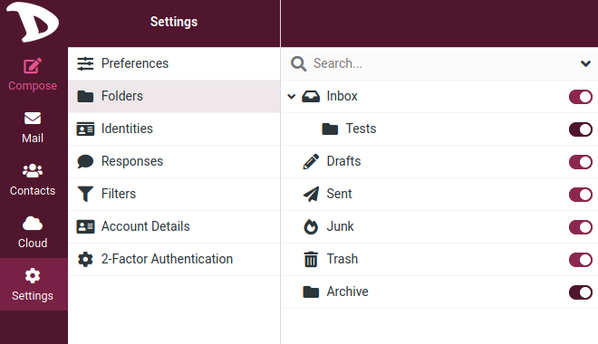

# Folders
Here are the settings that allows you to manage the mailbox folders.

By selecting one you will see in the right pane, information regarding location of the folder, viewing options, when a message is old and how many there are currently. In the mailbox default folders, only the display mode and the age of the mails can be changed.

In the folder list, the right column indicates whether a folder is subscribed or not. By clicking on the on/off button you can change the subscription for that folder.

Subscribed folders are displayed in the email view while unsubscribed ones are hidden and only visible here.

### Creating a folder

To create a folder:

01. Click on the **Create** folder button.

  

02. Enter a name for the folder.
03. Select or create a parent folder (the **Parent folder** field is already pre-selected whith the folder currently selected in the folder list)

  

04. Select the display mode and set when messages should be deleted.

05. Click **Save** to finish.

  

### Folders hierarchy
To maintain a certain order, you can create folders or hierarchical folder structures.

To move a folder simply drag & drop it from the list onto the desired parent folder.

You can also select the parent folder in the property form in the right and by hitting Save the currently selected folder is moved to its new parent.
