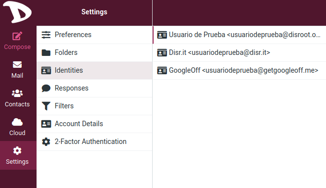
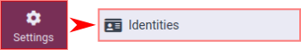
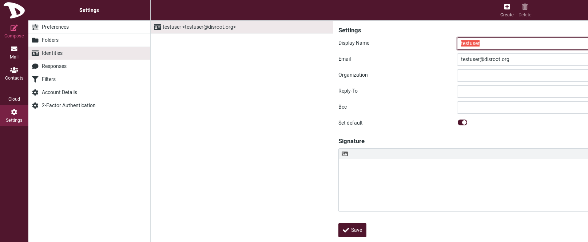
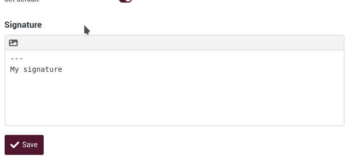
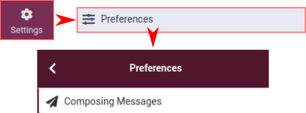
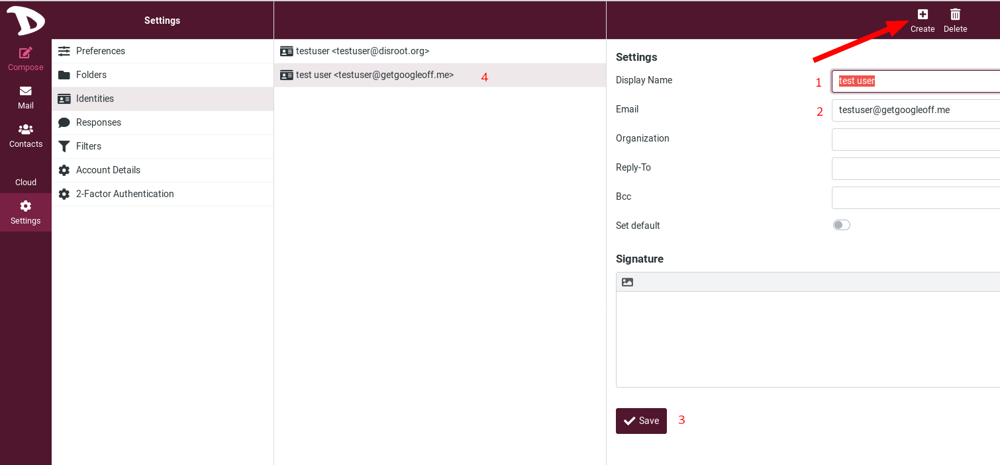
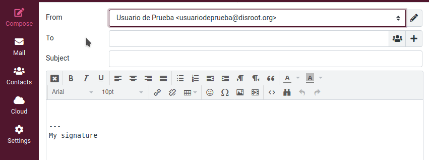

## Identités

### Identité par défaut
Votre identité est le nom et l'adresse e-mail affichés sur la boîte aux lettres du destinataire lorsque vous envoyez un e-mail.

Pour y accéder, cliquez sur **Paramètres** puis sur **Identités**.

Vous verrez votre identité par défaut (*testuser@disroot.org* dans cet exemple).
Si vous cliquez dessus, vous aurez accès à certains paramètres.

- **Nom d'affichage** : le nom complet affiché dans le programme de messagerie du destinataire lorsque vous envoyez un message. Ce nom peut être ce que vous voulez.

- **Email** : votre adresse e-mail par défaut **Disroot**. **Ne la changez pas** sinon l'envoi du message pourrait échouer à cause d'une adresse d'expéditeur invalide.

- **Organisme** : Ceci est facultatif. Si vous ajoutez ces informations, certains programmes de messagerie peuvent les afficher lorsqu'ils reçoivent des messages de votre part.

- **Reply-to** : Cet élément est facultatif. Si vous voulez que le destinataire réponde à une adresse électronique différente de celle à laquelle vous avez envoyé le message, tapez-la ici.

- Cci** : Ce champ est facultatif. Si vous voulez qu'une adresse électronique reçoive une copie cachée de tous les messages que vous envoyez avec cette identité, saisissez-la ici.

- **Définir par défaut** : Faire de l'identité actuelle la sélection par défaut lors de la rédaction de nouveaux messages. Cependant, vous pouvez toujours choisir une autre identité d'expéditeur lors de la composition d'un message.

Vous pouvez également créer une signature en utilisant l'éditeur. Cliquez sur le sélecteur de mode d'édition dans le coin supérieur gauche de la boîte et commencez à la composer. Cette signature sera insérée au bas du message que vous écrivez.

Visitez **Paramètres > Préférences > Composer des messages** pour configurer quand et comment les signatures sont insérées.

### Création d'identités / alias
Ici, vous pouvez configurer un alias pour votre email.

Un alias d'email est simplement une adresse de redirection. Tous les messages envoyés à cet alias sont redirigés vers votre compte email. Cet alias n'existe pas nécessairement, n'a pas de boîte de réception ou d'identifiants de connexion, et c'est un outil très utile pour gérer vos e-mails plus efficacement. Par exemple, vous pouvez avoir besoin de partager une adresse électronique sans exposer votre adresse personnelle ou si vous faites partie d'une liste de diffusion et que vous devez organiser les courriels qui y sont liés.

Par défaut, tous les Disrooters ont deux alias de courriel : *username@disr.it* and *username@getgoogleoff.me*. 

Pour ajouter un alias / une identité, cliquez sur **Créer**.

1. **Nom d'affichage** : Vous devez saisir ici un nom pour identifier l'alias.

2. **E-mail** : Définissez l'alias de votre choix, par exemple *username@disr.it* ou *username@getgoogleoff.me*.

- **Organisation**, **Reply To**, **Bcc**, **Set default** et **Signature** options que nous avons déjà vues.

3. **Enregistrer** : N'oubliez pas d'enregistrer vos modifications.

4. Une fois enregistrées, vos identités apparaissent ici .

### Envoi d'un e-mail avec une autre identité
Pour changer votre identité lorsque vous composez votre email :

1. Cliquez sur le champ **From**. Vous aurez accès à toutes les identités que vous avez définies.

2. Choisissez celle que vous voulez en cliquant simplement dessus.
