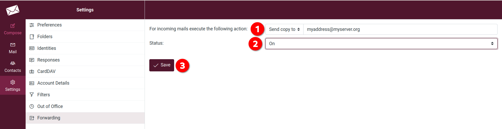
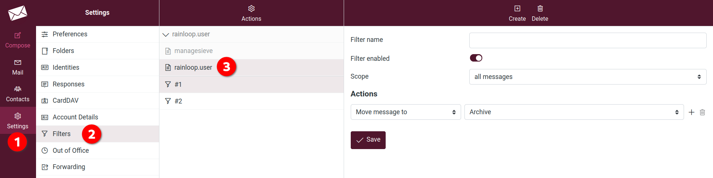
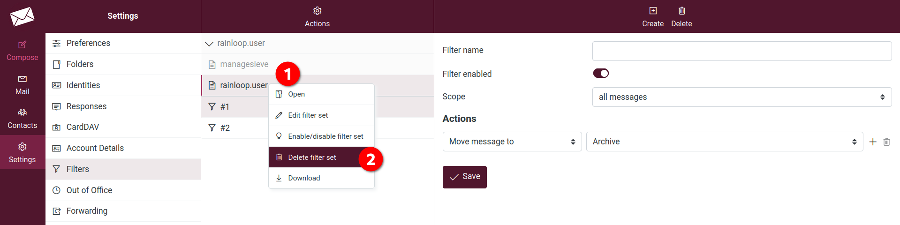

# Renvoi

Vous pouvez ici transférer vos courriels vers une autre adresse électronique.
1. Choisissez entre **Envoyer une copie à** ou **Rediriger vers** et indiquez l'adresse électronique vers laquelle transférer.
2. **Statut** : activez ou désactivez le transfert, selon que vous voulez l'activer ou le désactiver.
3. **Sauvegarder**.

# Problème avec le passage de Rainloop à Roundcube

Les utilisateurs qui ont défini un email de redirection dans Rainloop auront un problème avec Roundcube. Pour résoudre ce problème :

1. Allez sur [Disroot webmail] (https://webmail.disroot.org)
2. Allez dans **Paramètres**, puis **Filtres**.
3. Vous devriez voir **rainloop.user**. Il s'agit d'un ensemble de filtres définis par Rainloop. Vous devriez également voir différents filtres (comme *#1* ou *#2* dans la capture d'écran). Si vous cliquez sur ces filtres, vous verrez qu'ils sont un peu désordonnés. Le plus simple est donc de les supprimer et de les recréer à partir de Roundcube !

Pour supprimer cet ensemble de filtres **rainloop.user**, procédez comme suit

1. Cliquez avec le bouton droit de la souris sur l'ensemble de filtres **rainloop.user**.
2. Choisissez **Supprimer l'ensemble de filtres** et confirmez que vous voulez le supprimer.

Vous pouvez maintenant ajouter une nouvelle redirection comme expliqué précédemment.