# Contacts

**Contacts** est l'outil qui gère les contacts et les carnets d'adresses. Son interface se compose de deux sections : les **Groupes** et la **Liste de contacts**. Sur la gauche se trouve la vue détaillée qui affiche des informations sur les contacts.

Contacts](en/contacts_main.png)

Nous commencerons par la **Liste de contacts** pour nous familiariser avec ses options, puis nous verrons comment les différents contacts peuvent être regroupés pour créer des groupes et à quoi ils servent.

## Liste de contacts
La **Liste de contacts** est l'endroit où sont affichés les noms ou les adresses e-mail des contacts appartenant à un répertoire ou à un groupe. La première fois que vous y accédez, si vous n'avez pas utilisé votre compte **Disroot** auparavant, il est fort probable que vous la trouviez vide.

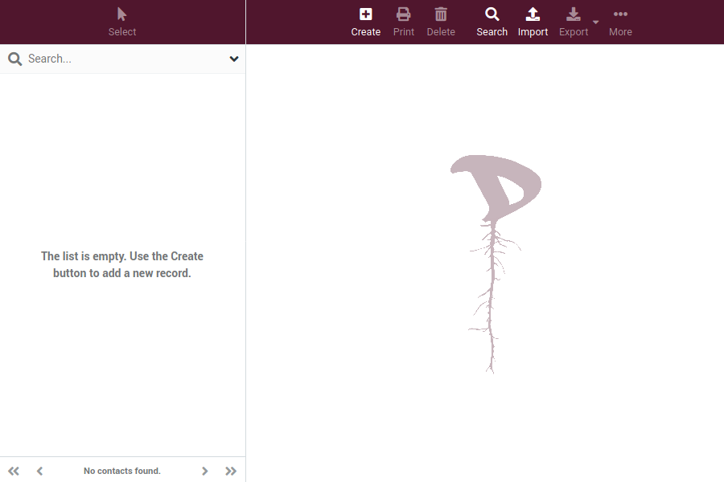

Au fur et à mesure que la liste est remplie, vous verrez le nombre total de contacts dans un répertoire ou un groupe en bas de la liste.

## Créer un contact
Pour créer un contact, il suffit de cliquer sur le bouton **Créer** dans le volet de la vue détaillée. Le formulaire de contact s'ouvre.

[Contacts](en/contact_create.gif)

Remplissez le formulaire avec les données qui vous semblent utiles pour identifier un contact. Vous pouvez même ajouter ou supprimer les champs d'information dont vous avez besoin.

## Actions de la liste de contacts

En plus de créer, imprimer ou supprimer un contact, vous pouvez effectuer d'autres opérations.

 Recherchez un contact en fonction de certains critères.

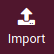 Vous pouvez importer des contacts depuis un carnet d'adresses existant. Le Webmail supporte actuellement l'importation d'adresses depuis le format vCard ou CSV (comma-separated).

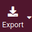 Vous pouvez exporter tous les contacts d'un répertoire ou d'un groupe, seulement certains ou même un seul vers un fichier vcf.

 A partir de là, vous pouvez générer un code **QR** à partir des données d'un contact sélectionné (que vous pouvez utiliser pour, par exemple, transférer un contact du webmail vers le mobile) et l'assigner/le supprimer d'un groupe de contacts.

## Carnet d'adresses
Maintenant que nous avons vu les contacts, jetons un coup d'œil au carnet d'adresses qui est - précisément - une collection ou un groupe de contacts. La première fois que vous ouvrez votre carnet d'adresses, il est probablement vide, à moins que vous n'ayez déjà utilisé votre compte **Disroot** et que vous ayez organisé quelques contacts et groupes auparavant.

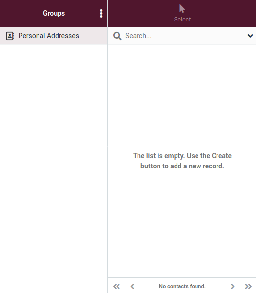

Les groupes de contacts sont utiles pour organiser vos contacts. Vous pouvez les sélectionner lorsque vous composez un message électronique, par exemple, et tous les membres seront inscrits comme destinataires.

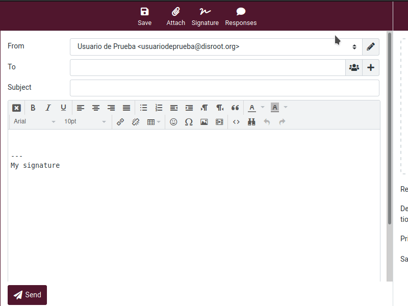

Les groupes sont également répertoriés dans l'auto-complétion lorsque vous tapez dans le champ du destinataire. Un contact peut être affecté à plusieurs groupes.

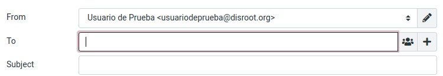

Cliquez sur un répertoire ou un groupe dans la liste pour afficher les contacts contenus dans la liste de droite. Le répertoire ou le groupe actuellement sélectionné est mis en surbrillance dans la liste.

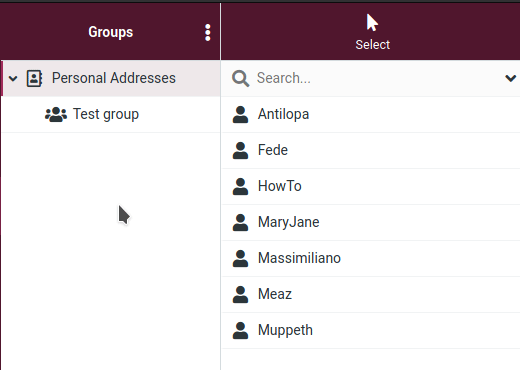

## Créer un groupe
Pour créer un groupe de contacts, sélectionnez d'abord le répertoire dans lequel vous allez le créer, puis cliquez sur le menu à trois points à gauche du titre de la section **Groupe**.

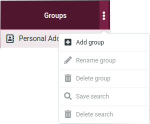

Sélectionnez **+ Ajouter un groupe** et une fenêtre s'ouvrira pour vous permettre de saisir le nom du groupe.

Cliquez sur **Save** pour sauvegarder votre groupe.

Vous pouvez interrompre la création du groupe en appuyant sur la touche **Esc** pendant la saisie du nom du groupe.

### Attribution de contacts aux groupes
Vous pouvez affecter des contacts à des groupes en les faisant glisser et en les déposant. Il suffit de sélectionner un ou plusieurs contacts dans la liste et de les déposer dans le groupe souhaité.

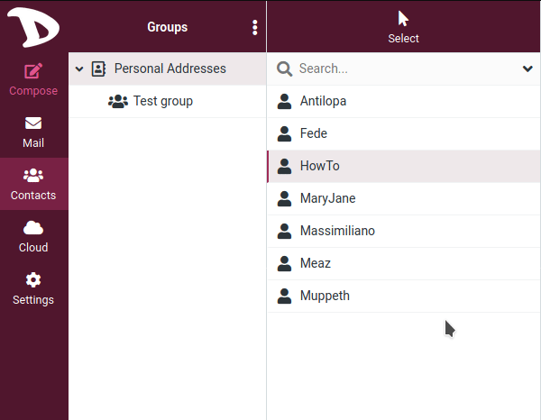

Pour supprimer un contact d'un groupe, il suffit de sélectionner le contact à supprimer, de faire un clic droit dessus, d'aller dans **--- Plus** dans le menu contextuel et enfin de sélectionner **Supprimer du groupe**.

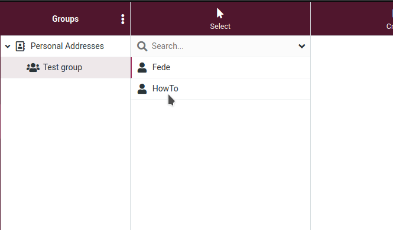

### Actions supplémentaires

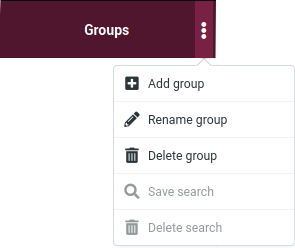

Comme vous l'avez peut-être remarqué, il existe d'autres options dans le menu **Groupes** qui sont activées selon que vous sélectionnez un répertoire ou un groupe.

- **Renommer un groupe** : Uniquement activée lorsque vous sélectionnez un groupe de contacts. Elle vous permettra d'entrer un nouveau nom pour ce groupe.

- **Supprimer le groupe** : Supprime un groupe sélectionné. Gardez à l'esprit que les contacts affectés à ce groupe **ne seront PAS** supprimés.

- **Sauvegarder la recherche** : Si vous avez déjà effectué une recherche dans le carnet d'adresses, cette option vous permettra d'enregistrer cette recherche comme un filtre à utiliser plus tard.

- **Supprimer la recherche** : Cette option n'est activée que si vous avez d'abord effectué et enregistré une recherche. Sélectionnez la recherche et cliquez sur cette option pour la supprimer.
