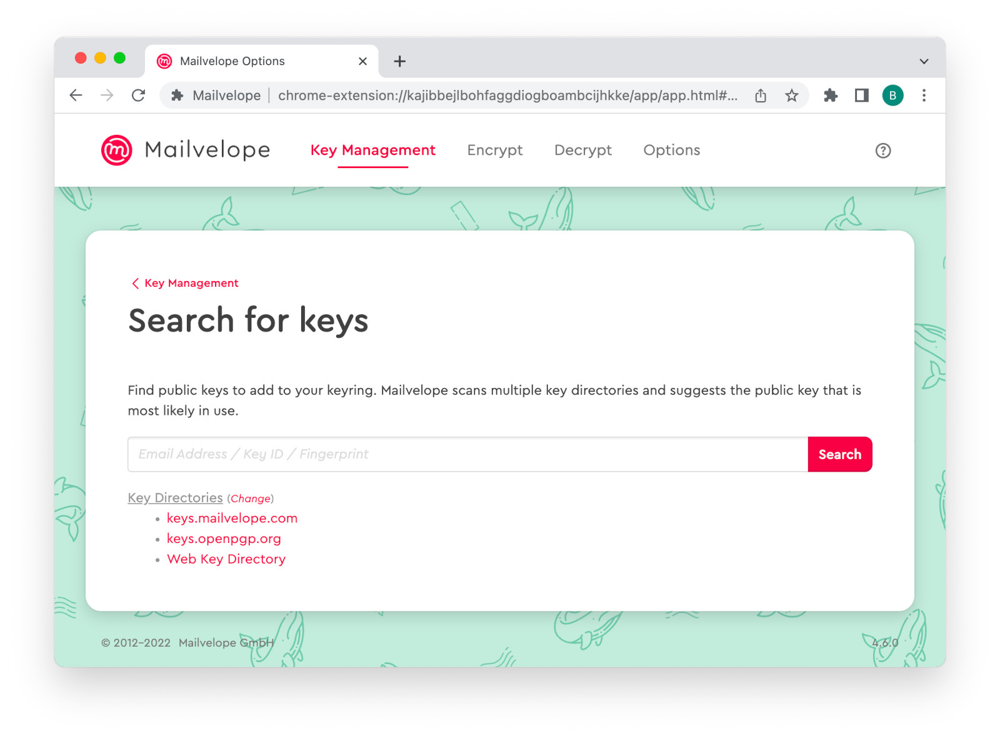

This how-to comes from [Mailvelope Help page](https://mailvelope.com/en/help).

# Encryption with Mailvelope

Mailvelope is a browser extension that builds PGP into your webmail.

- Encrypt and decrypt emails in your browser
- Manage the keys of your contacts
- Keep the content of your emails private from everyone except the recipient (even your email provider can’t read them!)
- Using security tools does not have to be difficult. We did our best to make Mailvelope easy for everyone to set up and use. The steps below will get you started sending and receiving encrypted emails.

## Install Mailvelope on your browser

Your first step is to add Mailvelope to your browser, using one of these download links:
- [Mailvelope for Google Chrome](https://chrome.google.com/webstore/detail/mailvelope/kajibbejlbohfaggdiogboambcijhkke?hl=en)
- [Mailvelope for Mozilla Firefox](https://addons.mozilla.org/en/firefox/addon/mailvelope/)
- [Mailvelope for Microsoft Edge](https://microsoftedge.microsoft.com/addons/detail/mailvelope/dgcbddhdhjppfdfjpciagmmibadmoapc)

Mailvelope has to be integrated deeply into your browser in order to work. You will need to give Mailvelope some permissions so that it can add new options to your webmail inbox. These permissions look a little different in every browser. Mailvelope does not read your email or your data, and only uses these permissions so that you can use its features within your webmail.

## Open Mailvelope

The Mailvelope icon lives in the top right corner of your browser. Click on it to start setting up your encryption keys.

## Add your keypair

In order to send and receive encrypted messages, you first need a "keypair". The Mailvelope setup screen will help you to either generate a new one or import an existing one.

### Don’t have a keypair or need a new one? Mailvelope will help you generate one.

Choose "Generate key" on Setup screen. Then enter your name (or pseudonym) and the email address you want your new key to be associated with. Choose a secure password or passphrase that you do not use for any other accounts. Write it down on paper or store it in a password manager.

Note: Since Mailvelope does not store your password, your password cannot be recovered if you lose it!

Mailvelope will confirm the successful creation of a key, and shows you the new key on the "Key Managment" screen.

To verify your key and make sure that your communication partners will find it, check your emails and click on the link in the verification email "Verify your email address" from "Mailvelope Key Server".

### Already have a keypair that you want to use? Import it to Mailvelope.

Open the Mailvelope Options (Remember: The Mailvelope icon lives in the right top of your browser) and navigate to "Key Management". To import your keypair, you will need the file (usually ending in ".asc") and its password. You can import it by dragging and dropping the file into the browser window, or by finding it on your computer using "Add file".

By clicking on "Import keys", Mailvelope will show you some technical information (Key ID/Fingerprint) about the key you want to add. After confirming your key will be showing up in your keyring and can be used.

To make sure, the new keypair is automatically available to other Mailvelope users who may want to write you an encrypted email, you can upload it to the Mailvelope key server (People who don’t use Mailvelope can also email you).

To do this click on your keypair. You will see a red notification, that "The user ID is not synchronized with the Mailvelope key server". Use the "Synchronize" button to upload the public key. Then check your mailbox and verify it by clicking the link in the verification email "Verify your email address" from "Mailvelope Key Server".

## Add others' keys

As you now have your own keypair, it’s time to add the keys of your contacts. If they also use Mailvelope, you probably don’t have much to do: The Mailvelope key server will find their public key automatically. Just start writing them an email, following the instructions in step 5. If their email address turns from red to green as you insert it, then Mailvelope already found their key. If not, you will need to add their key to your keyring before you can send them an encrypted email. There are two ways to do this:

### Import a key file

If your contact sent you their public key as a file (usually with the ending ".asc"), you can add this file to your keyring by choosing "Key Management" → "Import". You can import it by dragging and dropping the file into the browser window, or by finding it on your computer using "Add file".

### Searching key directories

Key servers are directories where public keys and their associated email addresses are listed. You can find your contacts’ keys by searching for their email addresses on key servers.

Navigate to "Key Management" → "Search". The search function built into Mailvelope searches Mailvelope’s own key server, as well as a couple of other commonly used key servers; you can customize the key servers included in the search if you like.

## Encrypting and decrypting an email using your Disroot webmail

### Set it up with webmail.disroot.org
Mailvelope integrates into Disroot webmail without any problem. However you have to add the domain name **webmail.disroot.org** to the list of authorized domains manually first.

To do this:
- simply navigate to [Disroot webmail](https://webmail.disroot.org)
- click on the Mailvelope icon (Remember: it lives in the right top of your browser) to open the main menu.
- select "Authorize this domain".

-  A Mailvelope dialogue to add the Disroot domain opens. Select "OK". Mailvelope will save the entry in the list of authorized domains.

- just make sure to reload the newly authorized website in order to activate Mailvelope on it.

### Send an encrypted email

Once you have configured Mailvelope on your browser, you can send encrypted messages in a few simple steps.

- Being in your Disroot Inbox, open the Compose task from the main menu to compose a new message. Click on the Mailvelope button in the email body to encrypt the message (and sign it).

- Now type the recipient's email address into the recipient field. Mailvelope will find the key automatically (it turns green), if your communication partner has uploaded their key to the Mailvelope key server like you most likely did in step *Add your keypair*. In case the typed address stays red, they simply might have forgotten to verify their keypair by clicking on the link in the key server validation mail.
Note: You can still add their keys manually by following the instructions in step *Add others' keys*.

- Now type your message into the "Message" field.
- After clicking on "Encrypt" you may have to type in the password attached to your key to sign your message.
- You will now see that Mailvelope has encrypted your message and it has been transferred to the regular Outlook.com editor. Now, add a subject (Note: The subject remains unencrypted by Mailvelope!) and retype the email address of your recipient into the "To" field. By clicking on "Send" the message is sent by Disroot webmail.

Note: Encrypted and signed messages will display your name and email address as you have listed them in your private key when opened by their recipients. This will help ensure the recipients that you are the actual sender of the encrypted messages. 

### Read an encrypted email

If you click on an encrypted email in your inbox, Mailvelope will show it as a sealed letter.

By clicking on that symbol Mailvelope will ask for the password attached to your key. You will now be able to see the encrypted message in cleartext.

If you do not have the correct public key of the sender and the correct private key of the recipient's mailbox in your keyring, you will be unable to decrypt and read the message.

> To can also check the [Mailvelope FAQ](https://mailvelope.com/en/faq)