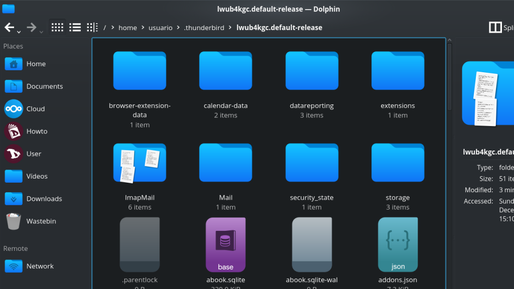
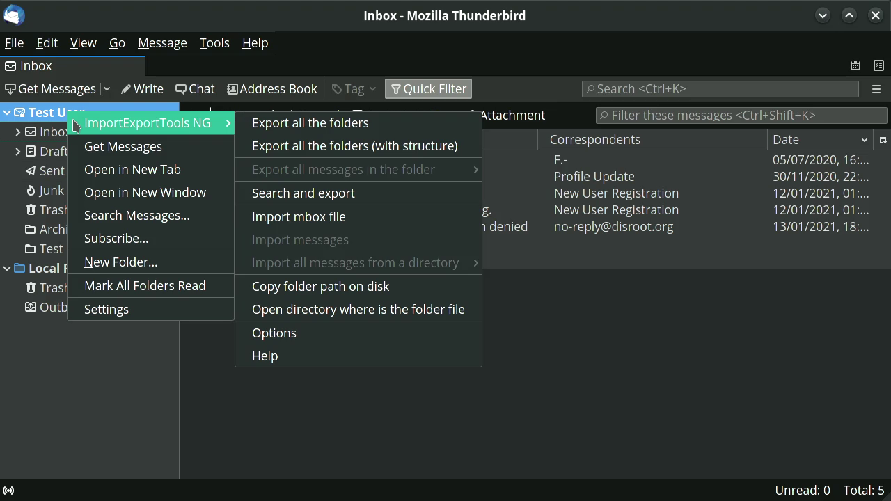

# Esportazione/importazione dei messaggi
**Thunderbird** non offre strumenti di backup nativi, quindi devi farlo manualmente o tramite un componente aggiuntivo.

## Procedura manuale
Il backup manuale della posta non è altro che la copia di una directory in un'altra posizione. **Thunderbird** memorizza le impostazioni e le e-mail in una directory che chiama "profile".

Per trovare il tuo "profile":

1. fare clic su **Aiuto** nella barra dei menu;
2. dal menu **Aiuto** selezionare **Informazioni sulla risoluzione dei problemi**;
3. in **Nozioni di base sull'applicazione** cerca **Directory del profilo** e fai clic su **Apri Directory**;
4. il file manager si aprirà nella posizione della directory del profilo.

Ora puoi fare un backup dell'intero profilo o solo delle mail. Per fare ciò, copia semplicemente la cartella nella posizione di backup. Tutti i messaggi di posta dagli account IMAP si trovano nella cartella **ImapMail**.

## Backup utilizzando il componente aggiuntivo Import/Export Tools

Sia l'installazione del componente aggiuntivo che il processo di esportazione delle e-mail sono abbastanza semplici.

### Installazione del componente aggiuntivo ImportExportTools

* Accedi a **Thunderbird**
* Vai su **Strumenti** nella barra dei menu e seleziona **Componenti aggiuntivi**
* Nel campo di ricerca dei componenti aggiuntivi digita _import export tools_ e poi premi invio
* Trova **ImportExportTools NG**, un piccolo software **GPL** che aggiunge strumenti di importazione/esportazione.
* Fai clic su **Aggiungi a Thunderbird**
* Dopo aver installato e fornito le autorizzazioni necessarie per il componente aggiuntivo, ora sei pronto per eseguire il backup di tutte le tue e-mail.

Questo componente aggiuntivo aggiunge una nuova voce di menu negli **Strumenti** e nei menu contestuali.

### Esportazione delle tue email
In **Thunderbird**, seleziona una cartella o una directory di cui desideri eseguire il backup e fai clic con il pulsante destro del mouse.
Il sottomenu dello strumento di importazione/esportazione mostra una serie di azioni che puoi eseguire per importare o esportare vari tipi di informazioni dentro e fuori **Thunderbird**.

Puoi esportare:
   * Cartelle singole e/o tutti i messaggi delle cartelle (EML, HTML, PDF, CSV o testo normale)
   * Esporta come singoli file o un singolo file
   * Esporta indici come testo normale o CSV
   * Esporta messaggi dalla finestra di dialogo di ricerca
   * Esporta profili completi o solo i file di posta elettronica
   
E importa:
   * Messaggi di posta elettronica (file Mbox comprese le strutture)
   * Profili
   * File EML ed EMLX
   * Singoli o tutti i file presenti nelle directory
